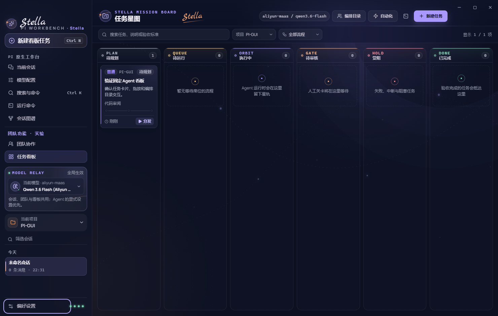

[**English**](README.md) | [简体中文](README.zh-CN.md)

# Stella · Pi Workbench

[](package.json)
[](https://github.com/earendil-works/pi)
[](#windows-and-macos-installers)
[](LICENSE)

Stella is an Electron desktop workbench for [earendil-works/pi](https://github.com/earendil-works/pi). It launches the bundled Pi JSONL RPC process directly: no simulated model responses, no replacement session store, and no dependency on where a recipient installed the Pi CLI.

The application opens in the native Pi workspace by default. Team Chat, Kanban, automation, the Pi-to-task bridge, and related commands are experimental surfaces that remain hidden until the user explicitly enables them under **Preferences → Feature pages**. Disabling those surfaces does not delete existing tasks. This keeps the complete native Pi experience independently usable while making local multi-agent coordination available when it is wanted.

Beyond chat, sessions, models, extensions, skills, and a local terminal, Stella includes a deterministic task board, a three-column Team Chat, Task Rooms, a typed LEAD coordinator, fixed and project-scoped agents, dynamic squads, versioned workflows, human acceptance gates, Autopilot triggers, and a read-only visual DAG. Eight persistent original skins share one recognizable **Stella signature**, and every skin can use a user-supplied local background.



## Design principles

- **Pi remains Pi.** Native sessions, messages, model routing, tools, extensions, skills, compaction, steering, follow-ups, and cancellation continue to run through the real Pi RPC runtime.
- **Native first.** The default product is the Pi desktop workspace. Team and task-control features are opt-in and have independent health states.
- **One local control plane.** Stella does not reproduce Multica, HiClaw, or an external chat platform, and it does not require PostgreSQL, Redis, a remote backend, or a resident daemon.
- **Failures stay visible.** Invalid configuration, unavailable skills, queue failures, trust changes, model errors, interrupted runs, and preview errors surface explicitly instead of being converted into fake success.
- **Models report; Stella transitions.** Agent text cannot move a task card. Persisted runtime events, typed coordinator actions, and human decisions drive the state machine.
- **User data stays local.** Project files and previews are not uploaded by the preview subsystem. Provider credentials remain in Pi's standard configuration directory.

## Pi model routing and provider configuration

The **Model Configuration** page is a direct Pi Model Router. It does not maintain a second model database and does not require opening a chat first. It reads the bundled Pi provider catalog, the real `get_available_models` result, and the recipient's standard Pi configuration directory.

- **Global model signal chain:** every page exposes the same `Provider → Model → Context → Session / Team / Kanban` selection. Only models currently returned by Pi can be selected. An agent's explicit model override still takes precedence.
- **Provider state:** the UI distinguishes credentials from `auth.json`, environment variables, inline `models.json` configuration, and OAuth. “Configured locally” and “verified remotely” are intentionally separate states.
- **API key reveal and management:** initial and refreshed snapshots never include secrets. A key is returned through a narrow main-window-only IPC only after the user presses **Reveal current API key**, and is removed from the renderer when hidden, when the provider changes, after save, or after 30 seconds. OAuth access tokens are never revealed. Dynamic `!command` credentials may be used for a connectivity test but are not executed by the reveal operation.
- **Real connectivity tests:** select a concrete model and send an isolated minimal inference request. The result includes success or failure, the actual model, elapsed time, and test time. It does not enter chat history, change the global model, or restart the active Pi RPC process.
- **Model discovery from URL and key:** the main process can query OpenAI/Responses `data[]`, Anthropic-compatible catalogs, and paginated Gemini `models[]`. Results can be searched, added, or removed individually or in bulk. Catalog discovery is not reported as inference success; the selected model still has to pass the real connectivity test.
- **Custom endpoints:** constrained forms support `openai-completions`, `openai-responses`, `anthropic-messages`, and `google-generative-ai`, including base URL, bearer-header behavior, model ID, context window, maximum output, reasoning, and image input. Existing advanced Pi fields are preserved.
- **Explicit apply semantics:** saving reloads the real Pi RPC process and restores the same `sessionFile`. Saved, locally configured, and connectivity verified remain independent states. OAuth/subscription login continues to use Pi's interactive `/login <provider>` flow.


## Session artifact preview

When Pi returns an absolute local path, the **Outputs and paths** card exposes a **Preview** action. The preview opens in the Inspector's **Files** tab without leaving the conversation or covering the composer.

A compact picker at the top lists every artifact explicitly delivered by the assistant in the current session. Windows paths are deduplicated case-insensitively and ordered by the most recent mention. Each option shows the file name, preview type, and time. Switching sessions closes the old session preview, so artifacts never leak into another session's list.

Supported formats:

- **Images:** PNG, JPEG, GIF, WebP, AVIF, BMP, and SVG. SVG scripts, event handlers, and external references are removed first.
- **Web and text:** HTML, Markdown, JSON, CSV, TSV, XML, YAML, and plain text. HTML runs in a scriptless sandbox with forms, network requests, external resources, and embedded objects isolated.
- **PDF:** rendered with Electron/Chromium's built-in local PDF viewer; no PDF.js or Office plug-in is bundled.
- **Word:** DOCX is rendered page by page with [docx-preview](https://github.com/VolodymyrBaydalka/docxjs), including text, tables, and common styles. AltChunk, comments, tracked changes, and embedded programs are not executed.
- **PowerPoint:** PPTX is converted to isolated HTML slides with [@jvmr/pptx-to-html](https://github.com/javier-mora/pptx-to-html). Slides can be switched in place; animations, macros, and embedded programs are not executed.
- **Excel:** XLSX and XLSM are read with [@office-kit/xlsx](https://github.com/office-kit/xlsx), including sheets, merged cells, row and column dimensions, hidden rows and columns, and common cell styles. Worksheets and large ranges can be paged. Macros are never executed.

Legacy binary `DOC`, `PPT`, and `XLS` files are not misrepresented as supported previews; users can reveal them in the operating system instead.

Office preview modules are loaded dynamically, so ordinary chat startup does not load their code. Before each read, the main process resolves and revalidates the canonical path and only accepts regular files under the current project, Pi data directory, or Stella application data directory. The document stage fills all remaining Inspector height and scrolls independently. Zoom, refresh, and maximize stay visible; system open, reveal in folder, and copy full path live in a responsive **More** menu.

## The intentionally simple v0.3.0 architecture

Stella uses one Electron application, one local `board.json`, and real Pi child processes. The architecture separates facts that are easy to conflate:

- **Independent capability health:** Pi, Task, Schedule, and Webhook each report `loading`, `ready`, `degraded`, or `error`. A corrupt board does not block Pi, a Pi startup failure does not hide task history, and a webhook port conflict only stops Webhook.
- **Deterministic task state machine:** dispatch creates `queued`, real execution creates `running`, human gates or agent reports create `review`, failure/interruption/rejection creates `blocked`, revision returns to `planned`, and a task reaches `completed` only after the user accepts the report.
- **Derived agent presence:** agent definitions are immutable role configuration. Team Pulse derives available, queued, running, waiting, and attention-required presence from Workflow Runs, StepRuns, and AgentTasks.
- **Explicit acceptance:** an agent result becomes `reported + pending acceptance`. Accept, request revision, and reject decisions are persisted with their reason, time, and task transition.
- **One active execution attempt:** redistribution increments `executionAttempt`. Only the Workflow Run or root AgentTask referenced by `awaitingReviewExecution` may affect acceptance. Older pending reports become explicitly superseded.
- **Immutable task specifications:** meaningful edits increment `specRevision`, and every root execution stores a `TaskSpecSnapshot`. A late result from an older runtime cannot overwrite the current specification.
- **Frozen team plans:** coordinator and squad dispatches persist the team name, version, leader instructions, and member-agent snapshots. Catalog edits affect the next dispatch, never a run already in progress.
- **Shared workspace admission:** interactive Pi, workflows, and AgentTasks share a canonical-path write lease. Background writers wait FIFO; interactive Pi names the background owner when blocked; cancellation removes pending lease requests.
- **Live project trust:** every background launch rereads current trust. Switching to restricted mode updates tasks and Autopilot, and stops queued or running execution for that project.
- **Explicit Pi ↔ Task bridge:** when team features are enabled, **Pin as task** opens an editable draft. Nothing is created until the user saves. **Continue in Pi** accepts only a session that the main process verifies belongs to that task.
- **No second message system:** a Task Room is a chronological projection of Task, Message, Activity, Run, Step, AgentTask, and Artifact records. Every item retains its Run/Step/AgentTask source identity.
- **One Team Chat entry:** the permanent Launchpad accepts `@LEAD + goal` with verifiable acceptance criteria, atomically creates the task, first message, and coordinator execution, then opens the new Task Room.
- **No second execution engine:** the visual DAG is a read-only projection of historical workflow snapshots and StepRuns. Selecting a node reveals the agent, goal, error, artifacts, and session without mutating execution.


## Kanban and fixed agent teams

The board is not a chat log with cards layered over it. Stella owns recoverable workflow state, while Pi executes each isolated step. Real agent events, tool activity, final artifacts, failures, and human decisions flow back into the same task constellation.

Six general-purpose versioned roles are built in, with four additional roles for early pharmaceutical research:

| Agent | Access | Stable responsibility |
| --- | --- | --- |
| **General Coordinator / LEAD** | Read only | Clarify the goal, decompose work, delegate workers, and review, revise, replan, or escalate after reports |
| **Project Scout / SCOUT** | Read only | Investigate code, constraints, impact surface, and verification entry points |
| **Solution Planner / PLAN** | Read only | Convert scouting evidence into an executable plan |
| **Implementation Engineer / BUILD** | Write | Modify the real project according to an approved plan |
| **Verification Engineer / VERIFY** | Write | Run tests, type checks, or builds and expose failures |
| **Code Reviewer / REVIEW** | Read only | Independently review correctness, regression risk, security, and acceptance criteria |

Built-in squads include a Delivery Squad, Bug-Fix Squad, and Review Pair. Three fixed workflows are available:

- **Feature delivery:** scout → plan → plan approval → build → verify → review → final acceptance.
- **Bug fix:** reproduce → diagnose root cause → fix approval → implement → regression verification → review → acceptance.
- **Read-only review:** context scouting → independent review → human confirmation, with no project writes.

Every dispatch stores workflow and agent version snapshots. Writable Pi/Agent channels in the same canonical workspace share an exclusive lease. Only roles whose tool policy is verified as non-writing are treated as read-only. If the application exits during execution, unfinished work is restored as explicitly interrupted rather than reported as successful.

## Pharmaceutical early-research example

The repository includes a repeatable NLRP3 competitive-landscape and target-assessment scenario. It evaluates whether to begin a formal oral, brain-penetrant, selective NLRP3 small-molecule discovery program for an inflammation-enriched early Parkinson's disease population.

Three project-scoped Pi Skills are included under [`examples/pharma-early-research/.pi/skills`](examples/pharma-early-research/.pi/skills):

- `target-evidence`: collects and saves Open Targets, Human Protein Atlas, and ChEMBL target evidence.
- `clinical-landscape`: searches ClinicalTrials.gov, deduplicates assets, and retains termination, withdrawal, and status-update evidence.
- `target-assessment-report`: generates a decision report from a fixed scorecard and performs an independent evidence audit.

The Early Target Assessment Squad combines a target-biology researcher, clinical competitive-intelligence analyst, target-strategy lead, and evidence auditor. The workflow runs target evidence, competitive scan, evidence-scope approval, decision report, independent audit, and portfolio review.

Every domain agent declares `requiredSkills`. The main process performs a real Pi Resource Loader preflight before dispatch, and the runtime verifies the exact `skill:<name>` command after startup. A missing, disabled, or out-of-trust skill fails explicitly before an orphaned queue item can be created.

The example project already includes its skills. Installers never modify the recipient's Pi user directory. To reuse them elsewhere, place the three skill directories under `<project>/.pi/skills/`, or explicitly install them under `%USERPROFILE%\.pi\agent\skills\` on Windows or `~/.pi/agent/skills/` on macOS.

Typical UI path:

1. Open `examples/pharma-early-research` and choose **Trust and load**.
2. Open **Task board → Orchestration catalog** and verify the four pharmaceutical agents, squad, and workflow.
3. Create a task, select the fixed Early Target Assessment workflow, and provide the target, indication, modality, competitive boundary, and acceptance criteria.
4. Review the two evidence artifacts in the Task Room, approve the evidence-scope gate, inspect the resulting report and audit through the DAG, then complete portfolio review and accept the report.


The complete inputs, failure paths, and pass criteria live in [`examples/pharma-early-research/TEST_PLAN.md`](examples/pharma-early-research/TEST_PLAN.md). Frozen evidence and the formal report live under [`examples/pharma-early-research/evidence/raw`](examples/pharma-early-research/evidence/raw) and [`examples/pharma-early-research/reports/nlrp3-target-assessment.md`](examples/pharma-early-research/reports/nlrp3-target-assessment.md).

```bash
# Skill preflight, orchestration catalog, UI task creation, and pending DAG
npm run test:e2e:pharma

# Four real agents, two human gates, evidence, report, audit, and acceptance
npm run test:e2e:pharma:live
```

## AgentTaskQueue, dynamic squads, and Autopilot

Stella adds a deliberately small local automation layer without PostgreSQL, an external daemon, or another backend:

- **Persistent AgentTaskQueue:** a task can be assigned directly to one agent. Queue state, execution, session path, final output, tokens, cost, errors, and interruptions are stored in `board.json`. A normal result becomes `reported` and still requires acceptance.
- **Launchpad:** one required acceptance-criteria field plus `@LEAD + goal` atomically creates a normal-priority task, deterministic title, first user message, and coordinator AgentTask. Failed validation leaves no partial task or queue item.
- **Comments and `@mention` delegation:** typing `@` opens the agents actually available to the current task. Search works by localized name, responsibility, call sign, or ID; arrow keys plus Enter/Tab select a candidate. Presence, read/write access, and required skills are visible before dispatch. Unknown, ambiguous, and out-of-scope mentions reject the whole submission.
- **Typed `@lead` coordinator:** LEAD must finish each coordinator turn by calling the built-in terminal `coordinator_action` tool with `delegate`, `request_revision`, `replan`, `complete`, or `ask_human`. Stella validates the TypeBox schema, plan snapshot, agent scope, and skills before creating child work. Natural-language mentions and hand-written JSON do not count as delegation.
- **Project AgentDrafts:** Team Pulse can save a project-scoped role, call sign, responsibility, instructions, skills, thinking level, and tool permissions. Read-only agents cannot use `bash`, `edit`, or `write`; write access requires explicit user confirmation.
- **Dynamic squads:** fixed leader/member catalogs remain available for explicit squad workflows, with versioned `global` or `project` scope. A squad containing a project agent cannot run in another project.
- **Autopilot:** a task template, current project, and execution target can be bound to Manual, Schedule, or Webhook triggers. Every trigger creates a fresh task and audit record, then enters the same real dispatch path.


Schedules run only while Stella is open. If a schedule elapsed while the application was closed, Stella records one `missed` event and advances to the first future time; it does not pretend to have run offline or create a catch-up storm.

The webhook server binds only to `127.0.0.1` and defaults to port `43127`. Each webhook rule receives a random token. Local scripts can send a JSON object to the exact URL copied from Automation Studio:

```bash
curl -X POST "http://127.0.0.1:43127/api/webhooks/<random-token>" \
  -H "Content-Type: application/json" \
  -d '{"ref":"refs/heads/main","action":"verify"}'
```

A successful request returns HTTP `202` with the actual `autopilotId`, `runId`, and `taskId`. Invalid methods, routes, tokens, content types, UTF-8, JSON, or oversized bodies return structured errors. A dispatch failure never returns false success.

| Environment variable | Default | Meaning |
| --- | --- | --- |
| `STELLA_WEBHOOK_PORT` | `43127` | Fixed local port in `1..65535`; a conflict is reported as `BIND ERROR` |
| `STELLA_WEBHOOK_MAX_BYTES` | `1048576` | JSON body limit in bytes; set explicitly to `0` for no size limit |

## Eight complete skins

Skins change more than accent colors: artwork, tokens, panel material, borders, radius, brand marks, empty states, suggestion cards, and the composer all change together. Light, dark, and system appearance remain independent preferences.

| Skin | Visual direction | Open-source design reference |
| --- | --- | --- |
| **Stella · Night Navigation** | Iris star trails, soft glass, warm handwritten signature | [Codex-Dream-Skin](https://github.com/Fei-Away/Codex-Dream-Skin) and Codex information hierarchy |
| **Chenxi · First Light on Paper** | Matte paper, layered mountain mist, apricot dawn | [Rosé Pine Dawn](https://github.com/rose-pine/rose-pine-theme) color softness |
| **Dingyang · Sundial Blueprint** | Mineral print, solar scale, geometric order | [Solarized](https://github.com/altercation/solarized) luminance and [Trianglify](https://github.com/qrohlf/trianglify) geometry |
| **Xuri · Golden Sun over Sea** | Vermilion sun, mineral mountains and sea, restrained gold leaf | Public ukiyo-e composition and mineral-gold traditions |
| **Yuehua · Silver-Blue Moon Lake** | Moon path, drifting cloud, crystalline floral shadow | Ink-painting negative space and moonlit glass |
| **Obsidian Night Pact** | Victorian silver, rainy manor, deep-red rose | Victorian Gothic and Dark Academia visual language |
| **Chromatic Golden Journey** | Pink-violet streets, Italian gold, high-contrast comic color | Chromatic Pop and Italian Gold color studies |
| **Moonlit Go** | Black and white stones, ginkgo ink mist, aged Go board | Go-board geometry, ginkgo, and ink composition |


The seven replaceable background images are original AI-assisted assets generated for this project; Chenxi and Dingyang include their own Chinese title artwork. Referenced open-source projects were used for design study only—their images and runtime code are not packaged. See [`ASSET-LICENSES.md`](ASSET-LICENSES.md) for file-level provenance, compatibility IDs, and licensing boundaries.

## Interaction coverage

- Native Pi chat with text and image input, streaming messages, tool calls, steering/follow-up queues, cancellation, retry, and context compaction.
- New, switch, search, rename, clone, fork, branch-tree inspection, and HTML export for sessions.
- One globally visible model route, complete thinking-level selection, provider/auth inspection, explicit API-key reveal, real connectivity testing, and remote model discovery.
- Local command drawer in the active project, including cancellation, history navigation, and truncated-output location.
- Session artifacts with newest-first switching and image, HTML, Markdown, text, PDF, DOCX, PPTX, XLSX, and XLSM previews.
- Six-stage task constellation with project/workflow filters, search, drag-and-drop, details, edits, distribution, redistribution, archive, and deletion.
- Team Launchpad, Task Channels, Task Room timeline, searchable mentions, direct workers, LEAD clarification/resume, project AgentDrafts, and derived Team Pulse.
- Read-only DAG with historical run selection, dependencies, six node states, keyboard navigation, source identity, errors, artifacts, and sessions.
- Versioned agents, squads, workflows, isolated Pi sessions, workspace write leases, human plan/report gates, and explicit interrupted-run recovery.
- Manual, in-app Schedule, and loopback Webhook Autopilot with fresh tasks and trigger audits.
- Eight skins, light/dark/system modes, 14/16/19px global font sizes, compact density, collapsible/responsive sidebars, focus trapping, and reduced motion.

## Development

Requirements: Node.js `>= 22.19.0`.

Pi models, authentication, extensions, skills, sessions, and user settings continue to use Pi's standard user directory. Stella's Model Configuration page writes Pi's native `auth.json` and `models.json`; it does not create a private credential database.

```bash
npm install
npm run dev
```

Production build and local preview:

```bash
npm run build
npm run preview
```

## Windows and macOS installers

Installers bundle the Pi runtime but reuse the recipient's Pi configuration. `@earendil-works/pi-coding-agent` and its production dependencies are packaged with Stella, and the main process launches the bundled RPC entry with Electron's Node runtime. A recipient does not need a global `pi` command or a particular Pi installation path.

Recipient configuration remains under:

- Windows: `%USERPROFILE%\.pi\agent`
- macOS: `~/.pi/agent`
- If `PI_CODING_AGENT_DIR` is set, Pi uses that directory instead.

Do not package a developer's API keys, OAuth credentials, or `.pi/agent` directory. Users without a separate Pi CLI can start Stella, but must configure their own provider before the first inference.

Board state is stored under Electron's user-data directory in `board/board.json`, outside the opened project. Schema upgrades create a timestamped backup before the deterministic v1→v6 migration chain runs. Agent steps use the recipient's own model and authentication; built-in roles contain no API key, fixed model, or machine-specific Pi path.

Build locally:

```bash
# Unpacked application for the current platform
npm run package:dir
npm run test:packaged

# Windows x64 or Windows ARM64 NSIS
npm run dist:win
npm run dist:win:arm64

# Intel Mac or Apple Silicon Mac: DMG + ZIP
npm run dist:mac:x64
npm run dist:mac:arm64
```

Artifacts are written to `release/` and include the product version, operating system, and architecture:

```text
Stella Pi Workbench-0.3.0-win-x64.exe
Stella Pi Workbench-0.3.0-mac-x64.dmg
Stella Pi Workbench-0.3.0-mac-arm64.dmg
```

The Windows x64 installer built from this workspace is recorded in [`SHA256SUMS.txt`](SHA256SUMS.txt):

```text
8A330D10A4412B118737C639DF4AAA8A643BDC505C1DF43C489943B8CDCEAEB2  Stella Pi Workbench-0.3.0-win-x64.exe
```

The packaged-app smoke test launches with the executable search path emptied and requires the bundled Pi and Task capabilities to reach `ready`. The current NSIS installer is unsigned, so Windows may display **Unknown publisher**. The checksum verifies file integrity but is not a substitute for Authenticode publisher identity.

### Signing, notarization, and releases

Formal macOS packages must be built on macOS, not cross-built from Windows. [The GitHub Actions release workflow](.github/workflows/release.yml) builds Windows x64, Apple Silicon macOS, and Intel macOS artifacts on their corresponding runners.

A manually dispatched **Build installers** workflow may produce unsigned artifacts for internal validation. Pushing a version tag matching `package.json`, such as `v0.3.0`, requires signing; macOS additionally requires Apple notarization. A GitHub Release is created only after all platform jobs succeed.

| Repository secret | Purpose |
| --- | --- |
| `WIN_CSC_LINK` | Windows code-signing certificate path, URL, or Base64 content |
| `WIN_CSC_KEY_PASSWORD` | Windows certificate password |
| `MAC_CSC_LINK` | `Developer ID Application` `.p12` path or Base64 content |
| `MAC_CSC_KEY_PASSWORD` | macOS certificate password |
| `APPLE_ID` | Apple Developer account |
| `APPLE_APP_SPECIFIC_PASSWORD` | Apple app-specific password |
| `APPLE_TEAM_ID` | Apple Developer Team ID |

## Validation

```bash
npm run check
npm run build
npm run test:e2e
npm run test:packaged
```

The current Vitest suite contains **67 files and 278 tests**. It covers team-feature gating, v1/v2/v3/v4/v5→v6 migration and backup, immutable task specifications, execution-attempt isolation, live trust, the typed coordinator tool, skill preflight, coordinator/squad snapshots, RPC timeout shutdown, independent capability failures, workspace-lease FIFO and cancellation, report/acceptance separation, stable Task Room projections, explicit session bridges, background-history filtering, DAG keyboard interaction, AgentTaskQueue, Autopilot, Webhook, extension UI, global font sizes, Pi Bash cancellation, composer behavior, newest-first artifact projection, the compact file picker, full-height previews, local preview IPC, and a real ten-slide PPTX relationship-path regression.

Electron E2E cold-starts the real Pi RPC runtime and exercises the default native workspace, persisted team-feature gating, return from Team to Pi, Launchpad, Task Room, mention impact preview, Pi session pinning, task creation, drag-and-drop, orchestration catalog, Automation Studio, eight skins, session creation and rename, chat, command palette, Inspector, real terminal success/failure/cancel, image attachments, the preview byte bridge, font switching, keyboard focus, and responsive sidebars.

The packaged smoke test clears the executable search path and starts the new application from `release/`; it passes only when the bundled Pi and Task capabilities genuinely reach `ready`.

Real Alibaba Cloud Model Studio Qwen validation is explicitly paid and networked, so it is not part of the default regression command:

```bash
npm run test:e2e:qwen:live
```

It requires the `aliyun-maas` provider and a matching Qwen model in Pi's actual model catalog, switches the model through the UI, sends a randomized verification string through a real Pi session, and verifies provider/model identity, body, error state, token statistics, duration, and session statistics. Missing models, authentication failures, timeouts, and output mismatches fail directly; the test never substitutes another model.

## Repository structure

```text
src/
├─ main/                 Electron main process, capability health, workspace admission, runners, Pi RPC lifecycle
├─ preload/              Narrow contextBridge API allowlist
├─ renderer/src/
│  ├─ components/        Sessions, composer, Inspector, terminal, dialogs, and navigation
│  ├─ features/kanban/   Board, Task Room, read-only DAG, Pi bridge, squads, and Autopilot studio
│  ├─ hooks/             Pi/board synchronization and local preferences
│  ├─ assets/skins/      Seven original user-replaceable background artworks
│  ├─ lib/               Immutable runtime reducers and skin definitions
│  └─ styles/            Multi-skin design tokens, layout, and responsive behavior
└─ shared/               Protocols, v6 domain model, timeline/DAG/session projections, and built-in catalog
```

The main process runs Pi RPC with Electron's Node runtime and `ELECTRON_RUN_AS_NODE=1`. The renderer uses `contextIsolation` and `sandbox`, and reaches local capabilities only through the preload allowlist. External links are limited to HTTP(S); project paths and IPC commands are validated at the main-process boundary.

## Keyboard shortcuts

| Shortcut | Action |
| --- | --- |
| `Ctrl/Cmd + N` | Focus the Team Launchpad, open structured task creation on the board, or create a native Pi session |
| `Ctrl/Cmd + K` | Search and command palette |
| `Ctrl/Cmd + L` | Focus the active composer |
| <code>Ctrl/Cmd + `</code> | Toggle the local command drawer |
| `Ctrl/Cmd + I` | Toggle the session Inspector |
| `Esc` | Stop generation or close the active dialog/menu |

## Project trust

When a working directory contains project-scoped settings, extensions, skills, prompts, or themes, Stella opens a permission dialog before starting Pi:

- **Trust and load** starts the workspace with Pi's `--approve` mode.
- **Open restricted** starts with `--no-approve`, ignoring project-scoped executable resources and using user-level configuration only.

The decision is stored with the recent-project record in Electron's user-data directory. It is never written into the opened repository.

## License and assets

Source code is available under the [MIT License](LICENSE). File-level provenance for original skin artwork and product screenshots, compatibility-ID notes, and third-party dependency boundaries are documented in [`ASSET-LICENSES.md`](ASSET-LICENSES.md). Pi, fonts, icons, and npm dependencies remain under their respective upstream licenses.
