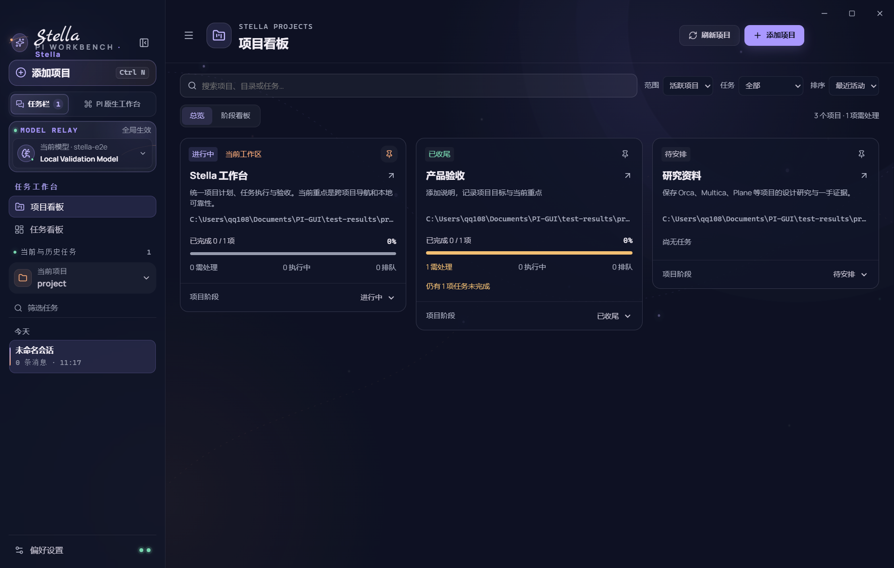

# Stella Pi Workbench

**English** | [简体中文](README.zh-CN.md)

Current source version: **v0.7.3** · Android versionCode: **11**.

The current source pins the official **Pi 0.85.1** runtime. Stella uses one Pi dependency tree and public SDK/RPC interfaces, without a Pi fork. Sol loads as an optional extension, not a second runtime. See the [upgrade verification](docs/testing/pi-0.85.1-upgrade-2026-09-18.md). Previously published installers keep their original bundled version.

**Preferences → Pi version management** compares your local CLI with the bundled Pi at startup. A mismatch offers an update, but only a native confirmation allows npm to install the exact bundled version (including an explicitly disclosed downgrade). Detection checks the executable and global npm prefix; ambiguous installations are reported, never overwritten. The GUI does not require a separate global Pi.

**Preferences → Sol mode**: enable the mode, choose mechanisms, then apply. It starts disabled; enabling preselects Action Fusion (confirmed file-mutation-plus-command operations) and ObservationPack (archived large logs with paged recall). EPR auxiliary-model reduction and OCC phase-boundary compaction/continuation are separate opt-ins. EPR uses an existing Pi model and credentials with additional billable usage; OCC uses native Pi compaction. Applying requires an idle runtime and preserves the session, model, and draft. Settings distinguish pending configuration from actual activation and expose errors and branch-specific auxiliary token usage. Only native conversations are affected, not Team or the global CLI; user `sol-pi.json` files are untouched. Back up the session directory's `sol-pi/` archives together with JSONL history. See the [spec](docs/specs/sol-mode.md), [tickets](docs/specs/sol-mode-tickets.md), [upstream adaptation](src/extensions/sol-pi/UPSTREAM.md), and [verification](docs/testing/sol-mode-2026-09-19.md).

Native reliability maintenance: long session trees now cross IPC as flat nodes and child IDs; usage/context metrics refresh after completed responses during multi-step turns. Stop also terminates supervised local background computation; **Inspector → Activity → Stop Pi and background computation** remains available after a turn ends. Windows uses Job Objects; POSIX tracks an inherited per-runtime marker. Remote/container jobs or processes deliberately escaping that scope require separate verification. See the [design and boundaries](docs/specs/native-runtime-preview-maintenance.md) and [verification record](docs/testing/native-runtime-preview-2026-09-19.md).

> **A native Pi desktop workbench with a local multi-CLI Agent control plane.** Use real Pi conversations, route managed tasks through Pi/Codex/Claude, inspect external CLI activity, and keep Kanban, human approval, artifacts, and automation in one installable application.

Stella is a local-first Electron workbench for [earendil-works/pi](https://github.com/earendil-works/pi). It launches the bundled Pi JSONL RPC runtime directly: it does not simulate Agent responses and does not bypass Pi's sessions, models, Skills, extensions, or user configuration. The native Pi workbench remains independently usable, while Team, Kanban, Workflow, Autopilot, and optional locally installed Codex/Claude CLIs form a second capability surface with separate failure boundaries.

This is no longer a "Pi skin" project. Eight replaceable visual themes remain part of the desktop experience, but the product itself is an installable, auditable, and recoverable local AI workbench. Stella does not reproduce the server stacks of Multica or AgentTeams/HiClaw; it applies their Issue/Attempt, Room/Leader/Worker, explicit-trigger, dependency-scheduling, and result-acceptance ideas within a deliberately small single-machine architecture.

## Product Positioning

### v0.6.0 · Native Session Reliability

This upgrade focuses on the native Pi GUI, without expanding Team or modifying official Pi 0.84.2. See the [specification](docs/specs/stella-v0.6.0-native-reliability.md), [delivery tickets](docs/specs/stella-v0.6.0-tickets.md), and [acceptance record](docs/testing/stella-v0.6.0-native-reliability-acceptance.md).

- Fixes corrupted Chinese/emoji at UTF-8 chunk boundaries and collisions between messages with identical timestamps. Each RPC process owns its decoder, pending requests, and generation; retired-process events cannot update a new session.
- Uses official entry IDs for history and exact RPC read sequence barriers to merge snapshots with the live message tail.
- **Inspector → Activity → Submission receipts** distinguishes pending, Pi-accepted, Pi-rejected, and unknown results. Accepted does not mean the task completed. Unknown submissions are never replayed automatically; repeated IPC delivery with the same submission ID does not execute twice.
- After an unexpected Pi exit, **Reconnect** restores the original session and unsent draft. Definitively rejected input can be retried explicitly after correcting its cause; unknown input requires review. Offline diagnostics retain the interrupted session correlation.
- **Inspector → Context → Export local diagnostics** saves versions, session paths, layout, event counts, and correlated request IDs. It excludes conversation bodies, raw logs, environment variables, and credentials by default. Nothing is uploaded.
- File previews expose content versions and can append a file reference or selection to the composer. Changed files require an explicit refresh; existing and concurrently edited drafts are preserved.
- Reading anchors, selected files, and unread attention are retained per session. A saved running observation is not treated as a live process after restart. Receipts live in `native-submissions.json` under application data; view metadata stays in local renderer storage. Neither rewrites Pi JSONL history.

Receipts prove GUI intent and Pi command acceptance, not cross-application exactly-once model execution. Incompatible future formats and write failures are explicit, and existing data is preserved. If a selection inside an isolated HTML/PPTX viewer is inaccessible, file-level references remain available without weakening isolation. Windows artifacts are unsigned; macOS still requires platform-specific building, signing, and validation.

| Surface | What users get | Architectural boundary |
| --- | --- | --- |
| **Native Pi workbench** | Chat, session tree, model and Provider configuration, thinking level, extensions, Skills, terminal, attachments, and local artifact previews | Uses the real Pi RPC runtime directly; no Task or Team setup is required |
| **Agent team control plane** | Task Launchpad, Task Room, Kanban, LEAD/Worker delegation, Squads, Workflow DAGs, execution graphs, human acceptance, Autopilot, and Pi/Codex/Claude execution Profiles | Stella owns deterministic state, scheduling, and audit; managed execution runs through a typed backend while external CLI sessions remain read-only projections |
| **Desktop experience** | Windows/macOS installers, globally visible model selection, responsive three-column layouts, eight themes, and replaceable artwork | Presentation never enters the domain model or changes execution semantics |

Team features are hidden by default and can be enabled under **Preferences → Feature Pages**. Disabling the surface hides its navigation without deleting existing tasks. Data remains local, credentials stay in Pi's standard configuration directory, and the application does not require PostgreSQL, Redis, a remote control plane, or a resident daemon.


The current Team design is documented in the fixed-commit upstream study [`docs/research/team-multica-hiclaw-2026-08.md`](docs/research/team-multica-hiclaw-2026-08.md), the implemented reliability specification [`docs/specs/stella-team-reliability-v1.md`](docs/specs/stella-team-reliability-v1.md), [ADR 0005](docs/adr/0005-dependency-aware-agent-task-scheduling.md), and [ADR 0006](docs/adr/0006-use-one-typed-coordinator-protocol-for-team-leaders.md).

## Project Board

Open **任务栏 → 项目看板** in the sidebar, or choose **打开项目看板** from the command palette. Projects remain available with Team features disabled.

- **Persistent project registry:** add an existing local directory, edit its display name and description, pin it, or archive and restore it. Current/recent projects and historical Task scopes are discovered incrementally; the registry outlives the 12-entry recent-project window.
- **Overview and planning stages:** the same projects appear as overview cards or four columns: Planned, Active, On hold, and Wrapped up. Drag a card or use its stage menu to update the plan. Search includes project details, paths, and Task content.
- **Actual Task progress:** completion, stage distribution, running/queued work, and human attention are derived from existing Tasks. Manual review, current execution reports, Coordinator questions, and Workflow human gates remain visible. Empty and unavailable Task data have distinct states.
- **Cross-project navigation:** open the existing Task board and detail panel without switching the current Pi session. Editing and execution use the original workflow for opening the owning project. Registering a directory does not grant project trust.
- **Tasks without a project:** the Task board defaults to all Tasks across projects. Choose **不选择项目** when creating a Task, including during first run. Unassigned Tasks support editing, comments, and manual progress; bind them to an opened workspace when local execution is needed.
- **Scrollable Task lists:** each Task column scrolls vertically, narrow windows scroll horizontally between columns, and project details have a separate Task list scroll area. Tasks are not truncated to a fixed number.
- **Recoverable local metadata:** project records live in `projects.json` under application data. Missing directories and invalid storage produce visible errors while preserving history; project metadata never duplicates Task execution state.

Project stages express planning. On hold, archive, and Wrapped up do not stop executions, disable automation, or accept Tasks. Wrapped-up projects explicitly show any unfinished Tasks.

Board storage upgrades to v10 to represent unassigned Tasks. Existing v9 data is backed up before migration; current project bindings and Task history are preserved.



See the [design and code analysis](docs/specs/stella-project-board.md), [Orca study](docs/research/orca-project-board-2026-09-13.md), [comparison of nine related projects](docs/research/project-board-comparison-2026-09-13.md), and [acceptance record](docs/testing/stella-project-board-acceptance.md) for the implementation decisions and verification scope.

## Illustrated User Guide

The desktop **Preferences → 功能介绍与操作说明** entry provides illustrated, three-step instructions for projects, unassigned Tasks, scrolling, Pi chat, execution review, and Android pairing. Android has its own **Settings** entry covering pairing, activity, review, and offline states. All text and illustrations are bundled for offline reading. See the [guide design](docs/specs/stella-user-guide.md), [desktop screenshot](docs/user-guide-desktop.png), and [0.7.0 build and installation acceptance](docs/testing/stella-v0.7.0-installation-acceptance.md).

## Pi Model Routing and Provider Configuration

The **Model Configuration** page is a direct Pi model router. It does not maintain a second model database and does not require the user to enter the chat page first. It reads the bundled Pi Provider catalog, Pi's `get_available_models` result, and the recipient's standard Pi configuration directory.

- **One global model signal:** every page displays the same `Provider → Model → Context → Session / Team / Kanban` route. Only models actually returned by Pi can be selected. An Agent's explicit model override still takes precedence.
- **Provider status:** local credential discovery, remote connectivity, and saved configuration are shown as separate facts. Finding a Key never masquerades as a successful remote request.
- **API Key viewing and management:** initialization and refresh snapshots never contain secrets. A Key is returned through a narrow main-process IPC only after an explicit button click, and is cleared when hidden, when the Provider changes, after saving, or after 30 seconds. OAuth access tokens are not displayed. Dynamic `!command` credentials may be used for connection tests but are never executed by the view action.
- **Real connection tests:** users can select a model and send an isolated minimal request. The result shows success or failure, the actual Provider/model, latency, and test time. Tests do not enter chat history, change the global model, or restart the active Pi RPC session. A test may consume a very small number of billable tokens.
- **Model discovery from URL and Key:** OpenAI/Responses `data[]`, Anthropic-compatible catalogs, and paginated Gemini `models[]` responses are supported. Results can be searched, added, or removed before saving. A successful catalog request is not presented as proof that inference works; the real connection test remains separate.
- **Custom endpoints:** constrained forms support `openai-completions`, `openai-responses`, `anthropic-messages`, and `google-generative-ai`, including Base URL, bearer headers, model ID, context, output limit, reasoning, and image-input capabilities. Existing advanced fields are preserved.
- **Explicit apply semantics:** saving reloads the real Pi RPC runtime and restores the same session identity—using the persisted `sessionFile`, or the exact session ID before an empty session has written its first record. “Saved,” “locally configured,” and “remotely verified” are independent states. OAuth and subscription login continue to use Pi's interactive `/login <provider>` flow.


## Session Artifact Preview

When Pi mentions an absolute local path, the output card offers **Preview** under **Inspector → Files** without replacing the composer. The compact file selector deduplicates paths and sorts them by their latest mention. A mention is not proof of existence: only an actual local inspection/read produces a verified preview. Returning to a session restores its selected file without mixing another session's list.

Supported formats:

- Images: PNG, JPEG, GIF, WebP, AVIF, BMP, and sanitized SVG.
- Web and text: HTML, XML, YAML, and plain text. HTML runs in a script-free sandbox with forms, network requests, external assets, and embedded objects isolated.
- Academic Markdown: locally rendered math, chapter navigation, footnotes, local relative images and file links. Follow a table, source file or an explicit PDF `#page=N` link, then return to the previous document and reading position without resetting the inspector width.
- CSV/TSV: string-preserving tables with selectable encoding/header row, full-data search, column filtering, text or exact-decimal sorting, frozen first column, pagination and original text. Long identifiers, leading zeros and formula-looking text are not rewritten or evaluated.
- JSON: expandable/paginated tree, key/value search and original source. Paper2Skill verification reports distinguish mechanical failures, unreviewed/disputed results and review limitations; missing fields are not marked as passed. A report is evidence of recorded checks, not proof of scientific reproduction. Unsafe-size JSON integers are flagged; the original source retains exact digits.
- Notebook: read-only nbformat 4 cells, Markdown attachments, saved stdout/stderr/errors, images, static HTML tables, math and JSON outputs. No kernel, widget execution or Python installation; missing outputs and unsupported MIME types are explicit.
- Source/MCP documentation: Python, R, shell, PowerShell and JS/TS highlighting, line numbers, search/jump and complete-source copying. `USAGE.md` and tool schemas are readable without importing code or starting/registering an MCP server.
- PDF: local PDF.js rendering with selectable text, continuous page scrolling, page navigation and fit-to-width zoom. Fonts, CMaps and decoders are bundled locally; it does not use Chromium's auxiliary text-download/OCR service, execute document scripts, or require an Office plugin. Scanned pages without text are explicitly identified; no OCR is claimed.
- Word: DOCX is rendered page by page with `docx-preview`, including text, tables, and common styles.
- PowerPoint: PPTX is converted to isolated HTML slides with `@jvmr/pptx-to-html`. The default fits the whole native-aspect slide to the inspector; manual zoom scrolls the page without scaling the toolbar. Navigate with the page selector, arrows/Page Up/Page Down, or Home/End while the preview is focused. Animations, macros and embedded programs are not executed; complex layouts may differ from PowerPoint. Bold absolute paths in assistant replies are recognized as artifacts.
- Excel: XLSX/XLSM is rendered with `@office-kit/xlsx`, including worksheets, merged cells, row/column sizing, hidden rows/columns, and common cell styles. Macros are not executed.

Legacy binary DOC/PPT/XLS files are not falsely reported as previewable and can still be opened with a system application. Office/math/highlighting readers are dynamically loaded. Before every preview, the main process revalidates the canonical path against the current project, Pi/app/temporary data directories and folders explicitly selected for artifact reading. Files are never uploaded.

The preview toolbar provides zoom, refresh, fit, system open for safe types, reveal in folder, and copy-path actions.

**Browse a reading package:** open **Inspector → Files → 产物目录 (Artifact directory)**, then **选择产物目录 (Choose artifact folder)**. Browse one directory at a time, filter by category or search the current directory; a file need not have been mentioned by the assistant. The dialog closes when you open a file so the whole inspector remains available for reading. **关联证据目录 (Associate evidence folder)** adds a separate review/original-PDF folder without switching the project or granting execution trust. Read grants last for the current app process; cancel makes no change. `artifact_checks[].file` links resolve from the explicitly selected package root, not a guessed folder beside the report. ZIP files must already be extracted.

Design and acceptance: [scientific artifact readers spec](docs/specs/scientific-artifact-readers.md), [tickets](docs/specs/scientific-artifact-readers-tickets.md), [verification record](docs/testing/scientific-artifact-readers-2026-09-19.md).

## Session Context and Compaction

Stella exposes Pi's native automatic and manual context compaction rather than maintaining a second conversation summary. Manual compaction is available only after the active reply and all steering/follow-up messages have settled, because Pi intentionally aborts an active Agent operation before a manual compaction. Concurrent manual compactions are rejected.

Compaction has a dedicated ten-minute RPC timeout instead of sharing the ordinary two-minute command timeout. Successful manual compaction reports the before/estimated-after token counts returned by Pi. Automatic compaction failures are surfaced in the session notices rather than leaving the inspector indefinitely busy or failing silently.

| Environment variable | Default | Meaning |
| --- | --- | --- |
| `STELLA_PI_COMPACTION_TIMEOUT_MS` | `600000` | Manual compaction RPC timeout; set to `0` to disable this timeout |

## Multi-CLI Tasks and External Activity · v0.5.0

Automated Tasks now select an execution Profile independently from their workflow or Agent target:

| Profile | Managed use | Boundary |
| --- | --- | --- |
| `pi.rpc` | Direct Agent, Workflow steps, Worker mentions, LEAD/Coordinator, Squad, and Pi Skills | Bundled and always uses Pi's native RPC/session semantics |
| `codex.exec` | Direct Agent, ordinary Workflow steps, and Worker mentions | Runs `codex exec --json`; captures Thread ID, tool events, final message, usage, exit, and interruption |
| `codex.review` | A read-only direct review Agent in a Git repository | Runs Codex review mode; not available to write Agents, Workflow, Squad, or Coordinator |
| `claude.print` | Direct Agent, ordinary Workflow steps, and Worker mentions | Runs Claude print mode with `stream-json`; captures session, tools, result, usage, exit, and interruption |

LEAD, Coordinator, Squad, and Agents that require Pi Skills remain on `pi.rpc`. Codex and Claude executables are optional user installations: Preferences shows their resolved path, version, authentication state, and a retry/configure action. A missing or logged-out CLI disables only its Profiles and Source; Pi and the Task board continue to work.

The Kanban header provides **Stella Tasks**, **CLI Tasks**, and **All**:

- **CLI Tasks** reads Claude `agents --json --all` and Codex App Server `thread/list` as source-owned, read-only activity. Cards cannot be dragged, edited, commented on, dispatched, or accepted.
- Codex CLI, Exec, App Server, and Sub-agent Threads expose status, waiting flags, cwd, parent identity, and lazy Turn details. Claude background/interactive Agents expose their official state and process shape.
- Source refreshes run only while an external view is visible. A failed refresh preserves that Source's last successful snapshot as stale and never clears the other Source.
- “Import as Task” creates an independent manual Task with immutable external origin. External completion never moves the imported Task. Managed or already imported sessions link to the existing Task instead of acquiring a second state owner.
- The **All** view places a compact external activity strip above the normal lanes and removes cards already managed by Stella; the pure external view keeps them for native-status reconciliation.

Stella does not bundle Codex or Claude, parse their private state directories, or treat an external CLI's `done` as Task acceptance. Existing Pi context compaction remains Pi-native and unchanged by the multi-CLI layer.

Writable automated Tasks can use the current project folder or an isolated Git worktree created from an explicit base ref. Stella persists the exact worktree/branch placement before starting the backend and retains reported, failed, and interrupted worktrees for inspection. Different isolated worktrees may run concurrently; current-folder writers still use the canonical-path FIFO lease.

| Environment variable | Default | Meaning |
| --- | --- | --- |
| `STELLA_EXECUTION_CONCURRENCY` | `3` | Application-wide managed execution limit, from `1` to `16` |

## A Small, Explicit Architecture

Stella keeps the native Pi workbench and Task Control as two first-class capability surfaces. It does not duplicate Pi; additional CLIs are isolated behind typed execution and discovery adapters.

- **Independent capability health:** Pi, Task, Schedule, and Webhook independently report `loading / ready / degraded / error`. A damaged Board cannot block Pi chat, and a Webhook port conflict only stops Webhook.
- **Deterministic Task lifecycle:** persisted Stella events move tasks through `planned / queued / running / review / blocked / completed`. Model prose cannot move cards.
- **Immutable execution identity:** every dispatch increments `executionAttempt` and snapshots the current Task specification. Stale runtimes cannot overwrite a newer execution or specification revision.
- **Explicit result acceptance:** a successful Agent or Workflow result becomes `reported + pending acceptance`. Only an explicit user acceptance completes the task.
- **Frozen plans:** Agent, Squad, and Workflow definitions are snapshotted at dispatch. Editing a catalog entry affects the next run, not history.
- **Bounded workspace-aware execution:** Workflow and AgentTask share one FIFO capacity pool. Current-folder writers also share a canonical-path write lease; separate Stella-owned worktrees can use different active slots.
- **Live trust resolution:** every background execution re-reads the project's current trust before starting its selected backend. A stale Task snapshot never grants permissions.
- **Explicit Pi↔Task bridge:** a Pi session becomes a Task only through the visible “Save as Task” draft. A Task session returns to Pi only after the selected `sessionFile` is validated against that Task.
- **One durable conversation:** Task Room is a projection of Task, Message, Activity, Workflow Run, Step Run, AgentTask, and Artifact facts. Team Chat does not create a second message database.
- **One execution lifecycle:** Pi, Codex, and Claude adapters feed the same AgentTask/Workflow lifecycle. Workflow DAG and Agent execution graph remain read-only projections of persisted facts.

## Team Workspace and Task Launchpad

The permanent Task Launchpad does not require users to create a Kanban card first. Type `@` to inspect every Agent currently available to the project, then select exactly one owner:

- Use `@LEAD` for complex, cross-role, or insufficiently decomposed work.
- Use a specific `@Worker` when the objective, owner, and acceptance criteria are already clear.

Stella atomically creates the Task, the first user Message, and the first AgentTask, then opens the new Task Room. `@LEAD` creates a Coordinator root; a Worker mention creates a direct AgentTask. Validation failures leave no orphan Task or partial message.


The channel list provides three derived views:

- All
- Needs me
- Running

“Needs me” is derived from blocked tasks, a Coordinator waiting for the user, Workflow human gates, and execution reports awaiting acceptance. It is not a separately persisted inbox.

### Dependency-aware AgentTask scheduling

Queued AgentTasks are classified as ready, dependency-blocked, or structurally invalid. A child is runnable only when it belongs to the Task's current active root and its parent is waiting for children. A Coordinator review waits for every same-round Worker to reach a terminal state.

The single local Runner uses a starvation-free score:

```text
effectivePriority = priorityWeight + floor(waitingMs / 15 minutes)
order = effectivePriority DESC, createdAt ASC, durableInsertionIndex ASC
```

Priority weights are `low=0`, `medium=1`, `high=2`, and `urgent=3`. Aging is unbounded, so low-priority work cannot be starved indefinitely. Durable array order is the final tie-breaker; random UUID ordering has no execution meaning. Claiming recomputes the queue inside the repository transaction.

### Typed LEAD and Squad coordination

LEAD and Squad Leader share the terminating `coordinator_action` protocol:

- `delegate`
- `request_revision`
- `replan`
- `complete`
- `ask_human`

Only validated tool details can create Worker tasks or change control state. Natural-language prose, Markdown JSON, handwritten JSON, and textual `@mentions` have no control authority.

Every delegation, revision, or replan creates a monotonic `delegationRound`. A failed Worker records its original error without cancelling its siblings. When all Workers in the round terminate, the Leader receives both successful and failed reports and explicitly decides whether to revise, replan, ask the user, or complete. Coordinator protocol failures remain visible and block the root; there is no silent natural-language fallback.

At startup, Stella repairs a missing Coordinator review when all members of the latest round are already terminal. It does not run periodic model-based “health checks.”

### Agent execution graph

Task Room renders the current persisted Agent execution tree:

- Coordinator or direct root
- Delegation rounds
- Worker nodes
- Leader review nodes
- Runtime status
- Queue position
- Dependency reason
- Original failure

The graph is a read-only projection of `parentAgentTaskId`, `delegationRound`, status, and queue facts.


## Kanban, Fixed Agents, and Workflow DAGs

The Kanban board is a durable process controller, not a card-shaped chat transcript. Stella owns recoverable state, while the selected Pi/Codex/Claude Profile executes compatible steps and writes normalized tool activity, output, failures, usage, session identity, and artifacts back to the same Task Room.

Built-in general-purpose roles include:

| Agent | Access | Responsibility |
| --- | --- | --- |
| **LEAD / General Coordinator** | Read-only | Clarify, decompose, delegate, review, revise, replan, or ask the user |
| **SCOUT / Project Scout** | Read-only | Inspect code, constraints, impact, and verification entry points |
| **PLAN / Solution Planner** | Read-only | Turn facts into an executable plan |
| **BUILD / Implementation Engineer** | Write | Modify the real project according to an approved plan |
| **VERIFY / Verification Engineer** | Write | Run tests, type checks, builds, and expose failures |
| **REVIEW / Code Reviewer** | Read-only | Independently review correctness, regressions, security, and acceptance criteria |

Built-in workflows include feature delivery, defect repair, and read-only review. Human gates, branch/join DAG nodes, version snapshots, isolated sessions, artifacts, token/cost statistics, cancellation, restart interruption, and final acceptance are persisted and visible.

## Early Drug Discovery Example

The repository includes a reproducible NLRP3 early-research scenario under [`examples/pharma-early-research`](examples/pharma-early-research). It evaluates whether to initiate a discovery program for an oral, brain-penetrant, selective NLRP3 inhibitor in an inflammation-enriched early Parkinson's disease population.

Project-local Skills are bundled under [`examples/pharma-early-research/.pi/skills`](examples/pharma-early-research/.pi/skills):

- `target-evidence`: Open Targets, Human Protein Atlas, and ChEMBL evidence.
- `clinical-landscape`: ClinicalTrials.gov asset and status analysis.
- `target-assessment-report`: a fixed decision scorecard and independent evidence audit.

The workflow uses target biology, clinical competitor, strategy, and evidence-audit Agents. Required Skills are checked by Pi's real Resource Loader before execution and again inside the runtime. Missing, disabled, or untrusted Skills fail explicitly; Stella does not generate a template report as a fake success.

```bash
# Deterministic UI and orchestration test; no model request
npm run test:e2e:pharma

# Real Agents, official data sources, human gates, report, and audit
npm run test:e2e:pharma:live
```

See [`examples/pharma-early-research/TEST_PLAN.md`](examples/pharma-early-research/TEST_PLAN.md) for input, failure paths, and acceptance criteria.

## Autopilot

Autopilot binds a Task template, project, and execution target to one of three explicit triggers:

- Manual
- Schedule while the Stella application is running
- Loopback Webhook bound to `127.0.0.1`

Every trigger creates a fresh Task and audit record before entering the same real dispatch path. Schedule downtime is recorded as `missed` and advanced to the next future occurrence; Stella never claims to have run while the desktop application was closed.

The default Webhook port is `43127`. Successful requests return HTTP `202` with real `autopilotId`, `runId`, and `taskId` values. Invalid routes, methods, tokens, content types, UTF-8, JSON, or oversized payloads return structured errors.

```bash
curl -X POST "http://127.0.0.1:43127/api/webhooks/<token>" \
  -H "Content-Type: application/json" \
  -d '{"ref":"refs/heads/main","action":"verify"}'
```

| Environment variable | Default | Meaning |
| --- | --- | --- |
| `STELLA_WEBHOOK_PORT` | `43127` | Fixed loopback port, `1..65535` |
| `STELLA_WEBHOOK_MAX_BYTES` | `1048576` | Maximum JSON body size; set to `0` to explicitly remove the limit |

## Visual Themes

Themes change artwork, design tokens, materials, borders, geometry, empty states, suggestions, and the composer while preserving the same information architecture.

| Theme | Visual direction |
| --- | --- |
| **Stella · Night Navigation** | Iris star trails, soft glass, warm handwritten signature |
| **晨曦 · First Light on Paper** | Matte paper, layered mist, apricot dawn |
| **定阳 · Sundial Cartography** | Mineral engraving, solar scales, geometric order |
| **旭日 · Sunrise at Sea** | Vermilion sun, mineral mountains and sea, restrained gold foil |
| **月华 · Silver-blue Moon Lake** | Moon path, clouds, ice-crystal florals |
| **黑曜夜契 · Obsidian Night Pact** | Victorian silver, rainy manor, dark-red roses |
| **绮旅黄金 · Golden Journey** | Pink-purple streets, Italian gold, chromatic comic contrast |
| **棋境 · Moonlit Go Board** | Black and white stones, ginkgo ink mist, aged board |


Theme artwork is original, AI-assisted project material. Open-source projects were used only for design research; their images and runtime code are not redistributed. See [`ASSET-LICENSES.md`](ASSET-LICENSES.md) for file-level provenance and compatibility IDs.

## Development

Requirements:

- Node.js `>= 22.19.0`
- npm

Pi models, authentication, extensions, Skills, sessions, and user settings remain in Pi's standard user directory. Stella's model configuration page writes Pi's native `auth.json` and `models.json`; it does not create a second credential store.

```bash
npm install
npm run dev
```

Production build and preview:

```bash
npm run build
npm run preview
```

## Windows and macOS Installers

Builds from the current source bundle `@earendil-works/pi-coding-agent@0.85.1` and its production dependencies. The Electron main process uses Electron's Node runtime to launch the bundled RPC entry, so recipients do not need a global `pi` command or a particular Pi installation path. Codex and Claude are optional external CLIs and are deliberately not bundled.

Recipient configuration is still read from Pi's standard directory:

- Windows: `%USERPROFILE%\.pi\agent`
- macOS: `~/.pi/agent`
- Override: `PI_CODING_AGENT_DIR`

Do not package a developer's API Keys, OAuth credentials, or `.pi/agent` directory. A recipient without a separate Pi CLI can launch Stella, but must configure their own Provider credentials before the first model request.

Board state is stored under Electron user data as `board/board.json`, outside the opened repository. Schema migration creates a timestamped backup and follows the deterministic v1→v9 chain. v8 adds immutable execution Profile/session snapshots and external origins; v9 adds execution-workspace preferences and persisted placement snapshots while migrating prior work to `current-folder`. Neither migration rewrites prior Pi history. Built-in roles never hardcode an API Key, model, or machine-specific CLI path.

### Local packaging

```bash
# Unpacked directory for the current operating system
npm run package:dir
npm run test:packaged

# Windows x64 NSIS
npm run dist:win

# Windows ARM64 NSIS
npm run dist:win:arm64

# Intel Mac DMG + ZIP
npm run dist:mac:x64

# Apple Silicon Mac DMG + ZIP
npm run dist:mac:arm64
```

Artifacts are written to `release/` and include version, OS, and architecture in the file name:

```text
Stella Pi Workbench-0.5.0-win-x64.exe
Stella Pi Workbench-0.5.0-mac-x64.dmg
Stella Pi Workbench-0.5.0-mac-arm64.dmg
```

Formal macOS signing must run on macOS. The repository includes [a GitHub Actions release workflow](.github/workflows/release.yml) for Windows x64, macOS Apple Silicon, and macOS Intel. Manual workflow runs may produce explicitly unsigned internal-test artifacts. A matching version tag requires signing, Apple notarization for macOS, and successful builds on every platform before creating the GitHub Release.

## Android Companion · v0.5.0

The separate React/Vite/Capacitor Companion connects to the desktop-owned Board over Companion Protocol `1`. One phone can keep independent Mac and Windows Host connections active at the same time, aggregate their Attention/Tasks/Claude/Codex activity, or scope the UI and commands to one exact Host. It includes an in-app QR scanner and keeps invalid-code, camera-permission, and unreachable-endpoint failures distinct. It does not run Provider CLIs or own a second orchestration database. Each desktop must remain running. Direct LAN or Tailscale is the initial transport; detected Tailscale IPv4 addresses are preferred in new pairing offers, while Relay and reliable FCM notifications remain follow-up work.

```bash
npm ci --prefix apps/companion
npm run companion:test
npm run companion:apk:debug

# Requires the signing variables documented in apps/companion/README.md.
npm run companion:apk:release
```

The signed script reads `version` and `androidVersionCode` from `apps/companion/package.json` and produces `release/Stella-Companion-{version}-android-vc{versionCode}.apk` plus `release/SHA256SUMS-android.txt`. `STELLA_ANDROID_VERSION_CODE` can explicitly override the build number. Product version, Android versionCode, and wire protocol are independent. Tag builds use the `ANDROID_KEYSTORE_BASE64`, `ANDROID_KEYSTORE_PASSWORD`, `ANDROID_KEY_ALIAS`, and `ANDROID_KEY_PASSWORD` GitHub Secrets; no signing key is committed. See [the Companion build and AVD guide](apps/companion/README.md) and [the QR pairing acceptance record](docs/testing/android-companion-qr-pairing-acceptance-2026-08-29.md).

## Verification

```bash
npm run check
npm run build
npm run test:e2e:native
npm run test:e2e
npm run test:packaged
```

The deterministic desktop suite covers Pi/Team/Kanban, Board v9 migration, execution-workspace lifecycle, real-Git concurrency, managed CLI execution, external-source projections, and Companion protocols. Native GUI regression also covers revision-safe draft submission, per-session reading anchors, persisted tool results, Skill keyboard selection, and real Pi automatic compaction. Protocol-fixture tests and billable real-model runs are reported separately in the [2026-09-12 reliability acceptance record](docs/testing/pi-gui-quality-2026-09-12.md); the [source research](docs/research/pi-gui-quality-2026-09-12.md) explains the design decisions. Companion/AVD verification remains a separate suite.

Electron E2E launches the real bundled Pi RPC runtime and covers the default native workbench, Team feature persistence, global model visibility, LEAD/Worker Task Launchpad selection, Task Room, mention impact previews, Pi-to-Task drafts, Kanban drag and drop, orchestration catalog, Autopilot, themes, sessions, terminal behavior, attachments, artifact previews, keyboard focus, and responsive sidebars.

Aliyun Bailian/Qwen live inference is intentionally excluded from the default suite because it uses network access and billable tokens:

```bash
npm run test:e2e:qwen:live
```

It requires an `aliyun-maas` Provider and a configured Qwen model. Missing configuration, authentication failure, timeout, or unexpected output fails explicitly; the test never silently switches models.

## Project Structure

```text
src/
├─ main/                 Electron main process, capability health, admission, runners, and Pi RPC lifecycle
├─ preload/              Narrow contextBridge API
├─ renderer/src/
│  ├─ components/        Sessions, composer, inspector, terminal, dialogs, and navigation
│  ├─ features/kanban/   Kanban, Task Room, Workflow DAG, Agent execution graph, Pi bridge, and Autopilot
│  ├─ features/projects/ Project overview, planning board, metadata editor, and Task navigation
│  ├─ features/team/     Task Launchpad, channels, Agent Pulse, and attention projections
│  ├─ hooks/             Pi/Board state synchronization and local preferences
│  ├─ assets/skins/      Original replaceable theme artwork
│  ├─ lib/               Immutable runtime reducers and theme definitions
│  └─ styles/            Design tokens, layouts, themes, and responsive behavior
└─ shared/               Protocols, v8 domain model, Profiles/sessions, scheduling, external projections, and catalogs
```

The main process launches Pi with Electron's Node runtime and `ELECTRON_RUN_AS_NODE=1`. The renderer uses `contextIsolation` and sandboxing and only reaches local capabilities through the preload allowlist. External links are restricted to HTTP(S), and paths and IPC commands are validated in the main process.

## Keyboard Shortcuts

| Shortcut | Action |
| --- | --- |
| `Ctrl/Cmd + N` | Add a project, focus Team Launchpad, create a Kanban Task, or create a Pi session depending on the active page |
| `Ctrl/Cmd + K` | Search and command palette |
| `Ctrl/Cmd + L` | Focus project/Task search, Team channel search, or the chat composer depending on the active page |
| <code>Ctrl/Cmd + `</code> | Toggle the local terminal drawer |
| `Ctrl/Cmd + I` | Toggle the session inspector |
| `Esc` | Stop generation or close the active dialog |

## Project Trust

When a directory contains project-level `.pi` settings, extensions, Skills, prompts, or themes, Stella asks the user to choose explicitly:

- **Trust and load:** starts Pi in approved mode and loads project resources.
- **Restricted open:** starts Pi without project approval and ignores project-level executable resources.

The choice is stored with recent-project metadata in Electron user data and is never written into the opened repository.

## License and Assets

Source code is licensed under the [MIT License](LICENSE). See [ASSET-LICENSES.md](ASSET-LICENSES.md) for original theme artwork, screenshots, compatibility IDs, and third-party boundaries. Pi, fonts, icons, and npm packages remain subject to their respective upstream licenses.
