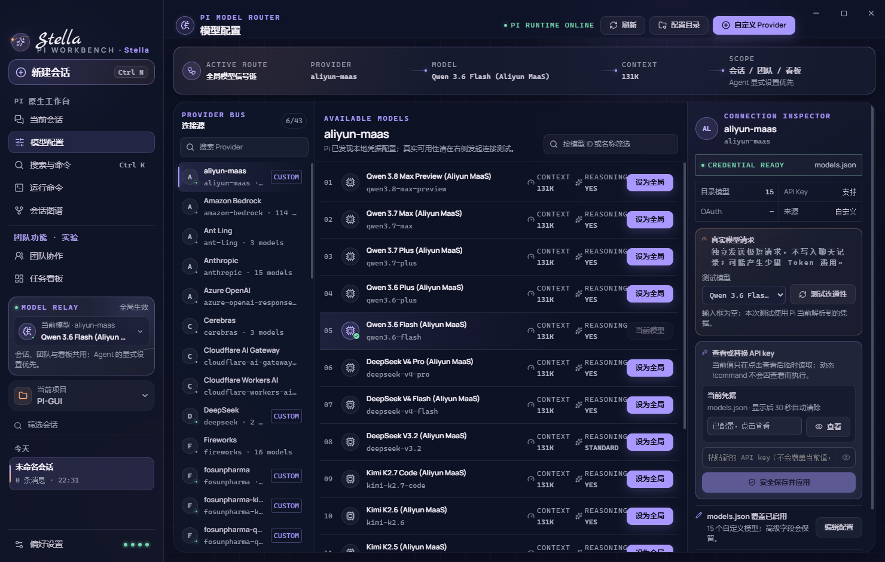
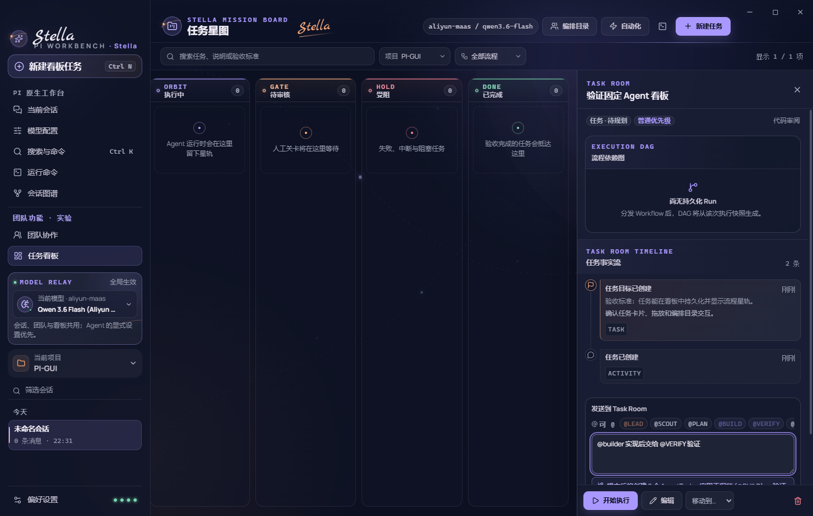
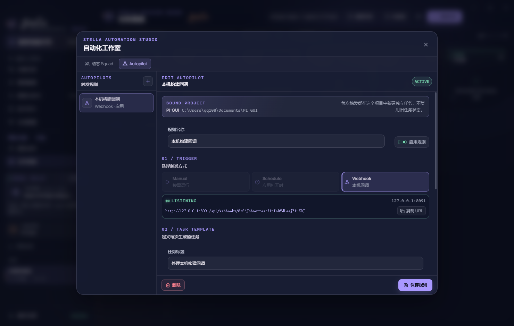
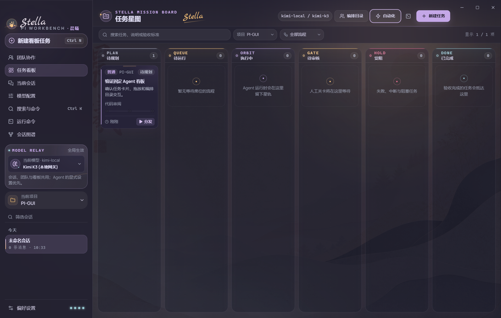
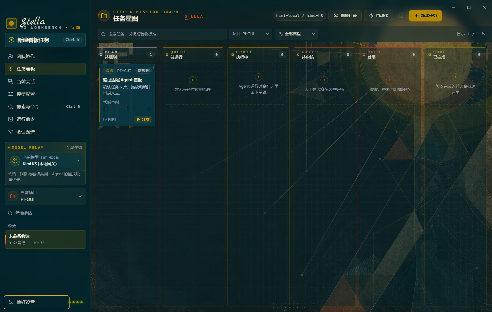
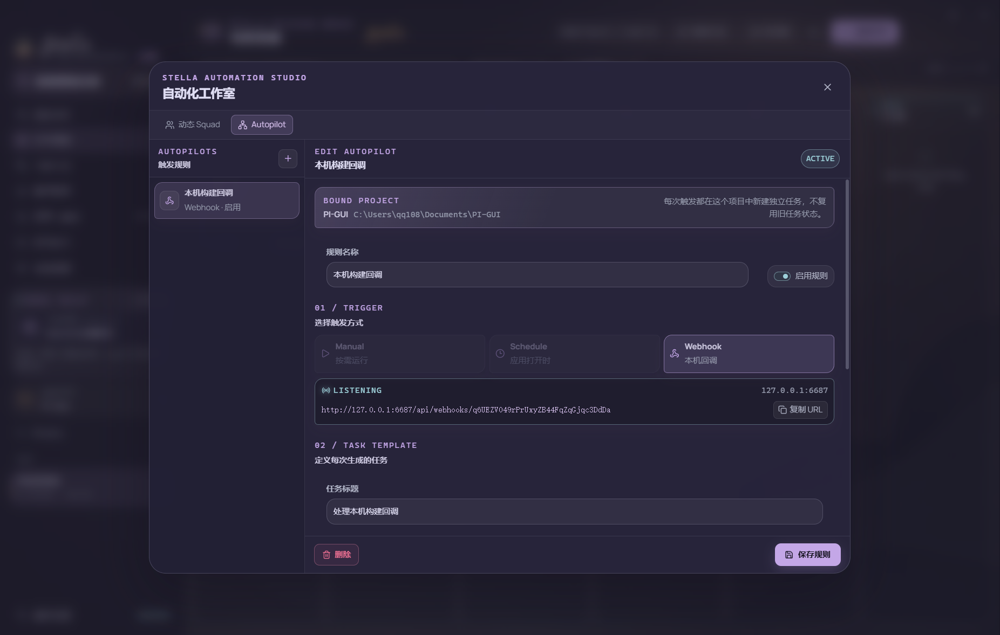
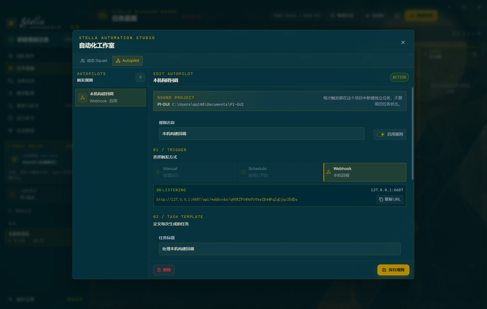

# Stella Pi Workbench

[English](README.md) | **简体中文**

> **Pi 原生桌面工作台 + 本地多 CLI Agent 控制面。** 在同一个应用里完成真实 Pi 会话、Pi/Codex/Claude 任务执行、外部 CLI 活动查看、任务看板、人工验收、产物与自动化。

Stella 是为 [earendil-works/pi](https://github.com/earendil-works/pi) 打造的 local-first Electron 工作台。它直接运行安装包内置的 Pi JSONL RPC，不模拟 Agent 回复，不绕开 Pi 的会话、模型、Skill 或扩展系统。Pi 原生工作台默认可独立使用；Team、Kanban、Workflow、Autopilot 以及用户本机可选安装的 Codex/Claude CLI 组成具有独立故障边界的第二能力面。

这已经不是一个“Pi 皮肤项目”。八套可替换主题仍然保留，但它们只是统一产品体验的表现层；项目主体是一个可安装、可审计、可恢复的本地 AI 工作台。Stella 也不复刻 Multica 或 AgentTeams/HiClaw 的服务端栈，而是在单机边界内吸收其 Issue/Attempt、Room/Leader/Worker、显式触发、依赖调度与结果验收思想。

## 产品定位

| 能力面 | 用户得到什么 | 架构边界 |
| --- | --- | --- |
| **Pi 原生工作台** | 聊天、会话树、模型与 Provider 配置、思考级别、扩展、Skills、终端、附件和本地产物预览 | 直接使用真实 Pi RPC；无需创建 Task，也不依赖 Team 功能 |
| **Agent 团队控制面** | 任务启动台、Task Room、Kanban、LEAD / Worker 委派、Squad、Workflow DAG、执行图、人工验收、Autopilot 与 Pi/Codex/Claude Profile | Stella 负责确定性状态、调度与审计；受管执行走类型化 Backend，外部 CLI session 只做只读投影 |
| **桌面体验层** | Windows/macOS 安装包、全局模型可见性、响应式三栏布局、八套主题与可替换背景 | 主题不进入领域模型，不改变执行语义 |

团队功能默认隐藏，可在“偏好设置 → 功能页面”开启；关闭只隐藏入口，不删除任务历史。数据保存在本机，凭据继续使用 Pi 标准配置目录，不引入 PostgreSQL、Redis、远程控制面或常驻 Daemon。


当前 Team 改进的完整上游证据、采用/拒绝矩阵和固定提交链接见 [`docs/research/team-multica-hiclaw-2026-08.md`](docs/research/team-multica-hiclaw-2026-08.md)；已实现的不变量与后续 Room/Plan DAG 边界见 [`docs/specs/stella-team-reliability-v1.md`](docs/specs/stella-team-reliability-v1.md)、[ADR 0005](docs/adr/0005-dependency-aware-agent-task-scheduling.md) 和 [ADR 0006](docs/adr/0006-use-one-typed-coordinator-protocol-for-team-leaders.md)。

## Pi 模型路由与配置

左侧“模型配置”提供一套独立的 Pi Model Router，不要求先进入聊天页，也不另外维护一份模型数据库。页面直接读取安装包内置 Pi 的 Provider catalog、`get_available_models` 结果以及接收者自己的标准 Pi 配置目录：

- **全局模型信号链**：始终显示 `Provider → Model → Context → 会话 / 团队 / 看板`；只允许选择 Pi 当前真实返回的可用模型。左侧 `MODEL RELAY` 仍在全部页面显示同一个当前模型，Agent 的显式模型设置优先。
- **Provider 配置状态**：区分 `auth.json`、环境变量、`models.json` 内联配置与 OAuth，并明确把“本地凭据已配置”和“远端请求已验证”分开，避免把找到 Key 误报成已经连通。
- **API Key 查看与管理**：初始化和刷新快照永不携带密钥；只有用户点击“查看当前 API Key”后，主进程才通过仅允许主窗口调用的独立窄 IPC 临时返回一次，并在隐藏、切换 Provider、保存或 30 秒后从页面清除。OAuth 访问令牌不回显；为避免一次“查看”产生本机命令副作用，`auth.json` / `models.json` 中以 `!command` 配置的动态凭据只允许测试、不会被查看操作执行或显示。新 Key 可先在内存中测试，再写入 Pi 标准 `auth.json`；替换时保留 Provider 专属 `env` 配置，也可以显式清除已保存凭据。
- **真实连通测试**：可为 Provider 选择具体模型，发送一条独立的极短模型请求并显示成功/失败、实际模型、耗时和测试时间。测试不进入聊天历史、不改变全局模型、不重启当前 Pi RPC；输入框中的新 Key 仅作为本次请求的临时覆盖，空白时使用 Pi 当前凭据。兼容端点返回的错误正文可能回显认证信息，因此主进程只返回脱敏后的结构化诊断，不把原始正文送入页面。测试可能产生极少量 Token 费用。
- **URL / Key 发现模型**：新建或编辑 Provider 时，可由主进程按协议请求远端模型目录；支持 OpenAI / Responses 的 `data[]`、Anthropic 兼容目录，以及 Gemini `models[]` 多页结果。新 Key 只在内存中用于发现，留空可使用 Pi 已保存的 API Key；结果支持搜索、逐项或批量加入与移除，并把远端明确返回的上下文、输出上限和图像能力带入表单。目录成功不等于模型可推理，保存后仍需执行上面的真实连通测试；未开放 `/models` 的端点会明确返回 404，并保留手工添加 Model ID 的路径。
- **自定义端点与模型**：受约束表单支持 `openai-completions`、`openai-responses`、`anthropic-messages` 与 `google-generative-ai`，可维护 Base URL、Bearer Header、模型 ID、Context、最大输出、推理和图像输入。已有 `headers`、`compat`、`modelOverrides`、内联密钥及其它高级字段原样保留。
- **明确应用语义**：保存后重载真实 Pi RPC，并恢复同一个 session identity；已有 JSONL 时使用 `sessionFile`，空会话尚未写盘时使用精确 session ID。“已保存”“本地已配置”“连通已验证”是三个独立状态，配置、重载或测试失败都会明确显示。OAuth/订阅登录仍由 Pi 的交互式 `/login <provider>` 流程负责。



## 当前会话文件预览

Pi 在回复中给出绝对本地文件路径后，“输出文件与路径”卡片会显示“预览”。点击后不离开聊天，也不覆盖输入器，而是在应用右侧打开只读文件栏；原有会话检查器会暂时收起。右栏左侧汇总当前 session 中 Assistant 明确交付的全部路径，Windows 路径不区分大小写去重，并按最后一次提及时间倒序排列，可直接切换文件。切换 session 会关闭旧 session 的预览，不会把产物列表串到新会话。

支持范围：

- 图片：PNG、JPEG、GIF、WebP、AVIF、BMP、SVG；SVG 会先移除脚本、事件处理器与外部引用。
- 网页与文本：HTML、Markdown、JSON、CSV、TSV、XML、YAML 和普通文本；HTML 在无脚本 sandbox 中显示，表单、网络请求、外部资源和嵌入对象被隔离，Markdown 链接仍由 Stella 的受控外链入口打开。
- PDF：使用 Electron / Chromium 内置的本地 PDF 阅读器，不引入 PDF.js 或 Office 插件。
- Word：DOCX 使用 [docx-preview](https://github.com/VolodymyrBaydalka/docxjs) 按页呈现文字、表格和常见样式；不执行 AltChunk、批注、修订或嵌入程序。
- PowerPoint：PPTX 使用 [@jvmr/pptx-to-html](https://github.com/javier-mora/pptx-to-html) 转为隔离 HTML 幻灯片，并在解析前规范化合法的 OOXML 包根关系路径；支持逐页切换，不执行动画、宏和嵌入式程序。
- Excel：XLSX / XLSM 使用 [@office-kit/xlsx](https://github.com/office-kit/xlsx) 读取工作表、合并单元格、行列尺寸、隐藏行列和常见单元格样式；支持工作表与大范围分页切换，不执行宏。旧二进制 `DOC / PPT / XLS` 不伪装为可预览，仍可通过“所在位置”交给用户选择系统应用。

Word、PowerPoint 和 Excel 解析器均为动态导入，普通聊天启动不会加载这些代码。主进程在每次预览前重新校验 canonical path，只允许读取当前项目、Pi 数据目录或 Stella 应用数据目录内的普通文件；文件不会上传。工具栏提供缩放、刷新、铺满窗口、系统打开（安全类型）、打开所在位置和复制完整路径。

## Session 上下文压缩

Stella 直接使用 Pi 的自动/手动 compaction，不维护第二份会话摘要。手动压缩只有在当前回复以及 steering / follow-up 队列全部完成后才可执行，因为 Pi 的原生手动 `compact` 会先中止正在进行的 Agent 操作；并发的手动压缩也会被拒绝。

压缩使用独立的 10 分钟 RPC 超时，不再复用普通命令的 2 分钟超时。成功后会显示 Pi 返回的压缩前与预计压缩后 Token；自动压缩失败会进入当前 session 的可见通知，不再静默失败或让检查器长期停留在压缩状态。

| 环境变量 | 默认值 | 作用 |
| --- | --- | --- |
| `STELLA_PI_COMPACTION_TIMEOUT_MS` | `600000` | 手动压缩 RPC 超时；设为 `0` 可关闭该超时 |

## 多 CLI 任务与外部活动 · v0.5.0

自动 Task 现在把“推进方式”和“执行环境”分开选择：

| Profile | 受管用途 | 边界 |
| --- | --- | --- |
| `pi.rpc` | 单 Agent、Workflow、Worker mention、LEAD/Coordinator、Squad 与 Pi Skills | 安装包内置，完整保留 Pi RPC/session 语义 |
| `codex.exec` | 单 Agent、普通 Workflow step 与 Worker mention | 使用 `codex exec --json`，记录 Thread、工具、最终消息、用量、退出与中止 |
| `codex.review` | Git 仓库中的只读直接审阅 Agent | 不允许写 Agent、Workflow、Squad 或 Coordinator 使用 |
| `claude.print` | 单 Agent、普通 Workflow step 与 Worker mention | 使用 Claude print `stream-json`，记录 session、工具、result、用量、退出与中止 |

LEAD、Coordinator、Squad 以及依赖 Pi Skills 的 Agent 继续固定使用 `pi.rpc`。Codex 与 Claude 是用户本机可选安装的外部 CLI；偏好设置会显示解析路径、版本、登录状态以及重试/指定路径操作。CLI 缺失或未登录时只禁用对应 Profile/Source，不影响 Pi 与看板。

看板顶部新增 **Stella Tasks / CLI Tasks / 全部** 三种视图：

- **CLI Tasks** 通过 Claude `agents --json --all` 与 Codex App Server `thread/list` 显示来源自有的只读活动；卡片不能拖拽、编辑、评论、分发或验收。
- Codex CLI、Exec、App Server 与 Sub-agent Thread 显示状态、waiting flag、cwd、父关系，并按需读取 Turn 详情；Claude Agent 显示官方状态与进程形态。
- 只有外部视图可见时才轮询。单个 Source 刷新失败会保留自己的最后成功快照并标记 stale，不清空另一 Source。
- “导入为 Task”创建带不可变 external origin 的独立手工 Task；外部状态不会移动它。已由 Stella 管理或已导入的 session 会链接现有 Task，不产生第二个状态所有者。
- **全部**视图在正常 lanes 上方放置紧凑外部活动带，并去除已由 Stella 管理的重复卡片；纯外部视图仍保留它们用于核对原生状态。

Stella 不捆绑 Codex/Claude、不读取其私有状态目录，也不会把外部 CLI 的 `done` 当成 Task 验收。Pi session 压缩仍完全使用原生 Pi 语义，不受多 CLI 层影响。

## v0.5.0 的简单架构

Stella 不复制 Multica、HiClaw 或外部聊天平台，也不引入 PostgreSQL、Redis、远程后端和常驻 Daemon。整个本地控制面仍是一个 Electron 应用、一份 `board.json` 和真实 Pi 子进程，但把最容易混淆的事实拆开：

- **独立 Capability Health**：Pi、Task、Schedule、Webhook 分别处于 `loading / ready / degraded / error`；Board 损坏不会挡住 Pi，Pi 启动失败也不会挡住任务历史，Webhook 端口冲突只停 Webhook。
- **确定性 Task 状态机**：Task 阶段只由 Stella 的持久化事件推进：分发为 `queued`，真实执行为 `running`，人工关卡或 Agent 报告为 `review`，失败/中断/驳回为 `blocked`，请求修订回到 `planned`，用户接受报告后才进入 `completed`。模型文本本身没有移动卡片的权限。
- **派生 Agent Presence**：Agent 定义仍是不可变角色配置；Team Pulse 从 Workflow Run、StepRun 与 AgentTask 计算“可用 / 排队 / 执行中 / 等待 / 需处理”，不会保存一份可能与真实运行漂移的 Agent 状态。
- **明确验收**：Agent 返回结果只会成为 `reported + pending acceptance`。用户可以接受、请求修订或拒绝；决定、说明、时间与对应 Task 状态转换会进入同一条事实记录。
- **唯一执行尝试**：Task 每次重新分发都会递增 `executionAttempt`，并只允许 `awaitingReviewExecution` 指向的一次 Workflow Run 或根 AgentTask 改变验收状态。更早的 pending 报告会明确成为 `superseded`，不能在新一轮执行后把卡片错误改回完成。
- **不可变任务规格**：用户每次实际修改目标、说明、优先级、验收标准或执行目标时递增 `specRevision`；每个根执行保存 `TaskSpecSnapshot`。旧 Runtime 即使迟到，也不能用旧规格覆盖当前任务。
- **冻结团队计划**：Coordinator 和 Squad 在分发时保存名称、版本、Leader 指令及成员 Agent 快照；运行期间修改 Squad 或 Agent 只影响下一次分发，不会追溯改变正在执行的委派范围。
- **共享 Workspace Admission**：Interactive Pi、Workflow 和 AgentTask 共用按 canonical real path 识别的写 Lease。后台写任务 FIFO 等待；Interactive Pi 遇到后台写者会显示具体占用者；取消任务会取消尚未获得 Lease 的等待。
- **实时项目权限**：后台 Runner 每次启动真实 Pi 前重新读取项目当前 trust，永不复用 Task 中陈旧的授权快照。切换为受限模式会同步 Task/Autopilot 并中止该项目仍在运行或排队的执行；主进程也拒绝从隐藏的旧项目 Task Room 修改任务。
- **显式 Pi↔Task 桥接**：只有开启团队功能后，Pi 顶栏才显示“固化为任务”；它只打开可编辑草稿，用户保存后才创建 `planned` Task。Task 中的“在 Pi 中继续”只打开用户选定且经主进程校验属于该 Task 的 session。普通 Pi 操作不会生成任务。
- **无第二套消息系统**：Task Room 是 Task、Message、Activity、Run、Step、AgentTask 和 Artifact 的纯时间线投影。所有条目保留 Run / Step / AgentTask 来源 ID。
- **一个 Team Chat 入口**：左侧“团队协作”不是另一套聊天数据库；左栏永久保留“任务启动台”，填写可验证的验收标准并指定恰好一个负责人。`@LEAD` 原子创建 Task、首条消息和 Coordinator；明确的 `@Worker` 则创建 direct AgentTask。成功后自动进入新 Task Room，右栏显示从执行事实派生的 Team Pulse。
- **无第二套执行引擎**：可视化 DAG 是历史 Workflow snapshot 与 StepRun 的只读投影；选点可查看 Agent、目标、错误、Artifact 和 session，不会反向修改执行状态。




团队协作默认进入常驻的“任务启动台”，不要求先打开看板建卡：输入 `@` 可查看当前项目可用 Agent；复杂、跨职责或尚需拆解的任务选择 `@LEAD`，边界和负责人都明确的任务可直接选择一个 `@Worker`。写明目标与必填验收标准、确认影响预览后，Stella 原子创建 Task、首条消息和第一个 AgentTask，再自动进入新 Task Room。后续可继续 `@Worker`、回答 LEAD 的澄清问题、查看依赖与委派轮次，并验收报告。团队页顶部、侧栏和 `Ctrl/Cmd + N` 都回到同一启动台；需要预先选择优先级、固定 Workflow 或 Squad 时，从“任务看板”使用结构化新建任务。

## 任务看板与固定 Agent 团队

看板不是对其他项目的复刻，也不是把聊天记录换成卡片。Stella 持有可恢复的流程状态，兼容步骤由用户选择的 Pi/Codex/Claude Profile 执行，再把归一化 Agent 事件、工具活动、最终产物、失败、session identity 和人工决定写回任务星图。

内置六个通用的带版本执行角色；医药早研场景另有四个领域角色：

| Agent | 权限 | 固定职责 |
| --- | --- | --- |
| **通用调度负责人 / LEAD** | 只读 | 澄清目标、拆解任务、委派 Worker，并在成员报告后验收、修订、重新规划或追问用户 |
| **项目侦察员 / SCOUT** | 只读 | 调查代码、约束、影响面和验证入口 |
| **方案规划师 / PLAN** | 只读 | 把侦察事实转化为可执行方案 |
| **实现工程师 / BUILD** | 可写 | 依据批准方案修改真实项目 |
| **验证工程师 / VERIFY** | 可写 | 运行测试、类型检查或构建并暴露失败 |
| **代码审阅者 / REVIEW** | 只读 | 独立检查正确性、回归、安全和验收标准 |

这些角色组合成“交付小队”“故障修复组”“审阅双人组”，并提供三条固定流程：

- **功能交付**：侦察 → 规划 → 方案人工确认 → 实现 → 验证 → 审阅 → 最终人工验收。
- **缺陷修复**：复现 → 根因诊断 → 修复人工确认 → 实施修复 → 回归验证 → 审阅 → 修复验收。
- **只读审阅**：上下文侦察 → 独立审阅 → 人工确认，全程不向项目写入文件。

每次分发都会保存流程和 Agent 的版本快照；后续修改模板不会改变历史记录。同一 canonical 工作区的所有可写 Pi/Agent 通道共享排他 Lease，避免 Interactive Pi、Workflow 与 AgentTask 同时修改相同目录。只有工具策略经验证为不可写的角色才按只读处理。应用在流程执行中退出时，重启后会把未完成运行明确标记为“已中断”，不会伪造成功。

看板交互包括：创建与编辑任务、项目/流程筛选、搜索、原生拖放、分发与重新分发、Task Room、只读 DAG、实时星轨进度、Agent 与工具事件、Markdown 产物、会话文件定位、人工批准/驳回、执行报告验收、中止流程、手动归档、删除，以及 Agent/团队/流程目录。看板列由上述确定性状态机推进；用户仍可在没有活动执行时显式移到“待规划、受阻、已完成”，而模型输出不能越过状态机直接改卡片。

## 医药早研靶点评估示例与 E2E

仓库包含一个可直接复跑的 NLRP3 早研竞品分析场景，用于回答“是否启动口服、脑穿透、选择性 NLRP3 小分子抑制剂用于早期帕金森病炎症富集人群的正式发现项目”。示例把三个项目级医药 Skill 固化在 [`examples/pharma-early-research/.pi/skills`](examples/pharma-early-research/.pi/skills) 中：

- `target-evidence`：采集并保存 Open Targets、Human Protein Atlas 和 ChEMBL 靶点证据。
- `clinical-landscape`：检索 ClinicalTrials.gov，按资产去重，并保留终止、撤回与状态更新时间。
- `target-assessment-report`：按固定评分卡生成决策报告并执行独立证据审计。

内置“早研靶评小队”由靶点生物学研究员、临床竞品分析师、靶点策略负责人和证据审计员组成；“早研靶点评估流程”依次执行靶点证据、竞品扫描、证据范围人工确认、决策报告、独立审计和组合评审。每个领域 Agent 都声明 `requiredSkills`。主进程先使用 Pi 的真实 Resource Loader 做分发前预检，再在 Runtime 启动后核对精确的 `skill:<name>` 命令；Skill 缺失、被禁用或不在当前 trust 边界内都会显式失败，不会先建孤儿队列，也不会退回模板报告。

开发仓库中的示例项目已经自带这些 Skills，不要求全局安装。Windows/macOS 安装包不会擅自修改接收者的 Pi 用户目录；在其他医药项目复用时，把三个 Skill 目录随项目放入 `<项目>/.pi/skills/`，或显式安装到 Windows 的 `%USERPROFILE%\.pi\agent\skills\` / macOS 的 `~/.pi/agent/skills/`。应用内置的 Workflow 在预检失败时会列出确切的缺失 Skill。

页面使用方式：

1. 启动 Stella，选择 `examples/pharma-early-research`，并在项目权限提示中选择“信任加载”。
2. 进入“任务看板 → 编排目录”，确认四个医药 Agent、早研靶评小队和早研靶点评估流程可见。
3. 新建任务，选择“固定流程 → 早研靶评”，填写靶点、适应症、模态、竞品边界和验收标准，然后开始执行。
4. 在 Task Room 阅读两个证据产物，在“证据范围确认”批准后等待报告与审计；在可视化 DAG 中检查节点状态和来源，再完成“组合评审”和“接受报告”。


完整测试输入、失败路径和通过标准见 [`examples/pharma-early-research/TEST_PLAN.md`](examples/pharma-early-research/TEST_PLAN.md)，固定证据快照与正式报告位于 [`examples/pharma-early-research/evidence/raw`](examples/pharma-early-research/evidence/raw) 和 [`examples/pharma-early-research/reports/nlrp3-target-assessment.md`](examples/pharma-early-research/reports/nlrp3-target-assessment.md)。快速页面测试不调用模型；真实测试会调用已配置的 Pi 模型和外部官方数据源：

```bash
# Skill 预检、编排目录、页面建任务与待执行 DAG
npm run test:e2e:pharma

# 四个真实 Agent、两个人工关卡、证据文件、报告、审计与最终验收
npm run test:e2e:pharma:live
```

## AgentTaskQueue、动态 Squad 与 Autopilot

Stella 在固定看板之上增加了一层刻意保持简单的本地自动化，不引入 PostgreSQL、外部 Daemon 或第二套后端服务：

- **依赖感知 AgentTaskQueue**：任务可直接交给单个 Agent，也可由 Coordinator 按轮次委派。排队、依赖、队列位置、运行、会话路径、最终输出、token、费用、失败和中断都会写入或投影自 `board.json`。调度采用“优先级 + 无上限等待老化 + 稳定持久顺序”，高优先级先行，同时避免低优先级永久饥饿；子任务只有在父任务进入等待成员状态后才可运行。
- **任务启动台**：团队协作首页始终存在一个项目级 Launchpad。填写必填验收标准并发送一个明确的 `@Agent + 目标` 后，主进程在同一事务中创建普通优先级 Task、确定性标题、首条用户消息和首个 AgentTask；`@LEAD` 进入结构化协调，`@Worker` 直接执行。任一校验失败都不会留下孤儿 Task。启动成功后消息只存在于新 Task Room，不维护第二份大厅聊天记录。
- **评论与 `@mention` 委派**：Task Room 输入 `@` 会展开当前任务真正可用的 Agent 名册，可按中文名称、职责、呼号或 id 检索，也可用方向键与 Enter / Tab 完成选择；输入框上方的快捷呼号与 Team Pulse 成员卡都能直接插入稳定的 `@CALLSIGN`。候选项同时显示实时 Presence、读写权限和必需 Skills。精确 `@builder` / `@BUILD` 仍可直接输入并生成真实 AgentTask；提交前会显示将创建的任务数量和委派顺序。未知、歧义或超出当前项目 / Squad 范围的 mention 会整体拒绝，不留下半条消息或半组队列。
- **`@lead` Coordinator**：`@lead` 启动通用调度负责人，并与直接 Worker 委派保持互斥；一条消息不能同时选择 LEAD 和 Worker。LEAD 必须把内置的终止型 `coordinator_action` 工具作为该回合最后动作，并提交 `delegate / request_revision / replan / complete / ask_human` 之一；Stella 校验 TypeBox schema、执行计划快照、Agent 范围和所需 Skills 后才创建真实子任务。成员报告后会再启动一个 LEAD 验收回合，而不是直接把父任务判为完成；`ask_human` 会停在 Task Room，普通用户回复会唤醒下一回合。自然语言、手写 JSON 或自然语言里的 `@mention` 都不会被当成已委派。
- **项目级 AgentDraft**：Team Pulse 的“创建 Agent”可为当前项目保存自定义角色、呼号、职责、固定指令、Skills、thinking 与工具权限。只读 Agent 禁用 `bash/edit/write`；可写 Agent 必须由用户明确勾选确认。创建后可直接 `@CALLSIGN`，也可由 LEAD 选择，其他项目不可调用。
- **动态 Squad**：保留固定 Leader + 成员目录能力，以兼容显式 Squad 工作流。Squad 带版本和明确的 `global / project` 作用域；包含项目 Agent 的 Squad 只能被同一项目的 Task/Autopilot 使用。Squad Leader 与 LEAD 共用终止型 `coordinator_action`，自然语言中的 mention 不产生控制副作用。某个 Worker 失败只结束该 Worker；同轮兄弟继续，全部终态后由 Leader 结合成功与失败报告明确修订、重规划、追问或完成。
- **Autopilot**：把“任务模板 + 当前项目 + 执行目标”固化成 Manual、Schedule 或 Webhook 规则。每次触发都会新建独立 Task 和审计记录，然后进入同一套真实分发路径，不复用旧任务状态。



Schedule 仅在 Stella 应用打开期间运行。`nextRunAt` 会持久化；若启动时发现停机期间已有计划到期，Stella 只写入一条 `missed` 审计并推进到第一个未来时间，不批量补跑，也不声称自己在后台在线。

Webhook Server 只绑定 `127.0.0.1`，默认端口为 `43127`。创建 Webhook 规则时会生成随机 token，自动化工作室会显示监听状态并提供完整 URL 的复制按钮。本机脚本可直接发送 JSON object：

```bash
curl -X POST "http://127.0.0.1:43127/api/webhooks/<从自动化工作室复制的随机 token>" \
  -H "Content-Type: application/json" \
  -d '{"ref":"refs/heads/main","action":"verify"}'
```

成功响应为 HTTP `202`，包含真实 `autopilotId`、`runId` 和 `taskId`；无效 method、route、token、Content-Type、UTF-8、JSON 或超限请求会返回结构化 JSON 错误。若任务分发失败，HTTP 不会返回成功，失败原因仍会保存在对应审计中。payload 同时保存在审计上下文并附加到新任务说明。

可用环境变量：

| 变量 | 默认值 | 说明 |
| --- | --- | --- |
| `STELLA_WEBHOOK_PORT` | `43127` | 固定监听端口，必须是 `1..65535`；冲突会在界面显示 `BIND ERROR`，不会随机换端口。 |
| `STELLA_WEBHOOK_MAX_BYTES` | `1048576` | JSON 请求体上限（bytes）；设为 `0` 可显式取消大小限制。 |

Webhook 与 Schedule 都随桌面应用启动和关闭；它们不是公网服务，也不会在 Stella 退出后继续运行。

## 八套完整皮肤

皮肤切换不只是换主色：每套视觉都会同步改变背景主视觉、色彩令牌、面板材质、边框与圆角、品牌符号、空状态图形、建议卡片和输入器；明色、暗色与系统模式仍可独立组合。

| 皮肤 | 视觉方向 | 开源参考 |
| --- | --- | --- |
| **Stella · 夜航星图** | 鸢尾星轨、柔光玻璃、暖色手写签名 | [Codex-Dream-Skin](https://github.com/Fei-Away/Codex-Dream-Skin)、Codex 的信息层级 |
| **晨曦 · 纸上初光** | 雾面纸艺、山岚层叠、杏色晨光 | [Rosé Pine Dawn](https://github.com/rose-pine/rose-pine-theme) 的柔和色阶 |
| **定阳 · 日晷制图** | 矿物版画、太阳刻度、几何秩序 | [Solarized](https://github.com/altercation/solarized) 的明暗关系、[Trianglify](https://github.com/qrohlf/trianglify) 的算法几何构成 |
| **旭日 · 海上金轮** | 朱砂日轮、矿物山海、克制金箔 | 浮世绘构图与矿物金色阶的公开视觉传统 |
| **月华 · 银蓝月湖** | 月路、流云、冰晶花影 | 水墨留白与月光玻璃材质 |
| **黑曜夜契 · 雨夜契约** | 维多利亚银器、雨夜庄园、深红玫瑰 | Victorian Gothic 与 Dark Academia 视觉语言 |
| **绮旅黄金 · 彩町漫游** | 粉紫街町、意式金饰、高对比漫画色 | Chromatic Pop 与 Italian Gold 色彩研究 |
| **棋境 · 月下手谈** | 黑白棋子、银杏墨雾、古老棋枰 | 围棋棋枰、银杏与水墨构成 |


所有皮肤保留相同信息结构，同时采用不同视觉语言。以下截图展示晨曦与定阳的看板适配：





自动化工作室同样适配全部视觉，而不是独立的管理后台：





七张可替换背景图均为本项目生成的原创、AI 辅助视觉资源；晨曦与定阳分别带有专属中文题字。开源项目只用于设计研究，没有复制其图片资产或打包其运行代码。逐文件来源与授权见 [`ASSET-LICENSES.md`](ASSET-LICENSES.md)；三个早期内部皮肤 ID 为兼容已保存偏好而保留，不代表第三方联名或官方授权。

## 已覆盖的交互

- 任务看板：六阶段任务星图、跨项目筛选、搜索、流程过滤、拖放、详情、编辑、删除和状态归档。
- 团队协作：左侧永久任务启动台与 Task Channel、中间启动输入器或完整 Task Room、右侧可收起 Team Pulse；支持从零选择一个 `@LEAD` 或 `@Worker` 创建任务、可检索 Agent 名册、键盘 mention 选择、Team Pulse 一键 @、LEAD 追问恢复和项目 AgentDraft，并提供“全部 / 待我处理 / 执行中”频道投影。
- Task Room：目标、用户消息、系统回执、Agent 输出、Run/Step/AgentTask 状态、Artifact 与验收决定的单一时间线投影。
- 可视化 DAG：历史 Run 切换、步骤依赖、六种节点状态、键盘选点，以及 Agent、目标、错误、Artifact 与 session 详情。
- Pi↔Task：当前会话固化为可编辑任务草稿、来源 identity、执行 session 显式续接和后台 session 历史隔离。
- Capability Health：Pi、Task、Schedule、Webhook 独立状态、原始错误和单独重试。
- 本地任务队列：直接 Agent 分发、任务评论、精确 `@mention`、依赖感知公平调度、稳定队列位置、真实产物与运行统计；当前 Runner 如实保持单执行器，不伪装并行。
- LEAD Coordinator：终止型 `coordinator_action` 工具协议、真实委派、成员报告后的复核回合、请求修订/重新规划/追问用户，以及无自然语言或手写 JSON 隐式分发。
- 动态 Squad：Leader 提示词、成员目录、统一结构化 Coordinator 协议、委派轮次、Worker 局部失败、Leader 汇总恢复与父子执行轨迹。
- Agent 执行图：按当前根执行展示 Coordinator、委派轮次、Worker 与 Leader 验收节点，并显示状态、依赖等待、队列位置和原始错误。
- Autopilot：Manual、应用打开期间的 Schedule、loopback Webhook、启停、绑定项目、fresh Task 和触发审计。
- 固定编排：六个通用 Agent、四个医药 Agent、内置团队与流程、版本快照、隔离 Pi 会话、项目写入互斥与真实运行事件。
- 人工关卡：方案批准/驳回、最终验收、决定说明、流程中止、失败原因与可重新分发的历史实例。
- 流程产物：保留每个 Agent 的最终 Markdown、Pi 会话路径、输入/输出 token 与费用统计。
- 真实 Pi RPC：提示词、图片、流式消息、steer / follow-up 队列、停止生成、可中止的自动重试与上下文压缩。
- 全局模型、Provider 配置与思考级别：左侧 `MODEL RELAY` 在全部页面始终显示同一个 Pi 当前模型；独立“模型配置”页可检查鉴权来源、按需临时查看 API Key、用指定模型真实测试连通、安全写入/清除 `auth.json` 凭据、维护 `models.json` 自定义 Provider/模型并从 Pi 真实可用目录切换全局路由。未声明模型覆盖的 Agent、LEAD、Squad 和 Workflow 步骤继承该选择，项目 Agent 的显式 Provider/Model 设置优先；会话页支持 `off` 到 `max` 的完整思考级别。
- 会话：新建、切换、搜索、重命名、克隆、从历史消息分叉、树状分支查看、HTML 导出。
- 工具过程：流式展示 tool call、参数、实时结果、错误和活动时间线。
- 本地命令：在当前工作目录执行 Pi `bash` 命令，支持取消、历史导航、截断输出定位。
- 编辑器：Enter 发送、Shift+Enter 换行、图片添加/预览/移除、斜杠命令、建议卡片与快捷键。
- 会话文件：Assistant 交付路径识别、右侧只读预览、session 内多文件按时间倒序切换、图片 / HTML / Markdown / 文本 / PDF / DOCX / PPTX / XLSX / XLSM 内容与常见样式，以及系统打开、所在位置和复制路径。
- 扩展 UI：`select`、`confirm`、`input`、`editor`、请求超时、通知、状态、编辑器上下组件、窗口标题与草稿注入。
- 项目权限：检测项目级 `.pi` 资源，在“信任加载”和“受限打开”之间明确选择。
- 桌面体验：首次项目选择、无边框窗口控制、命令面板、检查器、终端抽屉、八套可选皮肤、深色/浅色/跟随系统、14/16/19px 全局字号、紧凑密度、响应式侧栏与 Team Pulse、焦点闭环和减少动态效果。

## 运行

要求 Node.js `>= 22.19.0`。Pi 的模型、认证、扩展、技能和用户设置沿用其标准用户目录；“模型配置”页写入的也是该目录下 Pi 原生的 `auth.json` / `models.json`，不会生成 Stella 专属凭据副本。

```bash
npm install
npm run dev
```

生产构建与本地预览：

```bash
npm run build
npm run preview
```

## Windows / macOS 安装包

安装包采用“内置 Pi 运行时、复用用户配置”的结构。`@earendil-works/pi-coding-agent@0.84.2` 及其生产依赖会随 Stella 一起进入安装包，主进程使用 Electron 自带的 Node 运行内置 RPC 入口，因此接收者的全局 `pi` 命令安装在哪里、有没有加入 `PATH`，都不会影响 GUI 启动。Codex 与 Claude 是可选外部 CLI，明确不进入安装包。

接收者自己的配置、认证、会话、扩展和技能仍从 Pi 的标准用户目录读取：

- Windows：`%USERPROFILE%\.pi\agent`
- macOS：`~/.pi/agent`
- 若设置了 `PI_CODING_AGENT_DIR`，Pi 会改用该目录。

不要把开发者自己的 API Key、OAuth 凭据或 `.pi/agent` 目录放进安装包。没有单独安装 Pi CLI 的用户也能启动 Stella，但首次调用模型前仍需配置自己的提供方凭据。

看板状态存放在 Electron 的用户数据目录下 `board/board.json`，与被打开的代码仓库分离，因此不会向他人的项目写入 Stella 配置。旧 schema 升级时会先在同目录创建时间戳备份，再按 v1→v9 的确定性迁移链完整保留历史。v8 增加不可变执行 Profile/session 快照与 external origin；v9 增加 execution workspace 偏好与实际 placement 快照，并把旧执行确定性迁移为 `current-folder`。迁移不重写既有 Pi 历史。无法安全恢复的旧 Coordinator 会明确终止并写入迁移活动，而不是伪装继续执行；内置角色不硬编码 API Key、模型或本机 CLI 路径。

### 本机打包

```bash
# 只生成当前系统的未安装目录，适合做打包后冒烟测试
npm run package:dir
npm run test:packaged

# Windows x64 NSIS 安装程序
npm run dist:win

# Windows ARM64 安装程序
npm run dist:win:arm64

# Intel Mac：DMG + ZIP
npm run dist:mac:x64

# Apple Silicon Mac：DMG + ZIP
npm run dist:mac:arm64
```

产物统一写入 `release/`，文件名包含版本、系统与架构，例如：

```text
Stella Pi Workbench-0.5.0-win-x64.exe
Stella Pi Workbench-0.5.0-mac-x64.dmg
Stella Pi Workbench-0.5.0-mac-arm64.dmg
```

本地构建完成后运行以下命令生成当前产物的 SHA-256 清单：

```bash
npm run release:checksums
```

清单写入 `release/SHA256SUMS.txt`。GitHub Actions 会为各平台分别生成并上传带平台后缀的校验清单，避免使用与当前二进制不匹配的历史哈希。

macOS 签名只能在 macOS 上完成，因此不要在 Windows 上交叉生成正式 Mac 发布包。项目包含 [GitHub Actions 发布流程](.github/workflows/release.yml)，会分别在 Windows x64、macOS Apple Silicon 和 macOS Intel 主机上安装目标架构依赖并打包。

### 签名、公证与 Release

手动运行 `Build installers` 工作流会生成可供内部验证的构建产物；如果没有证书，产物会明确保持未签名。Windows 会显示“未知发布者”，未签名的 macOS 应用会被 Gatekeeper 拦截，因此不应把未签名的 Mac 包当作正式公共发行版。

推送与 `package.json` 版本一致的标签（例如 `v0.5.0`）时，工作流会强制要求签名；Mac 任务还会强制要求 Apple 公证。全部平台成功后才会创建 GitHub Release。仓库 Secrets 使用：

| Secret | 用途 |
| --- | --- |
| `WIN_CSC_LINK` | Windows 代码签名证书文件路径、URL 或 Base64 内容 |
| `WIN_CSC_KEY_PASSWORD` | Windows 证书密码 |
| `MAC_CSC_LINK` | `Developer ID Application` 的 `.p12` 文件或 Base64 内容 |
| `MAC_CSC_KEY_PASSWORD` | Mac 证书密码 |
| `APPLE_ID` | Apple Developer 账号 |
| `APPLE_APP_SPECIFIC_PASSWORD` | Apple 专用密码，不是 Apple ID 登录密码 |
| `APPLE_TEAM_ID` | Apple Developer Team ID |
| `ANDROID_KEYSTORE_BASE64` | Android 正式发布 keystore 的 Base64 内容 |
| `ANDROID_KEYSTORE_PASSWORD` | Android keystore 密码 |
| `ANDROID_KEY_ALIAS` | Android 发布 Key alias |
| `ANDROID_KEY_PASSWORD` | Android 发布 Key 密码 |

正式发布示例：

```bash
npm version 0.5.0 --no-git-tag-version
git add package.json package-lock.json
git commit -m "release: v0.5.0"
git tag v0.5.0
git push origin main --tags
```

## Android Companion · v0.5.0

独立的 React/Vite/Capacitor Companion 通过协议版本 `1` 连接桌面唯一事实源。一部手机可同时保持 Mac、Windows 的独立 Host 连接，聚合查看两台电脑的 Attention、Tasks 与 Claude/Codex 活动，也可切换到单台电脑并把命令精确路由到该 Host。它不在手机运行 Provider CLI，也没有第二套编排数据库。每台桌面 Main 关闭后对应 Host 会进入 offline/stale；首版使用同一 LAN 或 Tailscale，新配对码会优先采用检测到的 Tailscale IPv4，Relay 与可靠 FCM 通知后置。

```bash
npm ci --prefix apps/companion
npm run companion:test
npm run companion:apk:debug

# 配置发布签名变量后生成并验证签名 APK
npm run companion:apk:release
```

签名脚本输出 `release/Stella-Companion-0.5.0-android-vc6.apk` 与 `release/SHA256SUMS-android.txt`。产品版本、Android versionCode 和 Wire Protocol 独立演进。Tag 构建使用上表四个 Android GitHub Secrets，仓库不保存签名 Key。构建、签名和 AVD 验收方法见 [`apps/companion/README.md`](apps/companion/README.md)，完整发布证据见 [`docs/testing/stella-v0.5.0-release-acceptance-2026-08-29.md`](docs/testing/stella-v0.5.0-release-acceptance-2026-08-29.md)。

## 验证

```bash
npm run check
npm run build
npm run test:e2e
npm run test:packaged
```

当前桌面确定性套件为 106 个 Vitest 文件、462 项测试，Companion 另有 13 项测试。除既有 Pi/Team/Kanban 回归外，它覆盖 Board v9、execution workspace 生命周期、真实 Git isolated 并发与 current-folder 串行、Profile 能力真实性、Codex/Claude 受管执行、外部 Source last-good/去重/详情、Companion 协议/控制面/Gateway、多 Host 迁移与路由，以及 Pi 压缩独立超时与互斥。Electron E2E 使用真实内置 Pi RPC 冷启动，API 35 AVD 流程验收实际安装 APK。常规测试截图写入 Playwright 隔离输出目录；只有显式设置 `STELLA_UPDATE_DOCS_SCREENSHOTS=1` 时才更新 `docs/`。

阿里百炼 Qwen 的真实推理验证是显式付费/联网测试，不并入默认回归命令：

```bash
npm run test:e2e:qwen:live
```

它要求 Pi 模型目录中存在 `aliyun-maas` Provider 和 `Qwen 3.6 Flash (Aliyun MaaS)`，会从页面切换全局模型、通过真实 Pi 会话发送随机校验串，并核对 provider/model、正文、错误状态、token、耗时和 session stats。可用 `STELLA_QWEN_MODEL_LABEL` 明确指定同一 Provider 下的其他 Qwen 显示名；找不到指定模型、认证失败、网络超时或返回内容不符都会直接失败，不会改用别的模型。

## 结构

```text
src/
├─ main/                 Electron 主进程、Capability Health、Workspace Admission、Runner 与 Pi RPC 生命周期
├─ preload/              contextBridge 白名单 API
├─ renderer/src/
│  ├─ components/        会话、输入器、检查器、终端、弹窗和导航
│  ├─ features/kanban/   看板、Task Room、Workflow DAG、Agent 执行图、Pi 桥接与 Autopilot
│  ├─ features/team/     任务启动台、Task Channel、Agent Pulse 与频道注意投影
│  ├─ hooks/             Pi/看板状态同步与本地偏好
│  ├─ assets/skins/      七张原创、可由用户替换的皮肤主视觉
│  ├─ lib/               不可变运行态 reducer 与皮肤定义
│  └─ styles/            多皮肤设计令牌、布局与响应式样式
└─ shared/               共享协议、v8 领域模型、Profile/session、调度、外部投影与目录
```

主进程以 Electron 自带的 Node 运行时启动 Pi RPC，并设置 `ELECTRON_RUN_AS_NODE=1`。渲染器开启 `contextIsolation` 与 `sandbox`，只通过 preload 暴露的窄接口访问本地能力；外部链接仅允许 HTTP(S)，项目路径和 IPC 命令在主进程边界验证。

## 快捷键

| 快捷键 | 操作 |
| --- | --- |
| `Ctrl/Cmd + N` | 团队页聚焦任务启动台；看板打开结构化任务；聊天新建会话 |
| `Ctrl/Cmd + K` | 搜索与命令 |
| `Ctrl/Cmd + L` | 聚焦输入框 |
| <code>Ctrl/Cmd + `</code> | 切换本地命令抽屉 |
| `Ctrl/Cmd + I` | 切换会话检查器 |
| `Esc` | 停止生成或关闭当前弹窗 |

## 项目信任

当工作目录包含项目级设置、扩展、技能、提示词或主题时，Stella 会先显示权限对话框：

- “信任并加载”会以 Pi 的 `--approve` 模式启动当前工作区。
- “受限打开”会以 `--no-approve` 模式忽略项目级可执行资源，仅使用用户级配置。

这个选择会随最近项目记录保存在 Electron 的用户数据目录中；不会写入被打开的代码仓库。

## 许可证与素材

源代码采用 [MIT License](LICENSE)。原创皮肤背景和产品截图的逐文件来源、兼容 ID 说明及第三方依赖边界见 [ASSET-LICENSES.md](ASSET-LICENSES.md)。Pi、字体、图标与 npm 依赖继续适用各自上游许可证。
