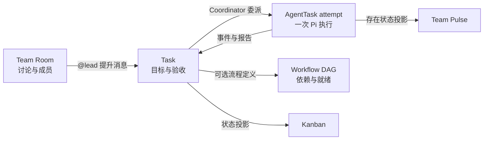

# PI-GUI Team 能力深度审查：Multica、HiClaw / AgentTeams、Buzz 与 Pi

> 调研日期：2026-07-26  
> 调研对象：PI-GUI 当前工作区、`multica-ai/multica`、阿里 HiClaw 的现行官方仓库、`bozz.xyz` 指向的可能项目、`earendil-works/pi`  
> 核心约束：Team 是 PI-GUI 的上层产品能力；不得修改 Pi 源码，只能通过 Pi 的公开 SDK、RPC 和扩展接口集成，并应能承受 Pi 后续升级。  
> 证据标准：外部项目结论只采用官方仓库、官方文档和固定 commit 的源代码。本文没有把搜索摘要或第三方介绍作为核心实现证据。

## 1. 结论先行

当前 PI-GUI 的 Team 已经不是“只有提示词的 Agent 列表”。它具备真实的任务持久化、Lead 严格协议、父子 AgentTask、运行时令牌、技能与信任预检、人工验收、重启中断恢复、Kanban 投影和 Pi RPC 子进程执行。尤其是 Coordinator 通过 `coordinator_action` 工具返回结构化动作，并拒绝把普通文本当成成功结果，这一点比许多只依赖提示词解析的团队原型更可靠。

但从用户交互和产品语义看，当前 Team 页面仍把四个不同概念压在了同一个“任务频道”上：

1. **Room**：人和 Agent 在任务形成前进行讨论、积累上下文的地方；
2. **Task**：有负责人、状态、验收和生命周期的工作项；
3. **Agent runtime**：一次实际的 Pi 进程执行；
4. **Workflow / DAG**：任务之间的依赖和调度规则。

当前页面左栏虽然显示“TEAM ROOMS / 协作频道”，但实际只有一个虚拟的 `project-launch-room`，以及由 Task 投影出来的任务频道。用户不能先创建一个中性的 Room、添加若干 Agent 成员、在里面交流，再通过 `@lead` 把一条消息提升为任务。这正是用户连续提出“在哪里输入 @”“为什么不能新建 Room”“当前交互不符合习惯”的根因，不是文案或引导不足。

四个参照项目分别给出不同的答案：

- **Multica** 最值得借鉴的是可靠的 AgentTask 队列、显式 mention、Squad Leader 路由、权限判断、重试谱系和 Issue 状态真相；但它的直接 ChatSession 仍是单 Agent，会话共享面主要是 Issue 评论，并不等于通用多 Agent Room。
- **HiClaw 当前已经迁移并更名为 AgentTeams**。它最值得借鉴的是 Source Room、Leader DM、Team Room、Task Room 的清晰分层，真实成员 mention，以及 Team / Worker 的生命周期与心跳；其 Matrix、Kubernetes CR、容器和共享文件控制面不适合 PI-GUI 的本地、单用户、轻量目标。
- **精确域名 `bozz.xyz` 在调研时是停放页，没有找到可归属的官方开源项目。** 高度疑似用户意指的是 Block 的 **Buzz**（`buzz.xyz` / `block/buzz`）。Buzz 最值得借鉴的是“Agent 就是频道成员”、稳定身份 mention 和统一签名事件流的交互直觉；其 Nostr relay、PostgreSQL、Redis、密钥身份栈不应照搬，而且其 ACP 的队列是进程内队列，默认 Drop 策略甚至可能静默丢事件，不能作为 PI-GUI 任务真相。
- **Pi 本身没有 Team / Room / Lead / Worker / Kanban 的持久业务模型。** Pi 提供的是一个 AgentSession、模型运行时、工具、技能、扩展和 headless RPC。Team 应继续由 PI-GUI 拥有，通过公开根导出和 `rpc-entry` 调用 Pi。

因此，适合 PI-GUI 的目标不是复刻任一项目，而是一个刻意收敛的组合：

> 采用 Buzz / AgentTeams 的 Room 与成员交互语义，采用 Multica 的任务真相与队列不变量，继续使用 PI-GUI 已有的严格 Coordinator 协议和 Pi RPC 隔离；所有 Team 数据归 PI-GUI，Pi 只是可替换的执行端口。

此外，“先把 Pi 升到最新”在本次快照中是一个**无需产生代码变更的操作**：PI-GUI 的 `package.json` 已精确锁定 `@earendil-works/pi-coding-agent` `0.82.1`；2026-07-26 查询 npm 的 `latest` 也是 `0.82.1`，Pi 官方仓库当前 `packages/coding-agent/package.json` 同样是 `0.82.1`。不应为了制造“已更新”而改写 lockfile。

## 2. 身份核验与版本锚点

### 2.1 Multica

- 官方仓库：<https://github.com/multica-ai/multica>
- 本次审查固定 commit：[`b0bae3f95ebe131079ae3f34e9cf39a62f69712e`](https://github.com/multica-ai/multica/tree/b0bae3f95ebe131079ae3f34e9cf39a62f69712e)
- commit 日期：2026-07-25

### 2.2 阿里 HiClaw

`https://github.com/alibaba/hiclaw` 在 2026-07-26 已跳转到：

- 当前官方仓库：<https://github.com/agentscope-ai/AgentTeams>
- 本次审查固定 commit：[`37c31b77d4e88ca87a1270c61a1e6f659e8023e1`](https://github.com/agentscope-ai/AgentTeams/tree/37c31b77d4e88ca87a1270c61a1e6f659e8023e1)
- commit 日期：2026-07-25

当前仓库 README 也把项目描述为协作式多 Agent runtime，并使用 manager / workers、Matrix、Team 等术语。本文统一写作“AgentTeams（原 HiClaw）”，避免把历史名称误认为另一个仍独立维护的实现。

### 2.3 `bozz.xyz` 与 Buzz 的歧义

调研时直接访问 `https://bozz.xyz` 返回一个仅显示 “Loading…” 的反自动化页，其脚本最终指向域名停放服务；在 GitHub 和公开网页中没有找到能够由该域名核验为官方的开源项目。因此：

- 本文**不声称 `bozz.xyz` 就是某个开源项目**；
- 为了覆盖用户很可能想表达的对象，另行审查名称只差一个字母、且产品描述与 Team/Room 高度相关的 Block Buzz；
- 若用户实际指的是另一个项目，需要以准确的仓库 URL 重新核验，本文对 Buzz 的结论不能自动转移给那个项目。

Buzz 的官方身份：

- 官方站点：<https://buzz.xyz>
- 官方支持文档：<https://block.github.io/buzz/support.html>
- 官方仓库：<https://github.com/block/buzz>
- 本次审查固定 commit：[`c2a4ee711e481bb427d6cf8cd08b2c7329d1508c`](https://github.com/block/buzz/tree/c2a4ee711e481bb427d6cf8cd08b2c7329d1508c)
- commit 日期：2026-07-26

### 2.4 Pi

- 官方仓库：<https://github.com/earendil-works/pi>
- 本次审查固定 commit：[`5bc1c2c0a6f07e00e8c240304182f213ab8d311f`](https://github.com/earendil-works/pi/tree/5bc1c2c0a6f07e00e8c240304182f213ab8d311f)
- commit 日期：2026-07-25
- Pi coding-agent 版本：`0.82.1`
- PI-GUI 当前锁定版本：`0.82.1`
- npm `latest`（2026-07-26 实查）：`0.82.1`

### 2.5 PI-GUI

- 当前 Git HEAD：`d157e376c02edc38f8aa8e5812d804b8c7be5594`
- 审查对象：2026-07-26 的当前工作区，包括尚未提交的本地修改
- 产品版本：`0.3.0`

由于工作区包含尚未提交的 Team 修改，本文对 PI-GUI 的行号和行为以本地快照为准，不把它们伪装成 GitHub 固定 commit 已经包含的事实。

## 3. 第一性原理：Team 系统必须先分清四种状态机

### 3.1 Room 是上下文容器，不是任务

一个 Room 至少回答：谁是成员、谁能看到历史、当前讨论主题是什么、有哪些消息、哪些消息被提升成任务。Room 可以没有任务，也可以产生多个任务。删除或关闭一个任务，不应抹掉 Room 的讨论历史。

### 3.2 Task 是承诺与验收容器，不是聊天消息

Task 至少回答：目标、状态、负责人、父子关系、验收标准、结果、失败原因、创建来源。一次 `@lead` 可以从消息创建 Task，但消息本身不应该兼任 Task 的所有字段。

### 3.3 AgentTask 是一次执行尝试，不是 Agent 本人

“靶点生物学研究员”是 Agent 定义；“该 Agent 对 CDK2 证据进行第 2 次执行”是 AgentTask / attempt。只有后者处于 queued、running、failed。把 Agent 卡片标成“在线”会误导用户以为存在一个常驻进程；当前 PI-GUI 的 Agent 绝大多数时候只是可调度定义。

### 3.4 Workflow / DAG 是依赖图，不是列表换皮

真正的 DAG 必须持久化边或每个节点的 `dependsOn`，验证无环，并只调度依赖全部完成的 ready nodes。若数据结构只是 `steps[]`，渲染时把相邻节点连起来，那么它是顺序执行链，不是通用 DAG。

这四种状态机的最小关系应是：



把这四类对象分开并不会强迫系统变复杂。相反，它能让数据模型和交互都更少例外：Room 只管沟通，Task 只管工作承诺，AgentTask 只管一次执行，Workflow 只管依赖。

## 4. 横向对比

| 维度 | PI-GUI 当前 | Multica | AgentTeams（原 HiClaw） | Buzz |
|---|---|---|---|---|
| 主要协作面 | 虚拟启动房 + Task Room | Issue 评论时间线 | Source / Team / Leader DM / Task Room | Community / Channel |
| 通用多 Agent Room | 没有 | Issue 上可多 Agent，但直接 ChatSession 只有一个 Agent | 有，Matrix Room 是核心对象 | 有，Agent 是频道成员 |
| `@mention` | 原始文本解析，按当前 callsign 解析 | 持久 canonical URI，类型和 ID 稳定 | 必须解析到真实 Matrix 成员 | 精确匹配 Agent 公钥 `p` tag |
| Lead 路由 | 严格 `@lead` 启动 + tool 协议 | Squad Leader 提示词 + canonical mention | Leader 按 Quick Task / Project Work 分流 | 示例 persona 可 @其他 Agent；不是统一持久 Lead 协议 |
| Task 真相 | 本地 board JSON + AgentTask | PostgreSQL Issue + AgentTask queue | CR + Matrix + task/project JSON 文件 | Nostr 事件 + DB workflow；ACP 本身进程内队列 |
| 并行度 | 全局单个 active AgentTask | 不同 Agent 可并行，同 Agent/Issue 串行 | 多 Worker 容器并行 | 按频道队列；多 Agent/频道可并行 |
| Agent 生命周期 | 由任务投影 available/running 等 | idle/working/blocked/error/offline | Pending/Running/Sleeping/Failed + heartbeat | Agent 是长期协议身份，运行器各自管理 |
| 权限 | 项目信任、工具 allowlist、技能预检 | view/invoke 分离，private/public_to，fail closed | Room/channel policy、AccessEntry、credentials | Owner/Admin/Member/Guest + author gate |
| 隔离 | 每个 AgentTask 一个 Pi RPC 进程；工作区策略 | 本地目录/运行时归因和队列约束 | Worker 容器、共享 task artifacts | Agent/relay 进程，密钥和频道成员身份 |
| DAG | 当前为线性 steps 投影 | Issue stage barrier，非声明式 DAG | TeamHarness 有显式 DAG/Loop | Workflow 是有序 steps，不是通用 DAG |
| 可观测性 | 生命周期、工具事件、tokens、报告、Kanban | 队列状态、归因、重试谱系、评论回执 | CR status、heartbeat、room/task state | 签名事件流、workflow run、approval |
| 失败恢复 | 明确失败；重启将 running 置 interrupted | 租约、CAS、stale reclaim、分类重试 | controller reconcile + heartbeat；任务文件状态 | workflow 持久；ACP 队列不持久且可 drop |
| 适配 PI-GUI 的价值 | 基线 | 后端不变量 | Room/角色/生命周期语义 | 最自然的频道交互与稳定身份 |
| 不应照搬 | — | 完整服务端/PostgreSQL 复杂度 | Matrix/K8s/容器控制面 | Nostr/relay/Redis/密钥栈与 silent drop |

## 5. Multica：Issue 是共享协作面，PostgreSQL 队列是执行真相

### 5.1 Issue 与 AgentTask 是分开的领域对象

Multica 的 Issue 有明确状态：`backlog`、`todo`、`in_progress`、`in_review`、`done`、`blocked`、`cancelled`；assignee 可以是 member、agent 或 squad，并支持父 Issue 和 stage。见固定 commit 的 [`packages/core/types/issue.ts`](https://github.com/multica-ai/multica/blob/b0bae3f95ebe131079ae3f34e9cf39a62f69712e/packages/core/types/issue.ts#L4-L55)。

AgentTask 则有自己的状态：`queued`、`dispatched`、`waiting_local_directory`、`running`、`completed`、`failed`、`cancelled`，并记录 failure reason、attribution/evidence、attempt 和 retry 关系。见 [`packages/core/types/agent.ts`](https://github.com/multica-ai/multica/blob/b0bae3f95ebe131079ae3f34e9cf39a62f69712e/packages/core/types/agent.ts#L175-L345)。

这一拆分非常重要：Issue 的 “done” 不是某一个进程退出码，Agent 的 “working” 也不是看板列。PI-GUI 当前已经有 Task、AgentTask、WorkflowRun 的分层，这是正确方向，应该继续保持。

### 5.2 Multica 的“聊天”不是通用多 Agent Room

Multica 的 `ChatSession` 包含单一 `agent_id`，其消息记录 failure reason 和 elapsed runtime。见 [`packages/core/types/chat.ts`](https://github.com/multica-ai/multica/blob/b0bae3f95ebe131079ae3f34e9cf39a62f69712e/packages/core/types/chat.ts#L29-L110)。因此不能根据 UI 上有 Chat 就推导出它支持“创建一个 Room，再把多个 Agent 拉进来”。

Multica 真正的多人/多 Agent 共享上下文是 Issue 评论时间线。显式 mention 可以唤起 Agent 或 Squad，执行结果再回写 Issue。这与 PI-GUI 现有的 Task Room 很接近：任务是共享上下文，Task 之外没有独立 Room。

所以，Multica 可以支持“从 Issue 中 @agent”，却不能单独解决用户要求的“先有 Room，后有 Task”的交互。若 PI-GUI 引入通用 Room，这是对当前产品心智模型的补全，不是照搬 Multica。

### 5.3 mention 使用稳定身份，不只保存显示文本

Multica 把 mention 保存为 `[@Label](mention://type/id)`，支持 member、agent、squad、issue 和 all，并对 ID 去重。见 [`server/internal/util/mention.go`](https://github.com/multica-ai/multica/blob/b0bae3f95ebe131079ae3f34e9cf39a62f69712e/server/internal/util/mention.go#L5-L36)。

这一点比 PI-GUI 当前只持久化消息正文、运行时再按 `@CALLSIGN` 解析更稳：

- Agent 改名后，旧消息仍能指向原身份；
- 同名 Agent 不会产生歧义；
- 渲染层可以改变显示名而不改变路由；
- 权限判断基于 ID，不基于文本碰撞。

PI-GUI 不需要照搬 `mention://` Markdown 格式，但应在 `RoomMessage` 中同时保存正文和结构化引用，例如 `{ agentId, displayToken, start, end }`。

### 5.4 Squad Leader 是路由者，不是隐式万能 Agent

Multica 的 squad briefing 明确要求 Leader 根据技能选择成员，使用 canonical mention，完成派发后停止，避免重复派发，并且只有 Squad 自己拥有 Issue 时才负责状态推进。见 [`server/internal/handler/squad_briefing.go`](https://github.com/multica-ai/multica/blob/b0bae3f95ebe131079ae3f34e9cf39a62f69712e/server/internal/handler/squad_briefing.go#L23-L176) 和同文件的 [roster/skills 构造](https://github.com/multica-ai/multica/blob/b0bae3f95ebe131079ae3f34e9cf39a62f69712e/server/internal/handler/squad_briefing.go#L179-L336)。

它的精华不是一段“你是负责人”的长提示词，而是四条边界：

1. Leader 有可核验的成员和技能目录；
2. 委派必须指向稳定身份；
3. 委派动作本身形成可观察任务；
4. Leader 只有在所有权成立时才能修改主任务状态。

PI-GUI 的 `coordinator_action` 工具和 agent snapshot 已经覆盖了 1—3 的大部分，且比从 Leader 自由文本中抽 JSON 更强。需要补的主要是 Room 来源、稳定 mention 和更清晰的状态所有权，而不是再增加一层提示词解析。

### 5.5 PostgreSQL AgentTaskQueue 的关键不变量

Multica 队列的价值不在“用了 PostgreSQL”，而在它实现的并发和恢复不变量：

- 创建 durable queue row：[`server/pkg/db/queries/agent.sql`](https://github.com/multica-ai/multica/blob/b0bae3f95ebe131079ae3f34e9cf39a62f69712e/server/pkg/db/queries/agent.sql#L241-L271)；
- 重试任务继承安全的 session/workdir 和 attribution lineage，并带 attempt / delay：同文件 [`#L338-L421`](https://github.com/multica-ai/multica/blob/b0bae3f95ebe131079ae3f34e9cf39a62f69712e/server/pkg/db/queries/agent.sql#L338-L421)；
- `FOR UPDATE SKIP LOCKED` 领取，按优先级 FIFO；同 Agent + Issue 串行，不同 Agent 可以并行：同文件 [`#L493-L531`](https://github.com/multica-ai/multica/blob/b0bae3f95ebe131079ae3f34e9cf39a62f69712e/server/pkg/db/queries/agent.sql#L493-L531)；
- claim 失败 CAS requeue、回收 stale dispatched、prepare lease、start 和 complete 均有状态前置条件：同文件 [`#L558-L671`](https://github.com/multica-ai/multica/blob/b0bae3f95ebe131079ae3f34e9cf39a62f69712e/server/pkg/db/queries/agent.sql#L558-L671)；
- queued 会立即出现在 active projection 中，而不是等第一次执行结束才显示：同文件 [`#L1150-L1158`](https://github.com/multica-ai/multica/blob/b0bae3f95ebe131079ae3f34e9cf39a62f69712e/server/pkg/db/queries/agent.sql#L1150-L1158)。

服务层对失败进行分类，只对符合条件的基础设施类失败创建显式 retry；若不重试，则保留用户可见失败，不吞错。见 [`server/internal/service/task.go`](https://github.com/multica-ai/multica/blob/b0bae3f95ebe131079ae3f34e9cf39a62f69712e/server/internal/service/task.go#L2929-L3152)。这比“失败就无限重跑”或“返回一个模板成功”可靠得多。

PI-GUI 当前单进程、本地 JSON 的目标不要求立即引入 PostgreSQL。可以在现有 BoardStore 内保留同样的不变量：领取令牌、状态前置条件、attempt 谱系、明确失败，以及未来增加受限并行时的 admission policy。技术选型应由并发和多进程需求驱动，而不是由竞品栈驱动。

### 5.6 mention、权限与反循环是服务端规则

Multica 明确区分“能看见 Agent”和“能调用 Agent”。私有 Agent 只允许 owner，有 `public_to` 的 Agent 只允许指定主体，且判断失败时 fail closed。见 [`server/internal/handler/agent_access.go`](https://github.com/multica-ai/multica/blob/b0bae3f95ebe131079ae3f34e9cf39a62f69712e/server/internal/handler/agent_access.go#L12-L108)。

评论路由区分显式 mention 和来源，合并 pending 请求，并设置窄范围的反循环规则。见 [`server/internal/handler/comment.go`](https://github.com/multica-ai/multica/blob/b0bae3f95ebe131079ae3f34e9cf39a62f69712e/server/internal/handler/comment.go#L1460-L1615) 与 [`#L1817-L1953`](https://github.com/multica-ai/multica/blob/b0bae3f95ebe131079ae3f34e9cf39a62f69712e/server/internal/handler/comment.go#L1817-L1953)。

对 PI-GUI 而言，Room membership 主要是“可见、可 mention 的产品范围”，不是安全沙箱。真正的安全边界仍应是项目 trust、工具 allowlist、技能预检、工作区写入策略和 Pi 子进程边界。不要把“Agent 在这个 Room 里”误当成获得任意文件/工具权限。

### 5.7 Multica 不是声明式 DAG 引擎

Multica 的 issue stage 是 Agent 驱动的顺序 barrier；服务端没有一套通用声明式 Workflow DAG。相关完成处理见 [`server/internal/handler/issue_child_done.go`](https://github.com/multica-ai/multica/blob/b0bae3f95ebe131079ae3f34e9cf39a62f69712e/server/internal/handler/issue_child_done.go#L436-L459)。

因此，不能把 Multica 的 parent issue / stage 直接作为 PI-GUI “可视化 DAG 已完成”的证据。若需要真正分支依赖，仍要在 PI-GUI 的 WorkflowDefinition 中明确建模。

## 6. AgentTeams（原 HiClaw）：Room 与 Worker 生命周期最完整，但运行控制面很重

### 6.1 Team / Worker 是声明式资源

AgentTeams 的 WorkerSpec 包含模型、runtime、镜像、identity、soul、skills、MCP、频道策略、资源、期望 lifecycle、访问和 credentials；WorkerStatus 包含 Pending/Running/Sleeping/Failed、Matrix ID / room、heartbeat 和 last active/message。见 [`agentteams-controller/api/v1beta1/types.go`](https://github.com/agentscope-ai/AgentTeams/blob/37c31b77d4e88ca87a1270c61a1e6f659e8023e1/agentteams-controller/api/v1beta1/types.go#L166-L392)。

TeamSpec 引用现有 Worker，并标识 `team_leader` / `worker`；TeamStatus 包含 Pending/Active/Degraded/Failed、Team Room、Leader DM、ready counts 和每个成员的 role、room、Matrix identity、ready、phase、heartbeat、error。见同文件 [`#L412-L553`](https://github.com/agentscope-ai/AgentTeams/blob/37c31b77d4e88ca87a1270c61a1e6f659e8023e1/agentteams-controller/api/v1beta1/types.go#L412-L553)。

这解决了 PI-GUI 当前一个明显的语义问题：AgentTeams 只有在真实 runtime 心跳和 controller 状态支持时才声称 Worker 正在 Running / Sleeping / Failed。PI-GUI 的 Team Pulse 当前主要从 AgentTask/WorkflowRun 投影，卡片上的“可用”只表示可以被调度，不表示存在一个在线守护进程。UI 应使用“可调度”“执行中”“等待”“需关注”等精确词汇；只有将来引入持久 daemon heartbeat 后，才显示“在线”。

### 6.2 Source Room、Team Room、Leader DM、Task Room 各司其职

AgentTeams 的 controller 会解析成员、创建房间、配置共享存储、向 Leader/Worker 注入协调上下文和 heartbeat，并聚合状态。见 [`agentteams-controller/internal/controller/team_controller.go`](https://github.com/agentscope-ai/AgentTeams/blob/37c31b77d4e88ca87a1270c61a1e6f659e8023e1/agentteams-controller/internal/controller/team_controller.go#L341-L522)。

TeamHarness 提示词进一步区分：

- **Source requester room**：用户原始提出请求的房间；
- **Dedicated task room**：项目执行的专用空间；
- **Direct Reply**：不需要建任务的直接回答；
- **Quick Task**：单 Worker 完成；
- **Project Work**：Lead 用 DAG 或 Loop 组织多 Worker；
- mention 必须解析到真实 Matrix 成员；
- 接受的结果才推进依赖，靠事件驱动而非轮询。

见 [`plugins/teamharness/prompts/team/TEAMS.md`](https://github.com/agentscope-ai/AgentTeams/blob/37c31b77d4e88ca87a1270c61a1e6f659e8023e1/plugins/teamharness/prompts/team/TEAMS.md)。

这是本次审查中对 PI-GUI 用户困惑最直接的参照。一个自然流程应是：用户先在 Room 中交流；`@lead` 判断是直接回答、Quick Task 还是 Project Work；只有需要执行时才创建 Task / Task Room。当前 PI-GUI 要求先在虚拟启动房写且只能精确 `@lead`，把“聊天入口”和“任务创建表单”绑定了。

### 6.3 Task Room 是隔离的执行上下文

TeamHarness 的 roomflow 会创建或复用私有 Matrix TASK room、邀请成员和管理员并持久化 binding。见 [`plugins/teamharness/mcp/server.py`](https://github.com/agentscope-ai/AgentTeams/blob/37c31b77d4e88ca87a1270c61a1e6f659e8023e1/plugins/teamharness/mcp/server.py#L1815-L1963)。

其 taskflow 把 leader delegate/check/cancel 与 worker ack/submit 分开，并把 artifact 限制到 `shared/tasks/{taskId}`。见同文件 [`#L3671-L4006`](https://github.com/agentscope-ai/AgentTeams/blob/37c31b77d4e88ca87a1270c61a1e6f659e8023e1/plugins/teamharness/mcp/server.py#L3671-L4006)。

PI-GUI 不需要 Matrix room 才能获得这种语义。一个本地 `TaskRoom` ID、成员快照、消息流和 artifact 根目录就足够。关键是：Source Room 的长期讨论不会因为 Task 完结消失，而 Task Room 的消息又能严格归属于一次执行工作。

### 6.4 AgentTeams 有真正的 DAG/Loop 语义

TeamHarness 的 projectflow 持久化 project state，支持 quick project、`plan_dag` 图校验、`plan_loop`、ready nodes、iteration、pause/resume/complete；ready 逻辑只返回依赖已经完成的节点。见 [`plugins/teamharness/mcp/server.py#L2962-L2994`](https://github.com/agentscope-ai/AgentTeams/blob/37c31b77d4e88ca87a1270c61a1e6f659e8023e1/plugins/teamharness/mcp/server.py#L2962-L2994) 与 [`#L3196-L3506`](https://github.com/agentscope-ai/AgentTeams/blob/37c31b77d4e88ca87a1270c61a1e6f659e8023e1/plugins/teamharness/mcp/server.py#L3196-L3506)。

这与 PI-GUI 当前 `steps[]` 相邻连线有本质区别。若 PI-GUI UI 继续叫 DAG，数据层至少要有 `dependsOn: readonly WorkflowStepId[]`、重复/缺失引用校验、拓扑无环校验和 ready-node scheduler；否则应该诚实改名为“执行链”。

### 6.5 生命周期来自 reconcile 与 heartbeat

Worker heartbeat 会采集快照，并向 controller 报告 ready/heartbeat；见 [`qwenpaw/src/qwenpaw_worker/heartbeat.py`](https://github.com/agentscope-ai/AgentTeams/blob/37c31b77d4e88ca87a1270c61a1e6f659e8023e1/qwenpaw/src/qwenpaw_worker/heartbeat.py#L43-L235)。Team 状态由 controller reconcile 汇总，而不是前端根据最后一条消息猜测。

PI-GUI 目前是桌面应用，AgentTask 执行时才启动 Pi RPC。对这种架构，最准确的 Agent 生命周期是：

- `schedulable`：配置、技能、项目 trust 和模型都满足；
- `queued`：已有 AgentTask 等待；
- `running`：存在持有 runtime token 的执行；
- `waiting`：等待子任务、人工或验收；
- `attention`：失败、协议无效、缺技能或配置错误。

不要加入一个虚假的定时 heartbeat 去伪造“在线”。只有真正长期运行的本地 daemon 才需要 AgentTeams 式 heartbeat。

### 6.6 不应照搬的复杂度

AgentTeams 的隔离依赖 Kubernetes CR、Worker 容器、Matrix 身份与房间、共享存储、AccessEntry 和 credentials bindings。AccessEntry 类型见 [`agentteams-controller/api/v1beta1/types.go#L46-L119`](https://github.com/agentscope-ai/AgentTeams/blob/37c31b77d4e88ca87a1270c61a1e6f659e8023e1/agentteams-controller/api/v1beta1/types.go#L46-L119)。

这些机制服务于多人、分布式、长生命周期 Worker。PI-GUI 的首要目标是本地桌面、单用户、安装简单，并保留 Pi 独立能力。引入 Matrix/K8s/容器不会让 `@lead` 更自然，只会制造第二套部署、身份、日志和升级面。

可借鉴的是**语义**：真实成员、不同房间角色、清晰生命周期、任务 artifact 边界；不应借鉴的是完整控制平面。

## 7. Buzz：最自然的“Agent 是频道成员”交互，但不是可靠任务队列范本

### 7.1 Buzz 的核心心智模型

Buzz 官方 README 把产品描述为人和 Agent 共享 room 的 self-hostable workspace；消息、反应、workflow、review 和 git event 进入统一签名日志，Agent 拥有自己的 key、频道 membership 和 audit trail。见 [`README.md`](https://github.com/block/buzz/blob/c2a4ee711e481bb427d6cf8cd08b2c7329d1508c/README.md)。

官方支持文档进一步说明：每个 community 可以连接自己的 relay，community 之间不 federation；桌面应用是开源的。见 [Buzz Support](https://block.github.io/buzz/support.html)。

对 PI-GUI 最有价值的不是签名协议，而是这条用户直觉：

> Agent 不是右侧一张只能被“分配任务”的配置卡，而是 Room 中有稳定身份、可被选择和 mention 的参与者。

这直接支持用户要求的流程：创建 Room → 添加“靶点策略负责人”“靶点生物学研究员” → 输入 `@靶点策略负责人 创建 CDK2 早研靶点评估` → Lead 创建可追踪任务。

### 7.2 mention 绑定精确 Agent 身份

Buzz 的 ACP filter 会检查 channel、event kind 和 `p` tag，并要求 `p` tag 精确等于 Agent 公钥；filter 出错时 fail closed。见 [`crates/buzz-acp/src/filter.rs`](https://github.com/block/buzz/blob/c2a4ee711e481bb427d6cf8cd08b2c7329d1508c/crates/buzz-acp/src/filter.rs#L343-L458)。测试文档说明 Agent 必须是频道成员，用户在同一频道 @mention，回复也回到该频道。见 [`TESTING.md`](https://github.com/block/buzz/blob/c2a4ee711e481bb427d6cf8cd08b2c7329d1508c/TESTING.md#L180-L260)。

PI-GUI 无需公私钥体系，也应该取得同样的稳定性：mention picker 选择的是 `agentId`，`@显示名` 只是 UI token。Room membership 则限制 picker 的默认候选，避免所有项目 Agent 混在一个长列表中。

### 7.3 中途消息策略是显式的

Buzz ACP 为 Agent 忙碌时的新消息定义 Queue、Steer、Interrupt、OwnerInterrupt，并为触发者定义 owner-only、allowlist、anyone、nobody author gate。见 [`crates/buzz-acp/src/config.rs`](https://github.com/block/buzz/blob/c2a4ee711e481bb427d6cf8cd08b2c7329d1508c/crates/buzz-acp/src/config.rs#L63-L110)。

PI-GUI 当前 Task Room 在执行中收到 mention 时，也需要明确用户预期：

- 作为下一条 AgentTask 排队；
- 作为当前运行的补充上下文，但不打断；
- 请求中断当前运行并启动新 attempt。

在本地单用户场景中，默认“排队”最可解释；任何中断都应有确认和独立事件。不能让后发消息静默覆盖当前目标。

### 7.4 Buzz ACP 队列不能当作任务真相

Buzz ACP 的队列按频道维护 pending / in-flight，支持最大 pending、batch、retry/backoff 和 dead-letter；但它是**进程内队列**，默认 Drop 模式在同频道已有 in-flight 时会丢事件，超出上限还会丢最旧消息。见 [`crates/buzz-acp/src/queue.rs`](https://github.com/block/buzz/blob/c2a4ee711e481bb427d6cf8cd08b2c7329d1508c/crates/buzz-acp/src/queue.rs#L1-L171)。

这种策略可以用于低价值聊天触发降噪，不能用于有状态任务系统：用户的任务请求必须形成持久 `AgentTask(queued)` 或明确错误，绝不能因为 Agent 正忙而无声消失。PI-GUI 当前 BoardStore 的显式 queued 状态比该队列更适合任务真相。

### 7.5 Workflow 是顺序 pipeline，不是通用 DAG

Buzz WorkflowDef 是 ordered steps，触发器包括 message/reaction/diff/schedule/webhook；动作包括发消息/DM、改 topic、reaction、webhook、request approval 和 delay。见 [`crates/buzz-workflow/src/schema.rs`](https://github.com/block/buzz/blob/c2a4ee711e481bb427d6cf8cd08b2c7329d1508c/crates/buzz-workflow/src/schema.rs#L12-L147)。它有持久 workflow run 与 approval 状态，数据库实现见 [`crates/buzz-db/src/workflow.rs`](https://github.com/block/buzz/blob/c2a4ee711e481bb427d6cf8cd08b2c7329d1508c/crates/buzz-db/src/workflow.rs#L83-L116)，审批状态更新使用条件更新/CAS，见同文件 [`#L1020-L1085`](https://github.com/block/buzz/blob/c2a4ee711e481bb427d6cf8cd08b2c7329d1508c/crates/buzz-db/src/workflow.rs#L1020-L1085)。

README 的 works-today 表又明确把部分 approval gate glue 标为“being wired up”。因此不能因为 schema 已存在就宣称完整工作流体验全部成熟。对 PI-GUI 的启示仍是：对 shipped、experimental 和 planned 能力使用真实标签。

### 7.6 示例 Agent 团队主要是 persona 约定

Buzz 的 Meadow 示例有三 Agent persona，orchestrator 可以 @Bana / @Lev。见 [`examples/meadow-core/README.md`](https://github.com/block/buzz/blob/c2a4ee711e481bb427d6cf8cd08b2c7329d1508c/examples/meadow-core/README.md) 和 [`agents/skip.persona.md`](https://github.com/block/buzz/blob/c2a4ee711e481bb427d6cf8cd08b2c7329d1508c/examples/meadow-core/agents/skip.persona.md)。

这展示了频道内的团队感，但 persona mention 本身不是 durable coordinator protocol。PI-GUI 不应退回“Lead 在自然语言里说 @worker，希望另一个监听器碰巧理解”的实现；应保留现有结构化 `coordinator_action`，只是把动作和结果更自然地展示在 Room / Task Room 中。

### 7.7 不应照搬的基础设施

Buzz 的 relay 是单一事件真相，整体栈围绕 Nostr 签名事件，并包含 PostgreSQL、Redis 等组件。架构说明见 [`ARCHITECTURE.md`](https://github.com/block/buzz/blob/c2a4ee711e481bb427d6cf8cd08b2c7329d1508c/ARCHITECTURE.md)。它适合跨进程、协议原生、多人社区；PI-GUI 的本地桌面用户不需要管理 relay、Agent keys、数据库和 Redis，才能获得“频道里 @Agent”的体验。

应该借用的是交互模式和稳定身份，不是部署拓扑。

## 8. Pi 的真实边界：单 Agent runtime + 公开集成接口

### 8.1 Pi 公开提供了什么

Pi coding-agent `0.82.1` 的 package exports 公开根入口和 `./rpc-entry`。见 [`packages/coding-agent/package.json`](https://github.com/earendil-works/pi/blob/5bc1c2c0a6f07e00e8c240304182f213ab8d311f/packages/coding-agent/package.json)。根入口公开 `AgentSession`、`ExtensionAPI` / `defineTool`、`ModelRegistry` / `ModelRuntime`、`ResourceLoader`、`createAgentSession`、`SessionManager` 和内置 tools。见 [`packages/coding-agent/src/index.ts`](https://github.com/earendil-works/pi/blob/5bc1c2c0a6f07e00e8c240304182f213ab8d311f/packages/coding-agent/src/index.ts#L1-L260)。

SDK 文档明确将它定位为 custom UI、integration、pipeline、subagent tool 的可编程接口；一个 `AgentSession` 负责一次 Agent 交互生命周期。见 [`packages/coding-agent/docs/sdk.md`](https://github.com/earendil-works/pi/blob/5bc1c2c0a6f07e00e8c240304182f213ab8d311f/packages/coding-agent/docs/sdk.md#L3-L178)。

RPC 文档定义 headless JSONL 协议，适合嵌入和自定义 UI；`prompt` response 只表示请求已经 accepted/queued，接受后的运行失败由事件流报告，不能把 RPC 接收成功当成任务完成。见 [`packages/coding-agent/docs/rpc.md`](https://github.com/earendil-works/pi/blob/5bc1c2c0a6f07e00e8c240304182f213ab8d311f/packages/coding-agent/docs/rpc.md#L1-L76) 和状态/消息接口 [`#L160-L213`](https://github.com/earendil-works/pi/blob/5bc1c2c0a6f07e00e8c240304182f213ab8d311f/packages/coding-agent/docs/rpc.md#L160-L213)。

### 8.2 Pi 有 subagent 示例，但没有 Team 领域模型

Pi 官方 subagent extension 示例展示了为子任务启动独立 Pi 进程，并支持 parallel / chain 等方式；项目级 Agent 需要信任。见 [`packages/coding-agent/examples/extensions/subagent/README.md`](https://github.com/earendil-works/pi/blob/5bc1c2c0a6f07e00e8c240304182f213ab8d311f/packages/coding-agent/examples/extensions/subagent/README.md#L1-L30)、[`#L55-L117`](https://github.com/earendil-works/pi/blob/5bc1c2c0a6f07e00e8c240304182f213ab8d311f/packages/coding-agent/examples/extensions/subagent/README.md#L55-L117) 和 [`#L163-L175`](https://github.com/earendil-works/pi/blob/5bc1c2c0a6f07e00e8c240304182f213ab8d311f/packages/coding-agent/examples/extensions/subagent/README.md#L163-L175)。

这些示例证明 Pi 可以承担多个隔离执行，但没有定义：

- Room 与成员；
- Lead / Worker 业务角色；
- durable AgentTask queue；
- Task / Kanban 状态；
- mention 身份；
- human acceptance；
- workflow DAG；
- 重启后的团队恢复。

这些都应属于 PI-GUI。把它们补进 Pi fork 会让升级极其困难，也违背用户要求。

### 8.3 当前 PI-GUI 与 Pi 的边界总体正确

本次扫描发现 PI-GUI 对 Pi 的代码引用集中在：

- `src/main/index.ts`：根 package 与 `rpc-entry`；
- `src/main/model-configuration-service.ts`：根 package；
- `src/main/agent-skill-service.ts`：根 package；
- `src/shared/contracts.ts`：根 package类型；
- `resources/extensions/coordinator-action.ts`：根 package的 `defineTool` / `ExtensionAPI`。

未发现从 `@earendil-works/pi-coding-agent/src/...` 等私有源码路径导入。Coordinator 扩展也使用公开 `defineTool`。因此，“Team 不改 Pi”的技术边界已经大体成立。

建议把这条边界固化为可测试合同，而不是靠记忆：

1. 依赖只允许固定的公开入口；
2. 禁止导入 Pi `src/`、`dist/` 内部文件；
3. `PiAgentRuntimePort` 隔离 spawn、prompt、event、abort 和 model discovery；
4. Team 状态机不依赖 Pi 内部事件对象，只消费 PI-GUI 自己的规范化事件；
5. 升级时运行 public-export contract test、真实 RPC smoke test、Coordinator tool test 和中断恢复测试。

### 8.4 本次不应产生 Pi 升级 diff

当前依赖、npm latest、Pi 仓库 HEAD 三者都是 `0.82.1`。最稳妥的动作是记录“已是最新”，不执行无意义的 `npm update`，也不改写 lockfile。升级流程的目标是版本差异可审查，不是每次都产生文件变化。

## 9. PI-GUI 当前 Team 代码审查

### 9.1 已经做对的部分

#### 9.1.1 Task Room 是持久执行真相

`docs/specs/stella-v4-team-relay.md` 已明确 Task Room 是唯一 durable team conversation，Team Chat 只是投影；Worker 运行是隔离的真实 Pi RPC AgentTask。这比在两个页面各维护一套聊天状态更可靠。

#### 9.1.2 Coordinator 协议是严格工具协议

`resources/extensions/coordinator-action.ts` 使用公开 `defineTool` 注册 `coordinator_action`，Schema 明确定义动作并 `terminate: true`。`src/shared/coordinator-protocol.ts` 只接受 `delegate`、`request_revision`、`replan`、`complete`、`ask_human`，校验未知字段、Agent ID、objective、acceptance 和重复 Agent。

这已经从根因修复过用户遇到的：Lead 输出“报告文件 ...”而不是 JSON，导致 `Unexpected token`。正确行为是协议无效并清楚失败，不是尝试从任意自然语言截取 JSON 或把报告文本伪装成协调动作。

#### 9.1.3 AgentTask 是真实 Pi 执行

`src/main/agent-task-runner.ts` 为 AgentTask 启动 Pi RPC，Coordinator 类型才注入 coordinator extension，记录 lifecycle / tool events 和 token，使用 runtime token 防止陈旧执行写回。信任、skills、workspace policy 在 claim 前检查，失败会显式记录。

#### 9.1.4 状态与恢复边界清晰

`src/main/agent-task-service.ts` 已有 `queued`、`running`、`waiting_children`、`waiting_human`、`reported`、`failed`、`interrupted`、`cancelled`、`protocol-invalid` 等状态，并支持 parent/child、coordinator review 和 human acceptance。

`src/main/board-store.ts` 通过进程内 write queue 串行写入，写临时文件再 rename；启动恢复时把进行中的 WorkflowRun / AgentTask / AutopilotRun 标记为 interrupted/failed，而 queued AgentTask 保留。这符合桌面单进程应用的现实，不掩盖崩溃。

#### 9.1.5 当前 Pi 依赖边界可升级

Team 逻辑没有修改 Pi，也没有私有路径导入；Pi RPC 只是执行器。只要继续保持状态和协议归 PI-GUI，Pi 后续升级的 blast radius 可控。

### 9.2 关键缺口与优先级

#### P0 — “Room”只是标签，不是领域能力

`src/renderer/src/features/team/TeamWorkspace.tsx` 中 `TEAM_LAUNCH_ROOM_ID = "project-launch-room"`；频道列表由虚拟启动房加每个 Task 投影组成。没有 `TeamRoom`、room members、独立消息历史或 room-to-task linkage。

`src/shared/team-launch.ts` 又要求启动文本**恰好一个 `@lead`**，出现其他非 Lead mention 就拒绝。这是一个严格的“任务启动命令”，却被 UI 呈现为团队聊天，所以用户自然会问“为什么只能 @lead”“我不能新建 room 吗”。

判定：这是产品模型缺失，不能仅靠 placeholder、空状态说明或教程解决。

#### P0 — mention 历史只保存文本，不保存身份

`src/shared/agent-mentions.ts` 能解析当前目录中的 `@CALLSIGN`，picker 也支持 Unicode；但 `TaskComment` 只保存 `body`，没有 persisted mention references。Agent 改名、callsign 重用或删除后，旧消息无法稳定解释。

判定：新 RoomMessage 必须保存结构化 mention；旧 TaskComment 可通过一次显式迁移解析并标记 unresolved，不能在读取时默默重绑定到新 Agent。

#### P1 — Team Pulse 的“可用”容易被理解为在线

`src/shared/agent-presence.ts` 是由 AgentTask / WorkflowRun 投影 `available`、`queued`、`running`、`waiting`、`attention`。这不是心跳。Agent 定义没有常驻进程时，“available”准确含义是“当前可调度”。

判定：调整用户文案和 tooltip，不需要改 runtime。AgentTeams 式 heartbeat 只有本地 daemon 真正常驻后才有意义。

#### P1 — 全局单活跃执行限制了真实团队并行

`src/main/agent-task-runner.ts` 只有一个 `#active` 和全局 drain；`AgentTaskService.claim` 在任何 AgentTask running 时拒绝新的 claim。因此多个 Worker 的 UI 虽然都能 queued，运行时仍全局串行。

串行并非错误，它对同一工作区写入安全。但如果产品展示“多 Agent 团队并行”，这就是能力与承诺不一致。Multica 证明真正重要的是冲突域：同 Agent + Issue 串行，不同 Agent 可并行；PI-GUI 可以更保守地只允许**只读任务受限并行**，写任务继续由已有 WorkspaceAdmission 串行。

判定：这是架构能力缺口，不应通过动画制造并行感。实现前必须有 bounded pool、per-workspace admission、abort、runtime token 和聚合 event 测试。

#### P1 — 当前“DAG”是线性链投影

`src/shared/kanban.ts` 的 `WorkflowDefinition.steps` 是顺序数组，没有 `dependsOn`。`src/shared/workflow-dag.ts` 对相邻 nodes 自动加边。调度也是逐步执行。

判定：当前能力应叫“执行链”。若保留“DAG”产品承诺，需引入显式依赖、无环校验、ready-node 调度和分支汇合状态，不应只改画布。

#### P1 — 失败可见，但缺少 attempt 谱系和选择性重试

当前失败不吞错，这是正确的。但短暂进程启动失败、RPC transport 中断等基础设施错误没有 Multica 式显式 retry attempt；用户只能重新触发并产生难以关联的运行。

判定：若增加重试，只允许分类后的 transient runtime failure，创建新 attempt 并显示 `retryOf`、attempt number、delay 和原失败；模型语义错误、协议无效、缺技能、权限失败绝不能自动重试。

#### P2 — 单文件 BoardStore 只适合单进程

BoardStore 有进程内串行和原子 rename，但无跨进程锁。对于当前 Electron 单实例是合适的简单方案；若将来允许多个 daemon 或多窗口主进程同时写，同一 JSON 就会发生 lost update。

判定：本轮不引入 PostgreSQL。把“单主进程唯一 writer”写成运行不变量并测试单实例即可；只有真实需求变成多进程/远程协作时才迁移存储。

#### P2 — Room membership 不应和执行权限混为一谈

Agent 进入 Room 只表示出现在 picker、能收到 mention 和看到 room context。它不应自动扩大工具权限、技能路径或工作区写权限。

判定：继续以 project trust、agent allowlist、skill preflight、workspace admission 为安全真相；Room 成员变化只改变协作可见性。

## 10. 推荐的最小交互模型

目标不是增加一个庞大 Chat 产品，而是补齐用户已经明确要求的正常入口。

### 10.1 左栏

左栏由两组可折叠对象组成：

1. **团队房间**：用户创建的 Room，例如“CDK2 靶点评估”“日常讨论”；
2. **任务频道**：由 Task 创建的执行房间，保留当前任务状态、报告和 AgentTask 时间线。

虚拟 `project-launch-room` 可以迁移为项目默认的“团队大厅”，但它必须成为真正持久 Room，而不是特殊 case。

### 10.2 创建 Room

创建时只要求名称；Agent 成员可在创建后添加。默认包含当前用户，不自动运行任何 Agent。右侧 Team Pulse 在 Room 中显示成员及精确状态：可调度、执行中、等待、需关注。

### 10.3 普通消息

不含 mention 的消息只是讨论并持久化，不创建任务、不启动模型。这能让用户先补充材料和约束。

### 10.4 `@lead`

用户从 picker 选中具体 Lead 身份。提交后 UI 先持久化消息和 structured mention，再原子创建：

1. Task；
2. linked Task Room；
3. Coordinator AgentTask（queued）；
4. Room 中的任务卡引用。

如果原子操作失败，消息可以保留但必须显示“任务创建失败”和错误；不能把消息显示成已启动。

Lead 的动作仍通过 `coordinator_action`，不从自然语言猜测。Lead 可选择直接澄清（`ask_human`）、委派、replan、complete。

### 10.5 `@worker`

Room 中允许选择 Worker，但行为必须显式：

- 默认显示“创建快速任务”预览，包含 Agent、目标、工作区策略和预期输出；
- 用户确认后创建 direct AgentTask 和 linked Task；
- 不允许仅因 Agent 是 Room member 就自动唤醒所有成员；
- 已在 Task Room 中时，mention Worker 表示创建该 Task 的子 AgentTask。

这同时回答了“为什么只能 @lead”和“如何启用靶点生物学研究员”：Lead 适合拆解多步骤任务，Worker 适合目标已清楚的直接任务。

### 10.6 任务进行中

Task 创建后立即出现在左侧与 Kanban，不等待第一次运行结束。AgentTask 的 queued/running/waiting/report/failed 实时投影到 Task Room 和 Team Pulse。Room 原消息保留一个链接卡，点击进入 Task Room。

### 10.7 状态变化

状态变化必须来自持久事件：

- queued：AgentTask 已创建；
- running：claim 成功且有 runtime token；
- waiting_children：Lead 已委派并等待；
- waiting_human：明确的人类问题/验收；
- reported：Worker 提交报告；
- failed / protocol-invalid / interrupted：错误和日志可见；
- done：满足 acceptance 且由允许的角色或用户确认。

Agent 卡片只是这些任务状态的聚合投影，不维护第二份可漂移的 status。

## 11. 最小数据模型：在现有 Board JSON 内补 Room，不增加数据库

以下是领域形态，不要求照字面命名：

```ts
type TeamRoom = Readonly<{
  id: string;
  projectId: string;
  name: string;
  memberAgentIds: readonly string[];
  createdAt: string;
  updatedAt: string;
  archivedAt?: string;
}>;

type MentionReference = Readonly<{
  kind: "agent";
  agentId: string;
  displayToken: string;
  start: number;
  end: number;
}>;

type RoomMessage = Readonly<{
  id: string;
  roomId: string;
  author: Readonly<{ kind: "user" | "agent"; id: string }>;
  body: string;
  mentions: readonly MentionReference[];
  linkedTaskIds: readonly string[];
  createdAt: string;
}>;

type TaskOrigin = Readonly<{
  roomId: string;
  messageId: string;
}>;
```

设计约束：

- 所有 collection immutable-first，service 返回新快照，不修改参数；
- Agent ID 是路由真相，callsign/display name 只是展示；
- RoomMessage 和 Task 创建走 BoardStore 的一次串行写，防止只成功一半；
- Task Room 仍复用现有 TaskDetailPanel，不建立第二套 AgentTask UI；
- archived Room 不删除历史；
- 删除 Agent 时保留历史 mention 的 display token，并显示“Agent 已删除”；
- 默认 Team 大厅在数据迁移中显式创建，不继续用硬编码 magic ID 分支。

这套模型只增加两个持久集合和 Task origin 引用，不需要 PostgreSQL、Matrix、relay 或远程账号系统。

## 12. Pi 升级兼容架构

### 12.1 端口边界

Team domain 不应直接理解 Pi 子进程的所有内部事件。建议形成一个窄端口：

```ts
interface PiAgentRuntimePort {
  start(request: PiAgentRunRequest): Promise<PiAgentRunHandle>;
}

interface PiAgentRunHandle {
  readonly runId: string;
  readonly events: AsyncIterable<NormalizedAgentEvent>;
  abort(reason: string): Promise<void>;
}
```

Adapter 内部可以使用公开 `rpc-entry`；Team service 只消费 `NormalizedAgentEvent`，例如 started、assistant_delta、tool_started、tool_finished、usage、completed、failed。Pi 事件字段变化只修改 adapter 和 contract tests，不传播到 Kanban、Room 或 Coordinator service。

### 12.2 Coordinator 继续使用公开扩展 API

`coordinator_action` 应继续是 PI-GUI resource extension，通过 Pi 公共 `defineTool` 注入。协议 Schema 和 parser 属于 PI-GUI shared domain；Pi 只负责调用工具。

### 12.3 不修改 Pi 的 CI 检查

应有一条机械检查拒绝：

- `@earendil-works/pi-coding-agent/src/`；
- `@earendil-works/pi-coding-agent/dist/`；
- node_modules 中未公开文件的相对/绝对导入；
- patch-package 对 Pi 包的补丁。

### 12.4 每次 Pi 升级的最小验证矩阵

| 验证 | 必须证明 |
|---|---|
| package exports | 根入口和 `rpc-entry` 可解析 |
| model discovery | 当前模型与配置页可读取、测试连接 |
| RPC smoke | prompt 被接收，事件流到 completed/failed |
| coordinator tool | `coordinator_action` schema 被加载并返回严格动作 |
| worker task | 真实 Worker AgentTask 运行并保存报告 |
| cancellation | abort 后 AgentTask 明确 interrupted/cancelled |
| crash recovery | 重启后 running 不伪装继续，queued 不丢失 |
| skill preflight | 缺 skill 明确失败，安装后可运行 |
| current session | 非 Team 的 Pi 独立页面和能力保持工作 |

这一矩阵保护“Team 不改 Pi”和“Pi 全部原功能保持”两个约束，不需要 fork Pi。

## 13. 并发、队列和恢复的收敛方案

### 13.1 近期继续用 BoardStore

当前是一台电脑、一个 Electron 主进程、一个本地用户。BoardStore 的 serialized write + temp rename 足以作为单 writer durable store。引入 PostgreSQL 会增加安装包、迁移、端口、备份、Windows/macOS 服务管理和故障面，不符合“尽可能简单”。

### 13.2 若开放并发，按工作区影响分类

建议的不变量：

- 同一 Task 的 Coordinator 同一时刻最多一个 active attempt；
- 同一工作区的写任务串行；
- 只读 AgentTask 可以进入小型 bounded pool；
- 子任务完成通过事件唤醒 Coordinator，不轮询；
- claim 时生成 runtime token，所有写回比较 token；
- 取消父 Task 时显式处理 queued/running children；
- AgentTask 创建后立刻进入 UI active projection。

这借鉴 Multica 的冲突域并发，不需要复制 SQL。

### 13.3 重试必须留下新 attempt

可自动重试的范围只包括明确分类的暂时性错误，例如进程无法临时启动、RPC transport 非预期断开、provider 明确返回可重试限流；并且：

- 新建 AgentTask attempt；
- 保存 `retryOf` 和 attempt number；
- 原失败仍可见；
- 有明确上限和 backoff；
- 用户可取消等待中的 retry。

协议无效、模型给出错误研究结论、缺 skill、无权限、工作区不可信均不是 transient failure，必须直接暴露。

### 13.4 不采用 Buzz ACP 的 Drop 默认

任何会形成 Task 的消息都必须 durable enqueue 或明确拒绝。系统繁忙时可以显示 queued，不可以静默丢弃、替换旧任务或返回假成功。

## 14. DAG / Kanban 的真实能力边界

Kanban 和 DAG 是两个视图：Kanban 表示 Task 状态，DAG 表示依赖。二者可关联但不能互相推导。

### 14.1 最小真实 DAG 模型

```ts
type WorkflowStep = Readonly<{
  id: string;
  agentId: string;
  objective: string;
  acceptance: string;
  dependsOn: readonly string[];
}>;
```

必须验证：

- ID 唯一；
- dependency 存在且不能自依赖；
- 图无环；
- 同一 dependency 不重复；
- ready = queued 且所有 dependencies accepted；
- 任一 dependency failed 时，下游明确 blocked，不偷偷跳过；
- 分支汇合必须等全部前置完成；
- replan 产生可审计的新 revision。

### 14.2 若本轮不实现调度 DAG

则把当前 `workflow-dag` UI 改称“执行链”或“流程视图”，明确只支持顺序步骤。视觉上画成节点和边并不会把数组变成 DAG。这里应选择真实能力，而不是保留营销术语。

## 15. 借鉴与拒绝矩阵

| 来源 | 直接借鉴 | 适配后借鉴 | 明确拒绝 |
|---|---|---|---|
| Multica | Task/AgentTask 分离、稳定 mention ID、显式失败、queued 立即可见 | 队列不变量、retry lineage、权限 fail closed | 为本地单用户直接引入完整 PostgreSQL 服务架构 |
| AgentTeams | Source Room / Task Room 分层、真实成员 mention、精确生命周期词汇 | Quick Task / Project Work 分流、artifact scope、DAG ready 语义 | Matrix、Kubernetes CR、每 Agent 容器、伪 heartbeat |
| Buzz | Agent 是频道成员、picker 绑定稳定身份、同频道回复和审计流 | busy-message 策略、作者 gate | Nostr/relay/keys/Redis、ACP in-memory queue 作为任务真相、silent Drop |
| Pi | 公开 SDK、RPC、ExtensionAPI、独立进程执行 | 规范化 runtime adapter、升级合同测试 | 修改 Pi 源码、导入私有路径、把 Team 状态塞进 Pi session |
| PI-GUI 当前 | strict coordinator tool、Task Room、AgentTask 状态、runtime token、human acceptance | BoardStore 增加 Room/Message、受限并发、attempt 谱系 | 用虚拟 launch room 冒充通用 Room、用动画冒充并行、用文本猜 Coordinator JSON |

## 16. 验收标准

### 16.1 Room 与 mention

- 用户可创建、重命名、归档 Room；
- 用户可添加/移除项目 Agent 成员；
- composer 输入 `@` 显示该 Room 内可 mention Agent，并支持中文名/callsign 搜索；
- 选择结果持久化 agent ID；
- Agent 改名/删除后旧消息不错误重绑定；
- 普通消息不启动模型；
- `@lead` 原子创建 Task、Task Room、queued Coordinator AgentTask 和来源链接；
- `@worker` 显示 Quick Task 预览并在确认后创建；
- Task 创建后立即出现在左栏和 Kanban。

### 16.2 Team runtime

- Lead 只能通过 `coordinator_action` 改变协调状态；
- Worker 的每次执行都有独立 AgentTask、Pi process、runtime token 和 agent snapshot；
- 缺 skill、模型配置错误、provider 错误、协议无效都显示根因；
- Agent 卡片状态完全由 AgentTask/WorkflowRun 投影；
- 不存在真实 heartbeat 时 UI 不显示“在线”；
- 父子任务等待、报告、验收、失败和取消均可在 Task Room 追踪。

### 16.3 Pi 升级

- 项目无 Pi 私有源码导入和本地补丁；
- Team 通过 runtime port 调用公开 RPC；
- 当前会话、运行命令、模型配置、搜索等非 Team 页面不回归；
- 新 Pi 版本升级只影响 adapter、模型/事件合同或依赖锁定，不要求迁移 Team 领域数据；
- 2026-07-26 的版本检查明确记录为“已是最新 0.82.1”，不制造无意义 diff。

### 16.4 DAG

- 若 UI 叫 DAG，必须通过分支、汇合、环拒绝、失败阻塞和 replan revision 测试；
- 若仍为顺序数组，UI 只能称执行链。

## 17. 最终判定

当前 PI-GUI Team 的**执行内核比交互外壳成熟**。严格 Coordinator 工具、真实 Pi RPC AgentTask、状态持久化、运行时令牌、human acceptance 和显式失败是应该保留的核心；真正造成用户困惑的是没有独立 Room，却把虚拟任务入口命名为 Room，以及只保存显示文本的 mention。

最小且正确的结构调整是：在现有本地 BoardStore 中增加 durable TeamRoom / RoomMessage / structured mention，让 Agent 成为 Room 成员；`@lead` 只负责把 Room 消息原子提升为 Task，随后仍进入现有 Task Room、AgentTask 和 Kanban 流程。这样既获得 Buzz / AgentTeams 的自然频道交互，又保留 Multica 式任务真相和 PI-GUI 已有的严格执行协议。

Pi 不需要、也不应该为 Team 被修改。PI-GUI 当前已经使用 Pi `0.82.1`，与 2026-07-26 的 npm latest 和官方仓库版本一致；真正的升级保障应来自公开接口适配层和合同测试，而不是 fork 或 patch Pi。
