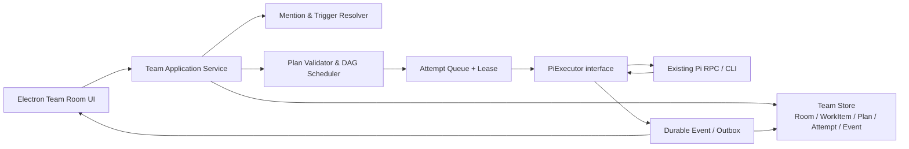

# Stella Team：Multica 与 HiClaw/AgentTeams 源码研究及本地化改进建议

> 研究日期：2026-08-02
> 研究范围：只使用两个项目的官方 GitHub 仓库、官方文档、源码与测试；不使用二手文章。
> 目标环境：Stella 本地 Electron 桌面应用，Pi 通过现有 RPC/CLI 适配层独立运行；Team 是上层协作能力，不能修改或侵入 Pi 原生能力。

## 0. 版本与来源固定

为避免 `main` 后续变化导致结论无法复现，本文所有源码链接都固定到具体提交。

| 项目 | 本文固定提交 | 身份说明 |
|---|---|---|
| Multica | [`37f3bb7dd9c0fe665051ce26dadab03b090dc1af`](https://github.com/multica-ai/multica/commit/37f3bb7dd9c0fe665051ce26dadab03b090dc1af) | 官方仓库 `multica-ai/multica` |
| HiClaw / AgentTeams | [`2ea027403398dfa06f3fc86445042d59f4684d71`](https://github.com/agentscope-ai/AgentTeams/commit/2ea027403398dfa06f3fc86445042d59f4684d71) | Alibaba/AgentScope 当前官方仓库为 `agentscope-ai/AgentTeams`；官方旧公告仍给出 `higress-group/hiclaw` 地址，[公告源码明确记录旧 GitHub 地址](https://github.com/agentscope-ai/AgentTeams/blob/2ea027403398dfa06f3fc86445042d59f4684d71/blog/agentteams-announcement.md#L484-L485)，而 v1.2.0 变更日志说明 HiClaw 兼容入口已退出、AgentTeams 成为唯一运行时契约，[见英文说明](https://github.com/agentscope-ai/AgentTeams/blob/2ea027403398dfa06f3fc86445042d59f4684d71/changelog/v1.2.0.md#L11-L15)。2026-08-02 访问 `github.com/alibaba/hiclaw`、`github.com/higress-group/hiclaw` 均重定向到该仓库。 |

本文把当前仓库称为“AgentTeams（原 HiClaw）”。

## 1. 结论先行

Stella 不应复刻 Multica，也不应移植 AgentTeams。适合 Stella 的组合是：

1. **交互采用 AgentTeams 的 Room-first 思想**：用户先创建 Room、加入 Leader/Workers，然后在同一输入框中通过 `@lead` 或 `@具体 Worker` 发起和推进工作。Room 是人可见、可持续的协作现场。
2. **执行内核采用 Multica 的强状态思想**：消息、长期工作目标、DAG 节点、每次 Agent 运行必须是不同实体；队列认领、幂等、租约、重试、状态事件都由控制面保证，不能依赖模型“记得”更新。
3. **任务分解采用 AgentTeams Team Leader 的 DAG 方法**：按上下文边界拆分，有唯一负责人、可检查输出、验收条件、无写冲突；只有依赖节点被 Leader 接受后，下游节点才可运行。
4. **Pi 只作为执行器**：Team 层通过 `PiExecutor` 接口调用现有 Pi RPC，消费其流式事件、工具调用、审批与产物；不改 Pi，不把 Team 状态写进 Pi 内部，也不让 Pi 升级被 Team 数据结构卡住。
5. **模型输出只能提出决策，不能直接成为控制面事实**：禁止再用“解析 LEAD 自然语言为 Coordinator JSON”作为唯一控制路径。Leader 应调用受校验的 typed command/tool（例如 `propose_plan`、`delegate_node`、`accept_result`）；应用服务校验并提交状态转换。
6. **单一事实源必须在本地 Team Store**：Room 消息不是队列，DAG 图不是运行记录，Pi session 也不是项目状态。所有可恢复协作状态进入同一个事务存储；UI 只从事实源和事件流投影。
7. **保持简单**：不引入 Matrix、Tuwunel、MinIO、Higress、Kubernetes CRD、每 Worker 一个容器等 AgentTeams 基础设施；也不照搬 Multica 面向多租户 SaaS 的全部权限、外部渠道与复杂评论路由。

一句话架构：

> **Room 负责对话，WorkItem 负责目标，PlanNode 负责依赖，TaskAttempt 负责一次 Pi 运行；Leader 负责提出与验收，控制面负责校验与状态。**

## 2. 第一性原理：Team 系统到底需要解决什么

多 Agent 产品最容易混淆四种事实：

| 事实 | 核心问题 | 生命周期 | 应由谁写入 |
|---|---|---|---|
| Room / Message | 谁在什么上下文里说了什么 | 长期、可归档 | 人或 Agent 写消息；系统持久化 |
| WorkItem | 这次要完成的可验收目标是什么 | 从创建到审核/完成 | 人、Leader 通过受控命令改变 |
| Plan / PlanNode | 工作如何分解、依赖和汇合 | 可版本化、可重规划 | Leader 提议，控制面校验后提交 |
| TaskAttempt | 某个 Agent 的某一次真实运行发生了什么 | 短期且不可覆盖 | 调度器和 Pi 执行适配层 |

如果把四者合成一个“Task”对象，会立刻出现当前类产品常见的问题：

- 对话发出后侧栏没有任务，因为系统等模型跑完才补记录；
- Agent 显示“可用”，但实际上已经有运行；
- Worker 报告成功就把整个项目标记完成；
- 同一消息重复触发两次；
- 应用重启后不知道该重跑、恢复还是等待；
- Leader 输出不是 JSON，整个协作失败；
- UI 图、数据库状态、Pi session 互相矛盾。

因此 Stella Team 的最低不变量应是：

1. **先持久化消息和触发意图，再启动执行**；消息发送成功与任务执行成功是两件事。
2. **一个 WorkItem 可以有多个 Plan 版本和多个 TaskAttempt；旧 Attempt 永不覆盖。**
3. **Agent 展示状态由运行事实推导，不允许模型或 UI 任意写 `busy/idle`。**
4. **DAG 的依赖满足条件是上游结果已被接受（accepted），不是 Worker 进程正常退出。**
5. **每次触发有稳定幂等键；认领有租约；状态转换有版本/CAS。**
6. **消息通知不是提交任务；提交任务也不等于通知已经送达。两者必须由 outbox/event 机制闭合。**
7. **失败必须以明确原因暴露；只对确认是瞬时基础设施故障的情况自动重试。**

## 3. Multica：值得借鉴的是任务内核，而不是页面结构

### 3.1 Chat、Issue、Task 的边界很清楚

Multica 将直接 Chat 定义为一对一、私密、无 Issue 上下文的探索空间；Chat 不自动创建 Issue，[官方 Chat 文档第 8–14 行](https://github.com/multica-ai/multica/blob/37f3bb7dd9c0fe665051ce26dadab03b090dc1af/apps/docs/content/docs/chat.mdx#L8-L14)。每条 Chat 消息都会创建一次 run，离线 runtime 时进入等待，[第 18–25 行](https://github.com/multica-ai/multica/blob/37f3bb7dd9c0fe665051ce26dadab03b090dc1af/apps/docs/content/docs/chat.mdx#L18-L25)。

它进一步明确：Issue 保存长期目标、讨论、负责人和最终状态；Task 只保存一次 Agent 运行。一个 Issue 可以跨越多次 Task，旧运行记录不会覆盖，[Task 文档第 8–20 行](https://github.com/multica-ai/multica/blob/37f3bb7dd9c0fe665051ce26dadab03b090dc1af/apps/docs/content/docs/tasks.mdx#L8-L20)。赋值、评论 @mention、Chat 和 Autopilot 最终都进入同一套 Task 创建、认领和 Agent 工具执行路径，[第 22–31 行](https://github.com/multica-ai/multica/blob/37f3bb7dd9c0fe665051ce26dadab03b090dc1af/apps/docs/content/docs/tasks.mdx#L22-L31)。

这个边界应直接借鉴，但 Stella 的页面入口不必照搬：Multica 的 Chat 与 Issue 分离适合项目管理 SaaS，却不符合用户希望的“先建 Room，再在 Room 中 `@lead` 创建任务”。Stella 应保留实体分离，但把它们放在一条交互路径里：

```text
创建 Room（无任务）
  -> @lead + 目标
  -> 同一事务创建 Message + WorkItem + Leader TaskAttempt
  -> Room 内显示 Plan/DAG、运行和产物
```

### 3.2 @mention 路由是确定性算法，不是交给模型猜

Multica 的评论交互提供“触发预览”：发送前显示将启动哪些 Agent、来源是显式 @、当前 assignee 还是 squad leader，以及不可用/无权限原因，用户可临时取消某个触发，[官方文档第 22–34 行](https://github.com/multica-ai/multica/blob/37f3bb7dd9c0fe665051ce26dadab03b090dc1af/apps/docs/content/docs/mentioning-agents.mdx#L22-L34)。

其路由顺序也被写成确定性规则：

- 显式 `@agent/@squad` 优先；
- `@all` 和 `@member` 抑制隐式 Agent 路由；
- 回复 Agent 评论时交回该 Agent；
- 线程继续由原参与 Agent 处理；
- 最后才落到 Issue assignee / squad leader。

文档版规则见[第 36–46 行](https://github.com/multica-ai/multica/blob/37f3bb7dd9c0fe665051ce26dadab03b090dc1af/apps/docs/content/docs/mentioning-agents.mdx#L36-L46)；源码把“显式 mention 胜出、`@all` 只抑制隐式 fallback”的顺序直接编码在 handler 中，[`comment.go` 第 2602–2619 行](https://github.com/multica-ai/multica/blob/37f3bb7dd9c0fe665051ce26dadab03b090dc1af/server/internal/handler/comment.go#L2602-L2619)，随后才处理 Agent 回复、线程 owner 和 assignee fallback，[第 2640–2677 行](https://github.com/multica-ai/multica/blob/37f3bb7dd9c0fe665051ce26dadab03b090dc1af/server/internal/handler/comment.go#L2640-L2677)。

显式 mention 按“最终执行 Agent ID”去重，但保留每个用户显式点名目标的独立结果，这样两个 squad 共用一个 leader 时只运行一次，却不会让 UI 丢掉某个被点名对象的反馈，[`comment.go` 第 2941–2975 行](https://github.com/multica-ai/multica/blob/37f3bb7dd9c0fe665051ce26dadab03b090dc1af/server/internal/handler/comment.go#L2941-L2975)。权限校验发生在暴露 archived/runtime 状态之前，避免通过错误原因枚举私有 Agent，[第 2976–2983 行](https://github.com/multica-ai/multica/blob/37f3bb7dd9c0fe665051ce26dadab03b090dc1af/server/internal/handler/comment.go#L2976-L2983)。

对 Stella 的直接启示：输入框里显示的是 `@靶点生物学研究员`，持久化的必须是 `mention://agent/<stable-id>`；发送前显示触发预览。不要靠正则从最终纯文本再次猜名字，也不要让模型决定谁“可能被 @ 了”。

### 3.3 连续消息合并避免重复运行，但不伪造成功

Multica 在同一 Agent 已有等待任务时，把连续评论合并到待处理任务；如果 Agent 正在运行，则把后续评论聚合成一次 follow-up，[文档第 48–52 行](https://github.com/multica-ai/multica/blob/37f3bb7dd9c0fe665051ce26dadab03b090dc1af/apps/docs/content/docs/mentioning-agents.mdx#L48-L52)。

更重要的是源码里的正确性不变量：只有当评论能被证明已附着到某个将处理它的 run 时，才返回 `queued/coalesced/deferred`；竞争无法收敛时返回真实错误，而不是伪造 deferred，[`comment.go` 第 2025–2060 行](https://github.com/multica-ai/multica/blob/37f3bb7dd9c0fe665051ce26dadab03b090dc1af/server/internal/handler/comment.go#L2025-L2060)。合并失败时，它区分“成功合并、目标已被认领、归因被拒绝、内部错误”，不把失败包装成成功，[第 2286–2324 行](https://github.com/multica-ai/multica/blob/37f3bb7dd9c0fe665051ce26dadab03b090dc1af/server/internal/handler/comment.go#L2286-L2324)。

这是 Stella 必须复制的语义，而不是复制代码规模：如果同一 Room 在 5 秒内连续补充三条给同一 Worker 的信息，可以合并为同一 queued attempt 的输入；但只有数据库中的 `attempt_input_messages` 确认关联成功后，UI 才显示“已合并”。

### 3.4 Squad Leader 的价值是“先协调、再停止”

Multica Squad 不是把所有成员同时唤醒。Issue 分给 Squad 后只先启动 Leader；Squad 是路由机制，不会自动提升并发，[官方 Squad 文档第 8–16 行](https://github.com/multica-ai/multica/blob/37f3bb7dd9c0fe665051ce26dadab03b090dc1af/apps/docs/content/docs/squads.mdx#L8-L16)。

标准流程为：Leader 认领、读取 briefing、把父 Issue 置为 `in_progress`、用一条精确 mention 评论委派、记录评估、然后停止；成员回报或阶段完成后再唤醒 Leader，由其决定下一步或进入 review，[第 29–40 行](https://github.com/multica-ai/multica/blob/37f3bb7dd9c0fe665051ce26dadab03b090dc1af/apps/docs/content/docs/squads.mdx#L29-L40)。Leader 自己的评论不触发自己，显式 @handoff 时 Leader 让路，待处理 Leader run 也会去重，[第 52–68 行](https://github.com/multica-ai/multica/blob/37f3bb7dd9c0fe665051ce26dadab03b090dc1af/apps/docs/content/docs/squads.mdx#L52-L68)。

源码把协调协议作为系统 briefing 注入：按成员技能匹配、精确 mention、每轮记录评估、派发后停止，[`squad_briefing.go` 第 23–71 行](https://github.com/multica-ai/multica/blob/37f3bb7dd9c0fe665051ce26dadab03b090dc1af/server/internal/handler/squad_briefing.go#L23-L71)。同时明确只有“本 Squad 拥有的 Issue”才允许 Leader 改父状态；被临时 @ 到别人 Issue 的 Squad 不得越权，[第 73–105 行](https://github.com/multica-ai/multica/blob/37f3bb7dd9c0fe665051ce26dadab03b090dc1af/server/internal/handler/squad_briefing.go#L73-L105)。

适合 Stella 的部分：Leader 不是万能 Worker，而是计划、派发、验收、重规划的角色。不能照搬的部分：Multica 主要靠提示词和评论 mention 形成协作，没有结构化 DAG 成为强制事实；Stella 应把“Leader 说要委派”转换为 typed command 和数据库状态，而不是只看其自然语言评论。

### 3.5 Task Queue 是真正的执行控制面

Multica Task 状态包含 `deferred -> queued -> dispatched -> waiting_local_directory/running -> completed/failed/cancelled`，[官方文档第 33–54 行](https://github.com/multica-ai/multica/blob/37f3bb7dd9c0fe665051ce26dadab03b090dc1af/apps/docs/content/docs/tasks.mdx#L33-L54)。Task 完成只表示一次 run 正常结束，并不等于 Issue 目标完成，[第 133–137 行](https://github.com/multica-ai/multica/blob/37f3bb7dd9c0fe665051ce26dadab03b090dc1af/apps/docs/content/docs/tasks.mdx#L133-L137)。

其 PostgreSQL 认领算法有几个关键点：

- 同一个 `(issue, agent)` 串行，但不同 Agent 可以在同一 Issue 并行；Chat 按 session 串行；
- 认领顺序为 `priority DESC, created_at ASC`；
- 通过 `FOR UPDATE SKIP LOCKED` 防止多个 daemon 重复认领；
- 认领时写 `dispatched` 和 prepare lease。

这些都在 [`ClaimAgentTask` SQL 第 508–546 行](https://github.com/multica-ai/multica/blob/37f3bb7dd9c0fe665051ce26dadab03b090dc1af/server/pkg/db/queries/agent.sql#L508-L546)。服务层在事务内锁定 Agent，统计 active Task 与 `MaxConcurrentTasks`，再认领下一条，[`task.go` 第 2273–2327 行](https://github.com/multica-ai/multica/blob/37f3bb7dd9c0fe665051ce26dadab03b090dc1af/server/internal/service/task.go#L2273-L2327)。runtime 认领前会提升到期 deferred、回收丢失响应的 stale dispatched task，并用版本化 empty-cache 关闭“刚查空就有新任务入队”的竞态，[第 2391–2445 行](https://github.com/multica-ai/multica/blob/37f3bb7dd9c0fe665051ce26dadab03b090dc1af/server/internal/service/task.go#L2391-L2445)。

Task token 与已交付评论 ID 在同一事务里确认；确认失败可把精确的那一代 claim 安全退回队列，[`task.go` 第 2478–2514 行](https://github.com/multica-ai/multica/blob/37f3bb7dd9c0fe665051ce26dadab03b090dc1af/server/internal/service/task.go#L2478-L2514)，对应 SQL 还用 CAS 和集合子集检查防止旧 handler 越代确认，[`agent.sql` 第 548–571 行](https://github.com/multica-ai/multica/blob/37f3bb7dd9c0fe665051ce26dadab03b090dc1af/server/pkg/db/queries/agent.sql#L548-L571)。

Stella 不需要复制全部多 daemon 优化，但必须保留三件事：**幂等键、认领租约、状态 CAS**。如果本地版本使用 SQLite 单进程调度器，可用 `BEGIN IMMEDIATE`、版本字段和单 scheduler loop 实现；不要为了照搬 `SKIP LOCKED` 单独引入 PostgreSQL。若当前 Team 后端已经依赖 PostgreSQL，则直接采用与 Multica 相同的事务认领形态。

### 3.6 Agent 状态应由 Task 推导

Multica 在 Task 认领后不做盲目的 `agent.status = working`，而是重新根据 active tasks 对账，[`task.go` 第 2341–2352 行](https://github.com/multica-ai/multica/blob/37f3bb7dd9c0fe665051ce26dadab03b090dc1af/server/internal/service/task.go#L2341-L2352)。对应 SQL 只要存在 `dispatched/running/waiting_local_directory` 就是 `working`，否则 `idle`，[`agent.sql` 第 1560–1568 行](https://github.com/multica-ai/multica/blob/37f3bb7dd9c0fe665051ce26dadab03b090dc1af/server/pkg/db/queries/agent.sql#L1560-L1568)。所有失败路径最终统一广播 task failure、对账 Agent 状态，并在没有 active/retry 时才把卡住的 Issue 从 `in_progress` 退回 `todo`，[`task.go` 第 3965–4064 行](https://github.com/multica-ai/multica/blob/37f3bb7dd9c0fe665051ce26dadab03b090dc1af/server/internal/service/task.go#L3965-L4064)。

Stella 应进一步把“在线性”和“工作负载”拆成两个正交字段：

- Presence：`online | offline | unknown`，由 Pi runtime/RPC 心跳推导；
- Workload：`idle | queued | working | blocked`，由非终态 Attempt 推导。

这样不会出现“模型在线但任务阻塞”“runtime 离线但数据库还残留 working”被一个枚举值互相覆盖的问题。

### 3.7 重试按失败类别，而不是失败就重跑

Multica 只自动重试 runtime offline/recovery、timeout、Codex 语义无活动、provider network、skill bundle unavailable 等瞬时形状；模型拒绝、编译失败、认证、配额和配置问题不自动重试，[`task.go` 第 3505–3529 行](https://github.com/multica-ai/multica/blob/37f3bb7dd9c0fe665051ce26dadab03b090dc1af/server/internal/service/task.go#L3505-L3529)。provider network 最多三次且最后一次短暂延迟，[第 3531–3572 行](https://github.com/multica-ai/multica/blob/37f3bb7dd9c0fe665051ce26dadab03b090dc1af/server/internal/service/task.go#L3531-L3572)；context overflow 等污染 session 的错误必须开新 session，而非继续重放，[第 3575–3615 行](https://github.com/multica-ai/multica/blob/37f3bb7dd9c0fe665051ce26dadab03b090dc1af/server/internal/service/task.go#L3575-L3615)。

这套分类很适合 Pi：保留原始 Pi error，同时归一化为 `transport/runtime/provider_auth/provider_quota/context/skill/tool/user_cancelled/agent_blocked/unknown`。只有 transport/runtime/provider_network 自动重试；其余直接显示可操作原因。

### 3.8 Multica 不应照搬的内容

1. **Chat 与 Issue 分页分入口**不符合 Stella 的 Room-first 诉求；只借实体边界。
2. **评论路由面向多人 SaaS、Slack/Lark、workspace 权限和 Issue 线程**，源码边界非常复杂；Stella 第一版只需要 Room 成员、显式 mention、reply-to 和 `/note`。
3. **Issue 状态仍部分依靠 Agent 按提示词更新**。Multica 自己也明确 Task 生命周期和 Issue 状态是分离的、Agent 通过约定管理 Issue 状态，[Assigning Issues 第 31–42 行](https://github.com/multica-ai/multica/blob/37f3bb7dd9c0fe665051ce26dadab03b090dc1af/apps/docs/content/docs/assigning-issues.mdx#L31-L42)。Stella 的技术状态转换应由 typed command + control-plane validator 保证。
4. **PostgreSQL 多 daemon 优化**只有在 Stella 实际运行多个调度进程时才需要；本地单进程不要提前复制 empty-cache、批量 runtime claim 等所有优化。

## 4. AgentTeams（原 HiClaw）：值得借鉴的是 Room 和 Leader 方法，而不是基础设施

### 4.1 定位就是“可见房间中的协作控制面”

AgentTeams 官方 README 将自己定义为：多个 Agent 在受控、可审计 Room 中协作，人可以全程看见和干预；Manager-Workers 架构负责协作，而不是重写 Agent runtime，[README 第 13–17 行](https://github.com/agentscope-ai/AgentTeams/blob/2ea027403398dfa06f3fc86445042d59f4684d71/README.md#L13-L17)。其核心卖点还包括不同 runtime 共处同一 IM Room、MinIO 共享文件和 Matrix 客户端，[第 19–30 行](https://github.com/agentscope-ai/AgentTeams/blob/2ea027403398dfa06f3fc86445042d59f4684d71/README.md#L19-L30)。

这与 Stella 用户直觉高度一致：Room 是默认入口，用户在那里添加 Leader/Workers、输入 `@lead`、观察委派、插话、补资料和接收产物。对 Stella 真正有价值的是这种交互语义，而不是 Matrix 本身。

### 4.2 它把“运行很多 Agent”和“让 Agent 协作”分开

官方架构文档区分：orchestration 解决生命周期、资源和隔离；collaboration 解决组织结构、谁可联系谁、委派和共享状态，[`k8s-native-agent-orch.md` 第 23–28 行](https://github.com/agentscope-ai/AgentTeams/blob/2ea027403398dfa06f3fc86445042d59f4684d71/docs/k8s-native-agent-orch.md#L23-L28)。Team Leader 本身仍是 Worker，只是换了 SOUL/skills；Manager 只联系 Leader，不穿透 Team 直接微操 Worker，[第 63–67 行](https://github.com/agentscope-ai/AgentTeams/blob/2ea027403398dfa06f3fc86445042d59f4684d71/docs/k8s-native-agent-orch.md#L63-L67)。

其 Team Room 拓扑为：

```text
Leader Room: Manager + Global Admin + Leader
Team Room:   Leader + Admin + Workers（Manager 不在）
Worker Room: Leader + Admin + 单 Worker
Leader DM:   Admin + Leader
```

官方定义见[第 107–145 行](https://github.com/agentscope-ai/AgentTeams/blob/2ea027403398dfa06f3fc86445042d59f4684d71/docs/k8s-native-agent-orch.md#L107-L145)。

Stella 不需要生成四类真实 Room。建议简化为：

- 一个用户可见的 **Task Room**：Human + Lead + Workers；所有可审计协作都在这里；
- 一个逻辑 **Coordinator channel**：只在系统内部给 Lead 发送 typed coordination event，不单独做聊天页；
- 只有确实存在敏感材料或上下文污染时，才为单 Worker 建私有子线程，而不是默认建 Worker Room。

### 4.3 Team 生命周期是声明式的，但基础设施远超 Stella 所需

AgentTeams 用 controller reconcile Worker、Manager、Team、Human；Worker 是独立容器且边缘无状态，Matrix 负责消息，MinIO/S3 保存 workspace 与 task tree，[架构文档第 7–15 行](https://github.com/agentscope-ai/AgentTeams/blob/2ea027403398dfa06f3fc86445042d59f4684d71/docs/architecture.md#L7-L15)、[第 119–130 行](https://github.com/agentscope-ai/AgentTeams/blob/2ea027403398dfa06f3fc86445042d59f4684d71/docs/architecture.md#L119-L130)。Team CR 的状态包含 Team Room、Leader DM、Leader readiness、Worker readiness 和逐成员 phase，[`types.go` 第 475–493 行](https://github.com/agentscope-ai/AgentTeams/blob/2ea027403398dfa06f3fc86445042d59f4684d71/agentteams-controller/api/v1beta1/types.go#L475-L493)、[第 509–556 行](https://github.com/agentscope-ai/AgentTeams/blob/2ea027403398dfa06f3fc86445042d59f4684d71/agentteams-controller/api/v1beta1/types.go#L509-L556)。

controller 会验证恰好一个 Leader、解析 Worker 引用、创建 Room、注入协调上下文和 channel policy，再汇总状态，[`team_controller.go` 第 341–391 行](https://github.com/agentscope-ai/AgentTeams/blob/2ea027403398dfa06f3fc86445042d59f4684d71/agentteams-controller/internal/controller/team_controller.go#L341-L391)、[第 530–546 行](https://github.com/agentscope-ai/AgentTeams/blob/2ea027403398dfa06f3fc86445042d59f4684d71/agentteams-controller/internal/controller/team_controller.go#L530-L546)。它还通过 allow-list 强制 Manager/Leader/Worker 的通信边界，[第 857–920 行](https://github.com/agentscope-ai/AgentTeams/blob/2ea027403398dfa06f3fc86445042d59f4684d71/agentteams-controller/internal/controller/team_controller.go#L857-L920)。

这些概念可映射为 Stella 的普通数据库约束和应用服务，不需要 CRD/controller：Room 必须有且只有一个 active Lead；RoomMember 决定谁可被 @；Pi 配置和 Agent 预设仍是独立实体，加入/移出 Room 不删除 Agent。

### 4.4 Leader 的 DAG/Loop 方法论很成熟

AgentTeams 的 Leader coordination skill 明确把 Leader 定义为策略层：决定 done、DAG/Loop、并行边界、验收、暂停和重规划，[`team-coordination/SKILL.md` 第 10–22 行](https://github.com/agentscope-ai/AgentTeams/blob/2ea027403398dfa06f3fc86445042d59f4684d71/manager/agent/team-leader-agent/skills/team-coordination/SKILL.md#L10-L22)。Project 是耐久上下文，Worker Task 是一次性执行单元；Worker 提交后由 Leader 决定是否接受，[第 24–38 行](https://github.com/agentscope-ai/AgentTeams/blob/2ea027403398dfa06f3fc86445042d59f4684d71/manager/agent/team-leader-agent/skills/team-coordination/SKILL.md#L24-L38)。

它的任务边界原则尤其值得采用：一个 owner、一个可检查输出、可独立工作的上下文、与兄弟节点无写冲突、清晰验收条件、能解锁下游；只并行无写冲突的节点，不把用户原始消息直接转发成 Worker spec，[第 65–80 行](https://github.com/agentscope-ai/AgentTeams/blob/2ea027403398dfa06f3fc86445042d59f4684d71/manager/agent/team-leader-agent/skills/team-coordination/SKILL.md#L65-L80)。

DAG 用于有限且依赖已知的工作；Loop 用于反复研究、build-test-fix 或直到质量阈值，不应预先把所有迭代展开成巨大 DAG，[第 40–63 行](https://github.com/agentscope-ai/AgentTeams/blob/2ea027403398dfa06f3fc86445042d59f4684d71/manager/agent/team-leader-agent/skills/team-coordination/SKILL.md#L40-L63)。Worker 的 `SUCCESS` 只是候选结果，不是 Project 自动推进，[第 121–142 行](https://github.com/agentscope-ai/AgentTeams/blob/2ea027403398dfa06f3fc86445042d59f4684d71/manager/agent/team-leader-agent/skills/team-coordination/SKILL.md#L121-L142)。

对 Stella 的取舍：**先做 DAG，不做通用 Loop 引擎**。Loop 可以在后续作为“每轮生成一个小 DAG + 明确 max iterations/stop condition”的可选策略加入，避免第一版状态机翻倍。

### 4.5 @mention 是发送边界，不是自然语言装饰

AgentTeams 的 Manager 规则要求完整 Matrix ID，阶段交接必须立即真实 @mention；低信息确认不得 @，两轮无新信息的 mention 往返要停止，[`manager/agent/AGENTS.md` 第 53–60 行](https://github.com/agentscope-ai/AgentTeams/blob/2ea027403398dfa06f3fc86445042d59f4684d71/manager/agent/AGENTS.md#L53-L60)。同时明确：不能在 Admin DM 的回复文本里写一个 Worker 名字就当作分配；必须把消息发送到 Worker 所在 Room，并且先同步文件再通知，[第 67–72 行](https://github.com/agentscope-ai/AgentTeams/blob/2ea027403398dfa06f3fc86445042d59f4684d71/manager/agent/AGENTS.md#L67-L72)。

源码也有明确防循环逻辑：只有可解析的 Room target 才可发送；含 mention 的低信息确认会被阻止，[`server.py` 第 586–631 行](https://github.com/agentscope-ai/AgentTeams/blob/2ea027403398dfa06f3fc86445042d59f4684d71/plugins/teamharness/mcp/server.py#L586-L631)。跨 session 的 `PROJECT_REQUESTED` 必须带结构化 reply route、相同 Agent 身份和不同目标 Room，否则显式失败，[`message_tool.py` 第 318–372 行](https://github.com/agentscope-ai/AgentTeams/blob/2ea027403398dfa06f3fc86445042d59f4684d71/plugins/teamharness/mcp/message_tool.py#L318-L372)、[第 375–429 行](https://github.com/agentscope-ai/AgentTeams/blob/2ea027403398dfa06f3fc86445042d59f4684d71/plugins/teamharness/mcp/message_tool.py#L375-L429)。

Stella 的 GUI 可以消除“完整 Matrix ID”这种用户负担：mention menu 只列 Room 中可调用 Agent，显示名称和状态，编辑器内部保存稳定 ID。发送边界仍要强：Leader 的“我会让研究员处理”不是委派；只有 `delegate_node` 成功提交并产生 outbox event 才是委派。

### 4.6 Project/Task 工具已结构化，但源码仍存在关键一致性缺口

AgentTeams 的 TeamHarness 引入 `projectflow/taskflow`，比纯提示词明显前进：

- DAG 校验拒绝重复 ID、未知依赖和环；DFS 复杂度为 `O(V+E)`，[`server.py` 第 2822–2857 行](https://github.com/agentscope-ai/AgentTeams/blob/2ea027403398dfa06f3fc86445042d59f4684d71/plugins/teamharness/mcp/server.py#L2822-L2857)；
- `plan_dag` 替换完整图并保留相同 node ID 的旧状态，[第 3310–3336 行](https://github.com/agentscope-ai/AgentTeams/blob/2ea027403398dfa06f3fc86445042d59f4684d71/plugins/teamharness/mcp/server.py#L3310-L3336)；
- Worker 必须 ack、submit，Leader 通过 `check_task` 检查 submitted 结果是否有效，[第 3881–3952 行](https://github.com/agentscope-ai/AgentTeams/blob/2ea027403398dfa06f3fc86445042d59f4684d71/plugins/teamharness/mcp/server.py#L3881-L3952)、[第 3986–4003 行](https://github.com/agentscope-ai/AgentTeams/blob/2ea027403398dfa06f3fc86445042d59f4684d71/plugins/teamharness/mcp/server.py#L3986-L4003)；
- terminal task 禁止被迟到的 delegate/ack/submit 复活，[第 3759–3780 行](https://github.com/agentscope-ai/AgentTeams/blob/2ea027403398dfa06f3fc86445042d59f4684d71/plugins/teamharness/mcp/server.py#L3759-L3780)。

但不能把它原样当作 Stella 的可靠调度内核。以下是从当前源码直接得出的审查结论：

#### 缺口 A：ready nodes 包含 `assigned`

`_ready_nodes` 同时把 `planned` 和 `assigned` 节点返回为 ready，只检查依赖是否 `completed`，[`server.py` 第 2962–2975 行](https://github.com/agentscope-ai/AgentTeams/blob/2ea027403398dfa06f3fc86445042d59f4684d71/plugins/teamharness/mcp/server.py#L2962-L2975)。这会让已委派节点再次出现在“可派发”集合中。其外部请求 redelegation 校验只阻止换到不同 Room，同一个 Room 的重复委派仍可通过，[第 2765–2777 行](https://github.com/agentscope-ai/AgentTeams/blob/2ea027403398dfa06f3fc86445042d59f4684d71/plugins/teamharness/mcp/server.py#L2765-L2777)。

Stella 的 ready 定义必须是：`node.status == pending && every dependency.status == accepted`。`queued/assigned/running/submitted` 均不可再次 ready。

#### 缺口 B：接受结果可以绕过有效性检查

`check_task` 只有在 task 为 `submitted` 且无 validation errors 时才返回 `effective=true`，[第 3986–4003 行](https://github.com/agentscope-ai/AgentTeams/blob/2ea027403398dfa06f3fc86445042d59f4684d71/plugins/teamharness/mcp/server.py#L3986-L4003)。但 `_accept_task_result` 只查 Project 中是否存在 node，然后直接把状态改成 completed/revision/blocked；它没有验证对应 task 当前确实 submitted，也没有消费 `effective` 证明，[第 3061–3105 行](https://github.com/agentscope-ai/AgentTeams/blob/2ea027403398dfa06f3fc86445042d59f4684d71/plugins/teamharness/mcp/server.py#L3061-L3105)。当前正确顺序主要靠 Leader skill 提示词要求“先 check 再 accept”。

Stella 必须把它变成服务层不变量：`accept_result(attempt_id, result_version)` 只允许接受已提交、校验通过、仍属于当前 node generation 的结果。

#### 缺口 C：文件状态没有事务、锁或版本 CAS

TeamHarness 的 JSON 读写只是 `read_text/json.loads` 与 `Path.write_text`，[`server.py` 第 2780–2788 行](https://github.com/agentscope-ai/AgentTeams/blob/2ea027403398dfa06f3fc86445042d59f4684d71/plugins/teamharness/mcp/server.py#L2780-L2788)。`delegate_task` 顺序写 spec、task meta、project meta、同步文件，最后只返回一个 `notificationNeeded` 提示，[第 3811–3879 行](https://github.com/agentscope-ai/AgentTeams/blob/2ea027403398dfa06f3fc86445042d59f4684d71/plugins/teamharness/mcp/server.py#L3811-L3879)。通知函数的注释明确说明它不发送消息，只告诉调用 Agent 后续再调用 message tool，[第 3156–3168 行](https://github.com/agentscope-ai/AgentTeams/blob/2ea027403398dfa06f3fc86445042d59f4684d71/plugins/teamharness/mcp/server.py#L3156-L3168)。

因此，代码层存在进程崩溃或并发写导致部分状态、丢更新、状态已提交但通知未发的窗口。这是源码推论，不代表其提示词流程一定每次失败；但它不适合作为 Stella 的强一致事实源。Stella 应用一个 DB 事务写 WorkItem/PlanNode/Attempt/outbox，再由 dispatcher 至少一次投递 outbox，消费者用 event ID 幂等。

#### 缺口 D：Team `Active` 与 readiness 语义混在一起

官方 lifecycle 文档把 Active 描述为 Leader 和 Workers 都在运行，Degraded 为部分 Worker 不可用，[`team-lifecycle.md` 第 3–9 行](https://github.com/agentscope-ai/AgentTeams/blob/2ea027403398dfa06f3fc86445042d59f4684d71/manager/agent/skills/team-management/references/team-lifecycle.md#L3-L9)。但 controller 在成员引用和基础设施成功后，汇总 `LeaderReady/ReadyWorkers`，随后无条件把 `Team.Status.Phase = Active`，[`team_controller.go` 第 958–988 行](https://github.com/agentscope-ai/AgentTeams/blob/2ea027403398dfa06f3fc86445042d59f4684d71/agentteams-controller/internal/controller/team_controller.go#L958-L988)。

这说明一个 `phase` 不足以同时表达“组织资源已创建”和“当前执行能力正常”。Stella 应拆开 `room.lifecycle`、`runtime presence`、`agent workload`、`work item status`，不要再用一个状态灯承载全部含义。

#### 缺口 E：Team 选择仍是非结构化语义判断

Manager 文档明确说 Team API 没有 domain/expertise/capabilities 等结构化匹配字段，选 Team 是 Manager 根据名称、描述和 roster 做语义判断，[`team-task-delegation.md` 第 3–14 行](https://github.com/agentscope-ai/AgentTeams/blob/2ea027403398dfa06f3fc86445042d59f4684d71/manager/agent/skills/team-management/references/team-task-delegation.md#L3-L14)。

Stella 已有 Agent Skills 概念，应把 `required_skills/preferred_skills` 作为 PlanNode 的结构化字段。模型可提出需求技能，但最终 eligibility 和缺失原因由系统计算，避免“模型觉得某人合适”却启动后才报 Skill 缺失。

### 4.7 Heartbeat 的思想可用，LLM 驱动轮询不应照搬

AgentTeams 的 Manager Heartbeat 以 `state.json.active_tasks` 为活动任务事实，检查 finite/team-delegated/infinite/project tasks，必要时唤醒容器、询问进度、升级 blocker，[`HEARTBEAT.md` 第 3–12 行](https://github.com/agentscope-ai/AgentTeams/blob/2ea027403398dfa06f3fc86445042d59f4684d71/manager/agent/HEARTBEAT.md#L3-L12)、[第 35–82 行](https://github.com/agentscope-ai/AgentTeams/blob/2ea027403398dfa06f3fc86445042d59f4684d71/manager/agent/HEARTBEAT.md#L35-L82)。它也要求正常时静默、只向管理员报告异常，[第 177–191 行](https://github.com/agentscope-ai/AgentTeams/blob/2ea027403398dfa06f3fc86445042d59f4684d71/manager/agent/HEARTBEAT.md#L177-L191)。

Stella 应采用“对账/reconcile”思想，但由廉价、确定性的 scheduler timer 执行：查询过期 lease、长时间无事件的 running attempt、离线 runtime、待处理 outbox；只有需要解释或重新规划时才启动 Leader 模型。不要每个心跳让 LLM 读取所有任务并逐个问“进展如何”。

### 4.8 AgentTeams 不应照搬的内容

1. Matrix/Tuwunel/Element Web：Stella 已有 Electron UI 和本地消息模型。
2. MinIO/S3 双向同步：本地 workspace 和产物索引已能提供文件能力；只需 Artifact 表和文件引用。
3. Higress gateway、凭证 consumer、Kubernetes CRD/controller：这是多容器企业部署控制面，不是单机 GUI 的必要条件。
4. 每 Worker 一个容器、单独 Room、Team Room/Leader Room/DM 四层拓扑：对本地用户太重。
5. `state.json + project meta.json + task meta.json + Matrix history + object storage` 多事实源：Stella 应只有一个事务 Team Store。
6. 依靠大段 AGENTS/SKILL 提示词维持控制不变量：提示词负责策略，数据库约束和应用服务负责事实。

## 5. 两个项目的对照判断

| 维度 | Multica | AgentTeams（原 HiClaw） | Stella 应采用 |
|---|---|---|---|
| 默认交互 | 私聊或 Issue 评论 | Room/Channel + @mention | Room-first，同一输入框发起和推进 |
| 长期工作实体 | Issue | Project / shared task tree | WorkItem |
| 单次运行实体 | DB Task Queue record | Worker task meta + runtime 会话 | 不可变 TaskAttempt |
| 团队入口 | Squad Leader 先运行 | Manager -> Team Leader -> Workers | Room 的 Lead，`@lead` 显式启动 |
| 任务分解 | 主要由 Leader 评论/mention | 结构化 DAG/Loop + Leader tools | 结构化 DAG 优先，Loop 后置 |
| 调度可靠性 | PostgreSQL 事务、lease、CAS、重试 | 文件状态 + 消息工具，部分不变量靠提示词 | 本地事务 store + lease/CAS/outbox |
| Agent 状态 | 从 active tasks 推导 | Worker/Team CR status + Matrix/容器状态 | Presence 与 Workload 分离并推导 |
| 结果语义 | Task completed != Issue done | Worker success != Leader accepted | submitted != accepted != WorkItem done |
| 人工介入 | 评论、stop/retry、review | Room 全程可见、pause/interruption | Room 中可见；计划/硬中断/最终 done 有明确门 |
| 观测 | Task transcript + event bus | Matrix history + file tree + controller status | 统一事件流、DAG、Attempt transcript、Artifacts |
| 主要复杂度 | 多租户 SaaS 与评论路由 | 多容器、Matrix、对象存储、K8s | 均不照搬，只取状态与交互原则 |

## 6. Stella 目标架构



### 6.1 模块职责

| 模块 | 只负责什么 | 明确不负责什么 |
|---|---|---|
| Team Room UI | Room、成员、mention、触发预览、DAG、运行与产物展示 | 不自行推断/写 Agent 状态 |
| Trigger Resolver | 把结构化 mention/reply 转换为确定的 trigger targets | 不调用模型决定目标 |
| Coordinator Service | 向 Lead 提供上下文与 typed commands，提交 Plan proposal | 不解析自然语言 JSON 作为控制事实 |
| Plan Validator | 校验 DAG、技能、owner、验收、资源冲突 | 不运行 Pi |
| Scheduler | ready 计算、容量、认领、lease、取消与恢复 | 不判断业务结果是否合格 |
| PiExecutor | 把 Attempt 映射到 Pi RPC，透传流式事件/审批/错误/产物 | 不保存 Team 业务状态，不修改 Pi |
| Result Gate | 校验提交完整性；由 Lead/人接受、修订、阻塞 | 不把进程 exit 0 当作自动接受 |
| Projection/Event | 生成侧栏、Agent 状态、DAG、timeline 视图 | 不作为事实源反向覆盖 DB |

### 6.2 最小领域模型

保持 YAGNI，第一版只需以下核心实体；字段可根据当前项目存储方式映射，不要求一定新建同名表。

#### Room

- `id`, `name`, `lifecycle: active|archived`
- `lead_agent_id`
- `created_at`, `updated_at`
- Room 可以在没有 WorkItem 时存在，解决“先建 room 再聊”的需求。

#### RoomMember

- `room_id`, `agent_id`
- `role: lead|worker`
- `joined_at`, `removed_at`
- 一个 active Room 恰好一个 active Lead；Worker 可增删，Agent 本体不受影响。

#### Message

- `id`, `room_id`, `work_item_id?`
- `author_type`, `author_id`, `body`
- `mentions[]`（稳定 entity ID，而非纯文本名字）
- `reply_to_message_id?`, `created_at`

#### WorkItem

- `id`, `room_id`, `title`, `goal`, `acceptance`
- `status: planning|queued|running|waiting_human|in_review|done|failed|cancelled`
- `created_by_message_id`, `current_plan_version`
- 第一条 `@lead` 触发时立即创建，不能等 Lead 首次运行结束后才出现。

#### Plan / PlanNode

- Plan：`work_item_id`, `version`, `status: proposed|approved|active|superseded|completed`
- Node：稳定 ID、title、owner、required skills、acceptance、output contract、resource keys
- Node status：`pending|queued|running|submitted|accepted|revision|blocked|cancelled`
- Dependencies：有向边；依赖只接受 `accepted`。

#### TaskAttempt

- `id`, `node_id` 或 `work_item_id + purpose=lead_plan`
- `agent_id`, `attempt_no`, `idempotency_key`
- `status: queued|claimed|running|waiting_approval|submitted|failed|cancelled`
- `lease_owner`, `lease_expires_at`, `session_id`, `started_at`, `finished_at`
- `failure_kind`, `failure_message`, `input_message_ids`, `result_ref`

#### Event / Outbox

- `id`, `aggregate_type/id`, `event_type`, `payload`, `created_at`, `delivered_at?`
- DB 状态和需要投递到 UI/Lead/Worker 的通知在同一事务提交。

### 6.3 为什么不要把 Room 与 WorkItem 合并

Room 是人类关系和上下文容器；WorkItem 是可验收工作。允许 Room 先存在可满足自然聊天，允许同一 Room 在一个 WorkItem 完成后继续复盘或显式开启下一项工作。为了控制第一版复杂度，建议：

- 每个 Room 同时最多一个非终态 WorkItem；
- 新的 `@lead` 在已有 active WorkItem 时默认解释为对当前工作补充/重规划；
- 用户点“新工作”或当前 WorkItem 终态后，再创建下一个 WorkItem；
- 所有自动解释都在发送前触发预览中明示，可取消。

这不是执行次数上限，而是消除一个 Room 多个并行目标造成的路由歧义。以后若确需并行 WorkItem，应引入 thread/work-item selector，而不是让模型猜消息属于哪一个。

## 7. 核心算法设计

### 7.1 Mention 解析与触发优先级

输入不是先变成纯文本再解析，而是编辑器生成结构化 token：

```ts
type MentionToken = Readonly<{
  entityType: "agent" | "role";
  entityId: string;        // agent UUID，或 room-local alias "lead"
  displayName: string;
}>;
```

推荐解析顺序：

```text
1. /note                         -> 只存消息，无 Agent trigger
2. 显式 @agent                  -> 所有合法显式目标，按 Agent ID 去重
3. 显式 @lead                   -> 解析为该 Room 当前 Lead
4. reply-to Agent message       -> 该 Agent（仅在无显式 mention 时）
5. 其他普通 Room 消息           -> 只存消息，不产生隐式付费运行
```

与 Multica 相比，Stella 第一版有意不做 assignee fallback：Room 群聊里没有 @ 的普通讨论不应意外启动模型。UI 可在回复 Agent 时自动显示“将继续唤醒 X”的 trigger preview。

复杂度：mention 解析 `O(M)`；Room membership/permission 查询应批量完成，避免每个 mention 一次查询。

### 7.2 触发预览

发送前 resolver 返回：

```ts
type TriggerPreview = Readonly<{
  targetAgentId: string;
  source: "explicit_agent" | "room_lead" | "reply";
  action: "create_work_item" | "plan" | "execute" | "follow_up";
  eligibility: "ready" | "offline" | "missing_skills" | "not_in_room" | "busy";
  reasons: readonly string[];
}>;
```

`busy` 不是拒绝，只表示将排队；`offline/missing_skills/not_in_room` 是明确 blocked。用户可以在发送前取消某个 target，但消息仍可发送为 note。

### 7.3 WorkItem 创建与幂等

`@lead` 在无 active WorkItem 的 Room 中触发：

```text
BEGIN
  insert message
  insert work_item(status=planning, created_by_message_id=message.id)
  insert lead planning attempt(status=queued,
    idempotency_key=room_id + message_id + lead_id + "plan")
  insert outbox(task_queued)
COMMIT
```

相同 idempotency key 再次到达时返回已有实体，不创建第二个 Attempt。只有事务成功后 UI 显示“已启动”；事务失败则消息发送/任务创建的具体状态必须明确，不得伪造成功。

### 7.4 Worker 选择：硬过滤 + 可解释的稳定排序

不要让模型输出一个 Agent 名称就直接启动。Leader 可提出 `required_skills`、`preferred_agent_id`；allocator 做：

1. **硬过滤**：Room active member、Agent enabled、Pi runtime 可用、必需 skill 全部存在、满足工作区/工具权限。
2. **稳定排序**（词典序优先，而不是未经校准的神秘权重）：
   1. 用户/Leader 明确指定的 preferred Agent；
   2. 必需 skills 全覆盖；
   3. preferred skills 覆盖数量更高；
   4. 当前 active attempt 数更少；
   5. 与同一 WorkItem/Artifact 的连续性更高；
   6. 稳定 Agent ID 作为最终 tie-breaker。
3. 把选择理由写进 PlanNode/事件，UI 可见。
4. 若没有 eligible Agent，节点进入 `blocked(missing_capability)`，列出缺少的 skills；不得静默让通用 Agent 假装成功。

排序复杂度在候选数 A 较小时为 `O(A log A)`；也可单遍维护最佳候选降为 `O(A)`。

### 7.5 DAG 校验

Leader 通过 `propose_plan` 提交完整 proposal；validator 做：

1. Node ID 唯一、依赖存在、无 self-dependency；
2. 恰好一个 owner 或声明由 allocator 选择；
3. `acceptance` 和 `output_contract` 非空；
4. 必需 skills 可解析；
5. DFS 或 Kahn 检测环，`O(V+E)`；
6. sibling 的 `resource_keys` 不应同时写同一资源，除非被依赖边串行化；
7. 节点数和内容问题应作为 validation errors 返回给 Leader 修正，而不是截断或静默降级。

资源冲突建议用显式 key，例如 `workspace:<id>:write`、`file:<path>`、`artifact:<name>`。如果 Pi runs 共用同一可写工作目录且没有 worktree 隔离，写操作节点必须通过同一 workspace write key 串行；只读研究节点可并行。

### 7.6 Ready 与 wave 调度

严格定义：

```text
ready(node) =
  work_item.status == running
  AND active_plan.status == active
  AND node.status == pending
  AND every dependency.status == accepted
  AND owner eligible
  AND no conflicting resource lease
```

每次发生 `plan_approved / node_accepted / node_cancelled / agent_capacity_changed` 时增量计算 ready nodes。对小型本地 DAG，直接扫描所有边 `O(V+E)` 足够；无需复杂的分布式图引擎。

调度一波 ready nodes 时：

- 先按显式 priority，再按稳定 node order；
- 检查每 Agent 容量和 resource lease；
- 在一个事务中把 node `pending -> queued` 并创建 Attempt；
- 同一个 node generation 只能有一个非终态 Attempt；
- Attempt 失败是否产生下一 attempt 由 retry policy 决定，不复活旧 Attempt。

### 7.7 Queue、Lease 与恢复

本地单 scheduler 的推荐最小算法：

```text
claimNext(workerId, now):
  BEGIN IMMEDIATE / transaction
  reclaim expired claimed attempts to queued or failed according to failure policy
  select first queued attempt
    where agent has capacity and node generation is current
    order by priority desc, created_at asc
  CAS queued -> claimed, set lease_owner and lease_expires_at
  COMMIT
```

随后启动 Pi RPC；收到 Pi 开始事件时 `claimed -> running`。执行期间按事件或定时续租；应用重启后：

- Pi session 仍可确认活跃：重新绑定并继续事件消费；
- 无法确认活跃且 lease 过期：记录 `runtime_recovery` 失败，再按策略创建新 Attempt；
- 已 submitted/failed/cancelled：绝不重跑；
- outbox 未投递：重新投递，消费者按 event ID 幂等。

### 7.8 结果门

状态必须分三层：

```text
Pi process completed
  -> Attempt submitted（结构完整、产物存在）
  -> Leader accepted / revision / blocked
  -> DAG 下游才可能 ready
```

`accept_result` 服务端前置条件：

- Attempt 属于当前 node generation；
- status 为 submitted；
- result schema/required artifacts/required checks 已验证；
- 当前 Plan 仍 active；
- command actor 是 Room Lead 或经配置允许的 human reviewer；
- 乐观版本匹配，避免接受旧结果覆盖新计划。

所有前置条件失败必须返回具体 error code。

### 7.9 状态投影

不要让每个页面维护一套 Agent 状态。投影规则集中在 domain/query 层：

```text
presence:
  Pi runtime heartbeat/config unavailable -> offline
  otherwise -> online

workload:
  any running/claimed/waiting_approval -> working
  else any queued -> queued
  else any current blocked node owned by agent -> blocked
  else -> idle
```

WorkItem：

- `planning`：Lead planning Attempt 或 plan proposal 待确认；
- `queued/running`：至少一个 node queued/running，或仍有 pending nodes；
- `waiting_human`：显式 approval/clarification gate；
- `in_review`：所有 required nodes accepted，最终交付待人确认；
- `done`：人确认，或用户明确开启的 final-autopilot policy；
- `failed`：无可重试 Attempt 且 DAG 无安全前进路径；
- `cancelled`：显式取消。

### 7.10 人工审批

建议 Room 级 execution mode：

- `manual`：Lead 提议 DAG，用户点击“批准并运行”；
- `autopilot`：合法 DAG 自动运行 ready waves，但遇到缺技能、歧义、危险 Pi 审批、硬中断、最终 done 时仍遵守相应明确门；
- 修改 running DAG 若会取消/停止正在执行的 node，先显示影响并要求确认。AgentTeams 也要求硬中断前说明将停止 Workers、未完成结果不会当成完成、只有已提交且接受的结果可复用，[`team-coordination/SKILL.md` 第 144–162 行](https://github.com/agentscope-ai/AgentTeams/blob/2ea027403398dfa06f3fc86445042d59f4684d71/manager/agent/team-leader-agent/skills/team-coordination/SKILL.md#L144-L162)。

Pi 原生工具/命令审批保持 Pi 自己的机制，Team 不绕过。

## 8. 推荐交互流程

### 8.1 创建 Room

1. 左侧“团队协作” -> “新建 Room”；
2. 输入 Room 名称；
3. 选择一个 Lead（默认可选“通用调度负责人”）；
4. 可立即添加 Workers，也可稍后添加；
5. 进入空 Room，底部始终有同一个聊天输入框。

空 Room 的中心提示不是“先创建任务才能输入”，而是：

```text
在这里与团队交流。
输入 @lead + 目标可创建工作；@具体 Agent 可直接请求协助；/note 仅记录消息。
```

### 8.2 `@lead` 创建工作

输入：

```text
@通用调度负责人 创建一个 CDK2 早研靶点评估任务，输出靶点证据、竞品格局、风险和下一步建议。
```

mention menu 自动完成稳定 ID。发送前预览：

```text
将创建 WorkItem
负责人：通用调度负责人
动作：规划 DAG
模型：Qwen ...
可用性：在线
```

发送成功后必须立即发生：

- 消息进入 timeline；
- 左侧 Room/工作列表立即出现 `planning` 状态，不等模型结束；
- Lead 卡片变为 online + queued/working；
- 流式运行在同一 Room 展示；
- typed plan proposal 到达后显示 DAG 卡片。

### 8.3 批准与执行 DAG

DAG 卡显示：节点、owner、required skills、依赖、验收、输出、当前状态。Manual 模式提供“批准并运行”和“要求修改”；Autopilot 模式显示为何自动批准及可暂停入口。

只有 ready 节点进入队列。每个节点 timeline 包含：queued、claimed、Pi session、工具活动、token/时长、提交、Leader 验收或修订。用户可从 Room 中直接 `@worker` 补充要求；resolver 明确这条消息是合并进 queued input，还是创建 follow-up Attempt。

### 8.4 人工插话

- `@lead 改为只评估肾病适应症`：触发 replan；若影响 running nodes，先确认。
- `@靶点生物学研究员 请补充遗传学证据`：直接 Worker follow-up，不改变 WorkItem owner。
- `/note 会议决定暂不评估 PROTAC`：只记录，不产生模型运行。
- reply 某 Agent 消息：预览显示将继续唤醒该 Agent。

### 8.5 结束

所有 required nodes accepted 后，Lead 生成聚合交付并把 WorkItem 推到 `in_review`；UI 不把“最后一个 Pi 进程 exit 0”显示为任务已完成。用户确认后 `done`，Room 仍可继续复盘或显式开启下一个 WorkItem。

## 9. 分阶段代码改进计划

下面的优先级按“先消除错误状态和不可恢复，再增加智能调度”排序。

### P0：领域边界与强状态（必须先做）

#### P0-1 统一 Team 领域模型

- 明确 Room、Message、WorkItem、Plan/Node、TaskAttempt、Event/Outbox 的边界；
- 迁移现有 Team 数据时保留历史，不让 UI 把旧 run 覆盖；
- 为所有状态转换实现纯 domain transition/validator；
- Room 与 Pi session 只通过 Attempt 关联。

验收：任何运行开始前，Message、WorkItem、Attempt 已可查询；应用重启后仍能确定当前事实。

#### P0-2 去掉自然语言 Coordinator JSON 控制依赖

- 给 Lead 暴露 typed commands：`propose_plan`、`revise_plan`、`delegate_node`、`submit_result`、`accept_result`、`request_revision`、`block_node`、`complete_delivery`；
- schema validation 错误原样进入运行详情；
- Lead 的普通文本只作为 Room 消息，不直接变更 DAG/状态；
- 不添加“解析失败就猜一个默认 Plan”的 silent fallback。

验收：Lead 输出普通报告而未调用 command 时，Attempt 明确失败为 `coordinator_protocol_error`，WorkItem 不被伪造为运行/完成；UI 给出可诊断原始输出。

#### P0-3 状态投影统一

- Presence 与 Workload 分开；
- 所有页面使用同一个 selector/query；
- Agent 状态从 Pi runtime 与 Attempt 推导；
- 终态事件触发重新对账。

验收：认领、运行、等待审批、失败、取消、重启恢复五类路径中，左侧、Room、Kanban、DAG 的 Agent/Task 状态一致。

#### P0-4 幂等、租约与 outbox

- Trigger 幂等键；
- Node generation 唯一 active Attempt；
- claim lease + heartbeat + stale recovery；
- 状态和 outbox 同事务；
- event consumer 按 event ID 幂等。

验收：双击发送、UI 重试请求、应用中途退出、Pi 启动响应丢失均不会产生重复 Worker 运行或丢失通知。

### P1：Room-first 交互闭环

#### P1-1 Room 可独立创建

- Room 创建时只要求名称和 Lead，Workers 可选；
- 空 Room 也有 composer；
- 同一页面完成聊天、创建 WorkItem 和执行观察；
- Room 列表与 WorkItem 列表分层显示，不再把“没有已完成 task”误认为“没有 room”。

#### P1-2 结构化 mention 与 trigger preview

- mention menu 只显示 Room active members，含 Lead alias；
- 显示在线性、workload、skills 与不可调用原因；
- `/note` 和 reply routing；
- 多 mention 按 Agent ID 去重，仍保留每个显式 target 的 outcome。

#### P1-3 立即反馈

- 发送事务提交后立即在侧栏出现 planning/queued；
- timeline 展示 queued/claimed/running/submitted/accepted；
- 失败不隐藏输入，支持带原输入的显式 retry。

验收：用户无需离开 Room 或寻找另一个“新建任务页”，即可从 `@lead` 到 DAG、Worker 执行和结果审核走完全流程。

### P2：可视 DAG 与调度

#### P2-1 Plan proposal/approval

- 完整图 schema、环检测、依赖存在、验收/输出/skills 校验；
- Plan 版本与 supersede；
- manual/autopilot Room policy；
- 修改 running Plan 的影响确认。

#### P2-2 Ready wave scheduler

- 只有 pending 且 dependencies accepted 的节点 ready；
- per-Agent capacity；
- resource key 冲突；
- priority + FIFO；
- submitted 后必须经过 Result Gate。

#### P2-3 可视化

- 节点颜色只来自状态机；
- 边显示依赖；
- 选中节点显示 owner、skills、Attempt、token、时长、产物、错误和验收；
- replan 后保留旧 Plan 只读历史，可切换版本。

验收：顺序、fan-out、fan-in、revision、blocked、cancelled、replan 七类图都能正确推进且 UI 不出现已派发节点再次 ready。

### P3：恢复、观测和策略增强

#### P3-1 Failure taxonomy 与定向重试

- 归一化 Pi/Provider/Skill/Tool 错误；
- 只重试瞬时基础设施错误；
- session poison 时新 session、保留安全 workspace；
- 每次 retry 新 Attempt，链路可见。

#### P3-2 Reconciler

- 应用启动和周期 timer 检查 lease、runtime、outbox、长时间无事件 Attempt；
- 正常状态静默；异常生成 system event，必要时唤醒 Lead 解释/重规划；
- 不用 LLM 轮询所有健康任务。

#### P3-3 Loop（可选，后置）

- 仅在真实需求出现时加入；
- 定义 goal、stop condition、max iterations；
- 每轮一个小 DAG，验收后决定继续；
- 到阈值仍未完成必须 blocked/ask human，不得无限自循环。

## 10. 测试矩阵

### 10.1 单元测试

1. mention precedence：`/note`、显式 Agent、`@lead`、reply、普通消息；
2. target dedup：多个显示名/role alias 落到同一 Agent 时只生成一次执行；
3. trigger preview blocked reasons；
4. DAG：重复 ID、未知依赖、自依赖、环、fan-out/fan-in；
5. ready：assigned/running/submitted 不可再次 ready，只有 accepted 依赖满足；
6. allocator：硬过滤、skills、load、稳定 tie-break；
7. Result Gate：未 submitted、旧 generation、缺产物、并发 replan 都拒绝 accept；
8. 状态投影：presence/workload 的全部组合；
9. retry 分类：auth/quota/config 不自动重试，network/runtime 可重试；
10. state transition property test：终态不可逆、一个 node generation 至多一个 active Attempt。

### 10.2 存储/调度集成测试

1. 两个 scheduler 同时 claim 不会重复；若生产只有单 scheduler，仍测试重复请求/CAS；
2. 创建 WorkItem 与 queued Attempt 同事务；
3. 状态提交后 dispatcher 崩溃，重启能投递 outbox；
4. Pi 已启动但响应丢失，lease/reconcile 不造成并行 duplicate；
5. 连续消息合并时，只有确实关联成功才返回 coalesced；
6. 应用重启恢复 running/queued/submitted；
7. replan 与迟到 result 的代际隔离。

### 10.3 真实 Pi E2E

不能只靠返回固定成功的假 Agent 验证整条链路。至少保留以下真实 Pi 运行：

1. 新建 Room -> 添加 Lead/Worker -> `@lead` 创建两节点 DAG -> Worker 产出 Markdown/HTML -> Lead 接受 -> WorkItem `in_review`；
2. fan-out 两个只读研究节点并行，fan-in 报告节点等待两者 accepted；
3. Worker 缺少必需 skill：发送前 preview blocked，不能启动后才发现；
4. Provider API key 错误：Attempt failed、无自动重试、Agent workload 对账为 idle/blocked；
5. 瞬时 provider network 错误：生成新的 retry Attempt，历史保留；
6. running 中关闭 Electron 后重开：不重复任务，timeline 与 Pi session 正确恢复或明确失败；
7. running 中 `@lead` 改范围：先显示影响，确认后 replan，迟到结果不能推进新 DAG；
8. 产物在 Room 与右侧检查器可打开，多个产物按时间倒序切换。

### 10.4 UI/UX 验收

- 任何 Room、空会话、运行中会话底部都有 composer；
- 左侧收起不丢 Room/WorkItem active indicator；
- 字体缩放对 mention menu、DAG、timeline、错误详情一致生效；
- 键盘可完成 `@` 搜索、选择、发送、取消 preview；
- 状态不仅依赖颜色，有图标/文本；
- 失败详情可复制，包含 Attempt ID、Agent、模型、时长、原始 Pi error、是否会重试；
- 当前模型是全局可见事实，但 Attempt 仍保存启动时实际 model snapshot，避免切换模型后历史被改写。

## 11. 明确采用与拒绝清单

### 采用

- Multica 的 Room/Issue（在 Stella 映射为 Room/WorkItem）与 TaskAttempt 分离；
- Multica 的触发预览、显式 mention 优先、执行去重、评论合并诚实结果；
- Multica 的事务 claim、lease、CAS、失败分类、状态对账；
- Multica 的 Leader-first、stop-after-dispatch、status ownership；
- AgentTeams 的 Room-first、人可见协作与明确 mention send boundary；
- AgentTeams 的 Manager -> Lead -> Worker 责任边界；
- AgentTeams 的 DAG/Loop 选择、上下文边界、无写冲突、Leader acceptance；
- AgentTeams 的 pause/replan 人工确认思想；
- typed project/task operations，但由 Stella 事务控制面重新实现不变量。

### 拒绝

- 复刻 Multica 的独立 Chat/Issue 页面路径；
- 复刻 Multica 全部多租户评论路由和外部 Bot 集成；
- 让 Issue/WorkItem 技术状态完全靠 Agent 提示词更新；
- 引入 Matrix、Element、Tuwunel、MinIO、Higress、Kubernetes CRD；
- 每个 Worker 一个容器或默认四层 Room 拓扑；
- `state.json/project meta/task meta/chat history` 多个事实源；
- 直接文件 JSON 覆盖作为并发调度状态；
- 把 `notificationNeeded` 交给模型“记得再发”；
- ready 集合包含 assigned 节点；
- 未校验 submitted/effective 就接受结果；
- 解析 Lead 普通文本 JSON 并静默猜测修复；
- Worker exit 0 自动等于 Project done；
- 健康任务也周期性唤醒 LLM 做 heartbeat。

## 12. 最终架构判断

从架构师视角，Stella Team 的核心不是“多开几个 Pi”，而是建立一个小而可靠的协作控制面：

- **Pi 是数据面执行器**：继续独立升级、独立使用；
- **Team Store + Scheduler 是控制面**：保存目标、计划、运行与恢复事实；
- **Leader 是策略组件**：提出 DAG、选择/建议 Agent、验收和重规划；
- **Room 是用户界面与审计面**：所有触发、状态、决定和产物在一条自然交互中可见。

从算法视角，真正决定可靠性的不是更长的 Leader prompt，而是几个简单不变量：稳定 mention ID、幂等触发、DAG `O(V+E)` 校验、accepted-only readiness、容量/资源约束、事务 claim + lease、代际隔离、typed Result Gate、事件投影。它们可以在本地单进程中实现，无需分布式平台。

因此推荐的工程路线不是扩大 Team 页面，而是先把当前“聊天、任务、Agent 状态、Coordinator JSON、DAG”收拢到上述领域边界，再完成 Room-first 的一条主路径。完成 P0/P1/P2 后，Stella 会同时具备 AgentTeams 的自然团队交互和 Multica 的可靠执行语义，但仍保持本地 GUI 应有的简单部署与 Pi 独立性。

## 13. 官方源码索引

### Multica

- [Chat 文档](https://github.com/multica-ai/multica/blob/37f3bb7dd9c0fe665051ce26dadab03b090dc1af/apps/docs/content/docs/chat.mdx)
- [Mentioning Agents 文档](https://github.com/multica-ai/multica/blob/37f3bb7dd9c0fe665051ce26dadab03b090dc1af/apps/docs/content/docs/mentioning-agents.mdx)
- [Squads 文档](https://github.com/multica-ai/multica/blob/37f3bb7dd9c0fe665051ce26dadab03b090dc1af/apps/docs/content/docs/squads.mdx)
- [Tasks 文档](https://github.com/multica-ai/multica/blob/37f3bb7dd9c0fe665051ce26dadab03b090dc1af/apps/docs/content/docs/tasks.mdx)
- [Task service](https://github.com/multica-ai/multica/blob/37f3bb7dd9c0fe665051ce26dadab03b090dc1af/server/internal/service/task.go)
- [Task claim SQL](https://github.com/multica-ai/multica/blob/37f3bb7dd9c0fe665051ce26dadab03b090dc1af/server/pkg/db/queries/agent.sql)
- [Comment routing](https://github.com/multica-ai/multica/blob/37f3bb7dd9c0fe665051ce26dadab03b090dc1af/server/internal/handler/comment.go)
- [Squad leader briefing](https://github.com/multica-ai/multica/blob/37f3bb7dd9c0fe665051ce26dadab03b090dc1af/server/internal/handler/squad_briefing.go)

### AgentTeams（原 HiClaw）

- [README](https://github.com/agentscope-ai/AgentTeams/blob/2ea027403398dfa06f3fc86445042d59f4684d71/README.md)
- [系统架构](https://github.com/agentscope-ai/AgentTeams/blob/2ea027403398dfa06f3fc86445042d59f4684d71/docs/architecture.md)
- [Kubernetes-native collaboration architecture](https://github.com/agentscope-ai/AgentTeams/blob/2ea027403398dfa06f3fc86445042d59f4684d71/docs/k8s-native-agent-orch.md)
- [Team API types](https://github.com/agentscope-ai/AgentTeams/blob/2ea027403398dfa06f3fc86445042d59f4684d71/agentteams-controller/api/v1beta1/types.go)
- [Team reconciler](https://github.com/agentscope-ai/AgentTeams/blob/2ea027403398dfa06f3fc86445042d59f4684d71/agentteams-controller/internal/controller/team_controller.go)
- [Manager AGENTS](https://github.com/agentscope-ai/AgentTeams/blob/2ea027403398dfa06f3fc86445042d59f4684d71/manager/agent/AGENTS.md)
- [Manager HEARTBEAT](https://github.com/agentscope-ai/AgentTeams/blob/2ea027403398dfa06f3fc86445042d59f4684d71/manager/agent/HEARTBEAT.md)
- [Team coordination skill](https://github.com/agentscope-ai/AgentTeams/blob/2ea027403398dfa06f3fc86445042d59f4684d71/manager/agent/team-leader-agent/skills/team-coordination/SKILL.md)
- [DAG execution reference](https://github.com/agentscope-ai/AgentTeams/blob/2ea027403398dfa06f3fc86445042d59f4684d71/manager/agent/team-leader-agent/skills/project-management/references/dag-execution.md)
- [DAG task reference](https://github.com/agentscope-ai/AgentTeams/blob/2ea027403398dfa06f3fc86445042d59f4684d71/manager/agent/team-leader-agent/skills/task-management/references/dag-tasks.md)
- [TeamHarness project/task implementation](https://github.com/agentscope-ai/AgentTeams/blob/2ea027403398dfa06f3fc86445042d59f4684d71/plugins/teamharness/mcp/server.py)
- [TeamHarness message implementation](https://github.com/agentscope-ai/AgentTeams/blob/2ea027403398dfa06f3fc86445042d59f4684d71/plugins/teamharness/mcp/message_tool.py)
- [Team DAG E2E test](https://github.com/agentscope-ai/AgentTeams/blob/2ea027403398dfa06f3fc86445042d59f4684d71/tests/test-21-team-project-dag.sh)
- [Projectflow tests](https://github.com/agentscope-ai/AgentTeams/blob/2ea027403398dfa06f3fc86445042d59f4684d71/plugins/tests/teamharness/mcp/tools/test-projectflow.rb)
- [Taskflow tests](https://github.com/agentscope-ai/AgentTeams/blob/2ea027403398dfa06f3fc86445042d59f4684d71/plugins/tests/teamharness/mcp/tools/test-taskflow.rb)
