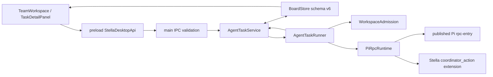

# PI-GUI Team 架构与 Pi 边界审查

审查日期：2026-07-26  
审查基线：`HEAD d157e376c02edc38f8aa8e5812d804b8c7be5594` 对当前未提交工作区  
审查时 Pi 依赖：`@earendil-works/pi-coding-agent@0.82.1`（精确版本）  
审查范围：Team Workspace、Task Room、mention、AgentTask、Coordinator、Squad、Workflow/DAG、Board 持久化、Pi RPC/Skill/model 适配和相关测试。

本报告只审查，没有修改产品代码、依赖或 Pi。

## 1. 结论先行

当前实现已经形成了一套真实、可审计的本地 Agent 执行控制面，而不是伪造多 Agent 输出：Task、AgentTask、运行令牌、不可变任务规格、Agent/Squad 执行快照、Pi session、token/cost、失败和人工验收都被持久化；Coordinator 已经从脆弱的“自然语言 JSON”升级为 Stella 自有的终止型 `coordinator_action` 工具协议；交互式 Pi 工作台与 Team/Workflow 后台 Runtime 也保持隔离。

但它目前准确的产品形态是：

> **以 Task 为中心、全局单执行者、星型一层委派的本地 Team Relay。**

它还不是 Multica/HiClaw 一类“可创建频道、向频道加入一个 Team、持续对话并由 Leader 多轮调度”的团队工作空间。最核心的架构原因不是 UI，而是领域模型里同时存在三套不同含义的“团队”，却没有一个可执行的 Team/Room 聚合：

- `TeamDefinition` 只是 Workflow 的静态角色目录，不能作为 `ExecutionTarget`；
- `Squad` 才是可执行的 Leader + members，但仍靠 Leader 最终自然语言里的 `@mention` 触发副作用；
- “团队协作”页面实际上是虚拟任务启动台 + 每个 Task 一个频道，频道没有独立的 Room、成员或生命周期。

本轮没有发现 P0。发现 4 项 P1 核心问题、8 项 P2 设计/工程债务和 2 项 P3 问题。所有修复都可以留在 Stella 适配层完成，不需要修改、复制或 fork Pi。

## 2. 现有领域模型的真实含义

| 用户概念 | 当前代码事实 | 能力边界 |
| --- | --- | --- |
| Room | 没有持久化 `Room` 实体；`project-launch-room` 是 renderer 常量，每个 Task 被投影成一个频道 | 不能创建任意房间、设置成员、先聊天后建任务或让多个 Task 共用房间 |
| Message | `TaskComment`，强制带 `taskId` | 能持久化用户/Agent/验收消息，但没有独立 Room、mention 解析快照、回复关系或消息投递状态 |
| Agent | 版本化 `AgentDefinition`；项目 Agent 为 `ProjectAgentDefinition` | 角色与在线状态分离是正确的；Agent 配置在分发时会冻结 |
| AgentRun | 没有单独实体；`AgentTask` 同时承担工作定义、队列项和一次运行记录 | 对单次执行足够简单；重试/批次/多次运行的关系表达开始吃力 |
| Team | `TeamDefinition`，仅包含静态 roles | 不能直接分发，主要给固定 Workflow 解释角色组成 |
| Squad | 可持久化、可作为 `ExecutionTarget` 的 Leader + members | 是当前唯一真正可执行的“团队”，但控制协议弱于 Coordinator |
| Board | schema v6 的本地 JSON 聚合 | 单机原子性和可迁移性较强；并发、规模和跨进程能力有明确上限 |
| DAG | `WorkflowRun` 可投影真实 Workflow DAG | Coordinator/Squad 已有 `parentAgentTaskId` 事实图，但 UI 明确不生成 AgentTask DAG |

相关定义：

- `src/shared/kanban.ts:56-95`：Agent、TeamDefinition；
- `src/shared/kanban.ts:126-169`：ExecutionTarget、TaskSpecSnapshot、KanbanTask；
- `src/shared/kanban.ts:247-288`：TaskComment、AgentTask；
- `src/shared/kanban.ts:290-316`：AgentExecutionPlanSnapshot、Squad；
- `src/shared/kanban.ts:362-379`：BoardState 与目录；
- `src/renderer/src/features/team/TeamWorkspace.tsx:16,38,130-141`：虚拟启动台与 Task 频道。

## 3. 运行调用链与状态所有权



关键状态权归属是合理的：

- Stella 持有 Task、WorkflowRun、AgentTask、人工关卡和验收状态；
- Pi 只执行一个隔离 Agent 回合并返回事件、消息、session 和统计；
- `executionAttempt + specRevision + runtimeToken` 阻止旧 Runtime 和旧规格回写当前任务；
- `TaskSpecSnapshot`、`agentSnapshot`、`executionPlan` 冻结分发事实；
- Task 进入 `completed` 前必须经过用户验收，`reported` 不等于 `accepted`。

主要实现位置：

- renderer → IPC：`src/shared/contracts.ts:210-255`、`src/preload/index.ts:72-114`、`src/main/index.ts:1310-1406`；
- AgentTask 事务：`src/main/agent-task-service.ts`；
- 队列与 Pi 生命周期：`src/main/agent-task-runner.ts`；
- 持久化：`src/main/board-store.ts:29-175`；
- 状态不变量：`src/shared/kanban.ts:1026-1180`；
- 生命周期身份：`src/shared/execution-state.ts`。

## 4. P1 发现

### P1-1：Squad 仍允许模型自然语言直接触发真实委派和 Task 阶段变化（现存控制面缺陷）

证据：

- `src/main/agent-task-service.ts:550-579` 对 Squad Leader 的最终文本直接运行 `parseAgentMentions(output, plan.delegates)`；只要文本出现成员 mention，就创建真实子 AgentTask，并把 Task 重新推进到 `queued`；
- `src/main/agent-task-service.ts:1165-1174` 明确提示 Leader 在最终自然语言里写 `@mention`；
- 相对地，Coordinator 在 `src/main/agent-task-service.ts:1093-1113` 必须调用终止型工具，普通文本没有控制权。

可复现方式：

1. 创建 Leader=PLAN、members=BUILD/VERIFY 的 Squad；
2. 让 Leader 的报告正文包含“文档示例：`@BUILD`”；
3. 即使这只是引用或说明，解析器仍会创建 BUILD 子任务并改变 Task 阶段。

影响：

- 数据平面（报告内容）和控制平面（委派行动）再次混合；
- 与 `stella-v4-team-relay.md` 的“模型 prose 不能改变 Task stage”不变量冲突；
- Coordinator 已修复的旧式隐式委派问题在 Squad 路径继续存在。

最小修复方向：Squad 复用 Stella 自有的结构化终止动作，并把可选成员范围作为执行快照传入；这是 Stella extension/协议工作，不需要改 Pi。

### P1-2：Coordinator 任一 Worker 失败会直接杀死整个组，LEAD 没有机会基于失败重规划（核心恢复能力缺口）

证据：

- `src/main/agent-task-service.ts:667-687`：任一运行中子任务失败会把根任务标记 `failed`、取消同组所有非终态兄弟，并把 Task 置为 blocked；
- `src/main/agent-task-service.ts:428-449`：子任务在启动/Skill/权限检查阶段失败也直接终止整个组；
- `src/main/agent-task-service.ts:453-488`：重启恢复发现失败子任务时同样失败父任务；
- `src/main/agent-task-service.ts:605-627` 只有“全部 Worker reported”才会创建 `coordinator-review`。

可复现方式：让 LEAD 同时委派 BUILD 和 VERIFY；让 BUILD 的 Pi Runtime 返回错误。VERIFY 被取消，根 Coordinator 失败，LEAD 收不到一个包含失败事实的复核回合。

影响：

- `replan`、`request_revision` 只能处理成功报告后的质量问题，不能处理真实执行失败；
- 一次可替代的 Worker/Skill/模型失败会退化为整项任务人工重启；
- 已成功的部分报告存在 Board 中，但 LEAD 无法自动利用它们调整下一步。

最小修复方向：区分“基础设施/状态损坏”与“Worker 可报告失败”。对后者持久化失败报告并进入 Coordinator review，让 LEAD 明确 `replan / ask_human / request_revision`；仍然完整暴露失败，不做静默重试。

### P1-3：当前没有真正可执行的 Team/Room 作用域，LEAD 默认获得项目内全部 Agent（核心领域缺口）

证据：

- `ExecutionTarget` 只支持 workflow/agent/squad，不支持 `team`：`src/shared/kanban.ts:126-129`；
- `TeamDefinition` 只有 roles，未进入 Team launch 或 mention 的约束：`src/shared/kanban.ts:89-95`；
- `coordinatorPlan()` 将所有可 mention Agent（除 LEAD）全部冻结为 delegates：`src/main/agent-task-service.ts:99-103`；
- Team launch 固定创建 `executionTarget={kind:"agent", agentId:"lead"}`，随后把项目全部 Agent 交给 LEAD：`src/main/agent-task-service.ts:237-302`；
- 非 Squad Task 的 mention 范围也是整个项目目录：`src/shared/agent-mentions.ts:102-123`。

可复现方式：从任务启动台创建一个普通代码任务，检查根 Coordinator 的 `executionPlan.delegates`。其中同时存在 SCOUT/BUILD/VERIFY 与 BIO/CLINICAL/STRATEGY/EVIDENCE；选择了哪个 `TeamDefinition` 对结果没有影响。

影响：

- “交付小队”“早研靶评小队”等 Team 目前只是目录展示，不是安全或调度边界；
- LEAD 可能跨领域选择不合适 Agent，且无法表达“这个 Room 只包含这些 Agent”；
- 用户不能创建一个 Room、加入靶点负责人/研究员，再在该 Room 里持续 @ 对话；只能先有 Task。

这是用户当前困惑的根因，不是文案问题。最小领域补充应先统一 `TeamDefinition` 与 `Squad` 的职责，并让 Room/Task 保存明确的 `agentScope` 或 `teamSnapshot`；避免再引入第四种“团队”。

### P1-4：Team Pulse 的 Presence 投影会把协议失败的 LEAD 显示为“可用”，并混入历史执行（现存状态一致性缺陷）

证据：

- AgentTask 状态包含 `protocol-invalid`、`cancelled`：`src/shared/kanban.ts:28-40`；
- 协议失败会把 Coordinator 根设置为 `protocol-invalid` 并阻塞 Task：`src/main/agent-task-service.ts:972-1027`；
- Presence 只把 `failed`/`interrupted` 视为 attention，遗漏 `protocol-invalid`：`src/shared/agent-presence.ts:41-48`；
- Presence 遍历一个 Task 的所有历史 AgentTask/WorkflowRun，没有按当前 `executionAttempt` 或 active/awaiting 引用过滤：`src/shared/agent-presence.ts:35-59`；
- 根 Coordinator 在全部成员已报告且 review 已排队后仍是 `waiting_children`，其 40 优先级会压过 coordinator-review 的 queued 30 优先级：`src/shared/agent-presence.ts:44-46,65-75`。

可复现方式：

1. 使用已有单测路径让 LEAD 不调用 `coordinator_action`；Task 会 blocked，根为 protocol-invalid；
2. 调用 `deriveAgentPresences`；LEAD 没有 attention signal，会显示 available；
3. 对同一 Task 做两次执行并让第二次 blocked，旧执行中的 failed/interrupted Agent 也会重新显示 attention；
4. 当最后一个 Worker reported、Coordinator review 尚在全局队列中时，LEAD 仍显示“等待成员报告”，而不是“排队验收”。

影响：Team 页面最关键的实时状态不是 Board 事实的正确投影，用户会误判谁需要处理、谁正在等什么。

修复应只重写纯 Presence projection：以 Task 当前 execution identity 为基线，明确 protocol-invalid/failure/cancelled 的显示规则，并让当前 coordinator-review 的 queued/running signal 覆盖根等待状态。

## 5. P2 发现

### P2-1：所有 AgentTask 全局串行，Team 不是并行 fan-out（有意限制，但需要如实定义能力）

- `src/main/agent-task-service.ts:360-366,379-385` 只要 Board 中存在任一 running AgentTask，就不再认领其他任务；
- `src/main/agent-task-runner.ts:96-123` 只有一个 `#active`。

这提供了最简单的单执行者、确定性和低资源占用，也符合 ADR 0002；代价是 LEAD 委派多个只读 Worker 时仍逐个执行。当前 UI 的“团队/委派”容易让用户预期并行。至少应在能力说明、队列位置和预计等待中显式表达；若后续扩展，优先只并行只读 Agent，写 Agent 继续受 WorkspaceAdmission 单写者约束。

### P2-2：多轮 Coordinator 没有 delegation batch/round 身份，修订报告会与旧报告混在一起

- 所有 delegated AgentTask 都直接以根 Coordinator 为 parent：`src/main/agent-task-service.ts:1030-1054`；
- 所有 coordinator-review 也直接以根为 parent：`src/main/agent-task-service.ts:1057-1078`；
- review prompt 汇总根下所有历史 delegated output，没有“本轮/已取代/修订版本”标识：`src/main/agent-task-service.ts:1122-1137`。

复现：第一轮委派 BIO/CLINICAL，之后 `request_revision` 再委派 BIO；下一次复核 prompt 包含两个同名 BIO 报告和一个 CLINICAL 报告，没有可靠批次关系。时间可以推断，但不是领域事实，可能让 LEAD 基于旧报告完成验收。

保持简单的做法是给 Coordinator action/review/delegated task 增加一个 `delegationRoundId`，而不是引入通用事件溯源系统。

### P2-3：主进程没有强制只读 Agent 的 context/resource 隔离不变量

- UI 创建 Agent 时始终写 `disableExtensions=true`、`disablePromptTemplates=true`、`disableContextFiles=true`：`src/renderer/src/features/team/AgentDraftDialog.tsx:33-46`；
- 主进程 IPC 接受这些布尔值原样传入：`src/main/index.ts:403-424`；
- `BoardService` 只阻止 read Agent 使用 bash/edit/write，却允许 `workspaceAccess="read" + disableContextFiles=false`，也允许任意 Agent 打开 ambient extensions/templates：`src/main/board-service.ts:264-295`。

因此 UI 约束不是安全边界。可通过 renderer API 直接创建一个名义只读、但允许项目 AGENTS/context 注入的 Agent。`AgentDefinition.disableContextFiles` 的注释本身明确说该字段用于防止只读 Agent 权限被上下文扩张（`src/shared/kanban.ts:73-74`）。应在主进程/领域服务强制，而不是只靠表单默认值。

### P2-4：Team launch/comment 没有幂等键，提交结果不确定时重试会重复创建事实

- `LaunchTeamTaskInput`、`CreateTaskCommentInput` 没有 `clientRequestId`：`src/shared/kanban.ts:439-447`；
- Team launch 每次都生成新的 Task、Comment、Coordinator ID：`src/main/agent-task-service.ts:237-302`；
- Board 没有单调 revision，renderer 同时接收 broadcast snapshot 和 invoke 返回 snapshot。

正常 UI 通过 pending 状态防双击，但 renderer/app 在“事务已落盘、IPC 响应丢失”后重试会创建重复任务。执行完成路径本身有 runtime token 幂等保护，这是正确的；缺的是用户命令入口的幂等身份。

### P2-5：Abort 已持久化成功后，Pi `abortAndStop()` 失败会让 IPC 报错，形成“状态已变但操作显示失败”

- `src/main/agent-task-runner.ts:130-143` 先调用 `service.abortTask()` 持久化和广播终态，再等待 Runtime `abortAndStop()`；后者异常会拒绝整个 IPC；
- `src/main/pi-rpc-runtime.ts:164-175` 即使进程已经 stop，RPC abort 的错误仍会被重新抛出。

这不破坏持久终态，但会让用户看到失败提示，并可能诱导重复操作；返回的 bootstrap 也可能比等待期间的新 Board 状态旧。应明确区分“持久化中止失败”与“终止已经生效、进程清理失败”，两者都要暴露，但不能把后者表述成整个用户命令未生效。

### P2-6：Board 没有保存一次运行实际解析出的模型、Pi 版本和 Skill 身份

- `AgentTask` 保存 Agent snapshot、prompt、session、usage/cost，但没有 `resolvedProvider`、`resolvedModel`、`piVersion` 或 Skill digest：`src/shared/kanban.ts:262-288`；
- Runner 在启动前临时解析全局模型：`src/main/agent-task-runner.ts:247-270`，没有回写运行快照；
- required Skills 只保存名称，不保存本次实际发现的路径/版本。

Agent 自己固定 provider/model 时可从 snapshot 推断；使用全局模型时，用户稍后切换模型便无法仅从 Board 还原历史执行环境。Pi session 里可能存在信息，但 Task Room 的持久审计事实不完整。

### P2-7：AgentTask 已有真实父子图，但可视化 DAG 只覆盖 Workflow

- `parentAgentTaskId` 已足够投影 Coordinator/Squad 的真实星型执行图；
- `src/renderer/src/features/kanban/WorkflowDag.tsx:42-75` 对非 Workflow 明确只显示“不生成 DAG”；
- 当前只有线性 Task timeline，没有 `AgentTaskDagProjection`。

这不是要伪造 Workflow；相反，应把真实 AgentTask parent、status、round、session、failure 投影成 Agent DAG。当前缺口会削弱 Team 多轮委派的可解释性，也让 P2-2 的批次问题更难被用户发现。

### P2-8：核心 Team/Coordinator 与公开 Pi extension 边界没有真实 E2E

- `tests/e2e/app.spec.ts:100-129` 只填写 Team launch、验证影响预览和 mention UI，没有点击启动并运行 LEAD；
- `tests/e2e/pharma-early-research.live.ts` 验证的是固定 Workflow；
- `tests/e2e/aliyun-qwen.live.ts` 验证的是交互式 Pi 会话；
- `tests/e2e/packaged.spec.ts` 验证打包 Pi 能启动，但不加载/执行 `coordinator_action`。

当前 Coordinator 的大量单测使用 Fake Runtime，覆盖状态机很好，但无法捕获 Pi 升级后 extension 加载、toolResult `details` 形状、terminate 语义或 packaged ASAR 路径变化。每次 Pi 升级最需要的一项回归正是：真实启动隔离 Pi RPC、加载 Stella extension、由一个可控模型执行一次 coordinator_action，并验证 Board 中的结构化行动。

## 6. P3 发现

### P3-1：Board 每个工具事件都全量解析、写盘和广播，长期 Team 使用会线性放大 IO

`recordToolEvent()` 每次调用都会通过 `BoardStore.update()` 对完整 Board 做 parse、JSON stringify、临时文件 rename，再广播完整 snapshot。Board 同时保存所有 prompt、模型 output、活动和历史执行。对本地小型项目合理，但没有归档/压缩策略时，长时间多 Agent 使用会让每个事件成本接近 O(Board 文件大小)。这是单文件简单架构的明确容量边界，应通过实际 Board 大小和事件量基准决定何时拆分，而不是现在预先引入数据库。

### P3-2：项目作用域在主进程与 renderer/shared 之间使用不同的路径相等语义

主进程用 canonical identity（`src/main/index.ts:942-955`），但 Team task、Agent mention 和 Presence 使用原始字符串相等：

- `src/renderer/src/features/team/TeamWorkspace.tsx:50-55`；
- `src/shared/agent-mentions.ts:102-123`；
- `src/shared/agent-presence.ts:25-43`。

新数据通常已被主进程规范化，所以当前风险主要在旧 Board、盘符大小写和历史 symlink/alias 路径。迁移或共享的 `projectIdentity` 值可以消除这类“主进程认为同项目，UI 却隐藏”的边缘差异。

## 7. 已正确实现的关键边界

以下不是问题，应在后续重构中保留：

1. **Coordinator 控制协议严格且无自然语言 fallback。** `coordinator_action` 使用 `additionalProperties:false` 的工具 schema；Stella 再做 action-specific、Agent scope、重复委派和 required Skill 校验。协议失败会原样持久化并显式阻塞。
2. **当前执行身份完整。** schema v6 通过 `executionAttempt`、`specRevision`、`TaskSpecSnapshot`、`runtimeToken` 和唯一 awaiting-review 引用阻止旧回合写回；`src/shared/kanban.ts:1026-1174` 对交叉引用做了强校验。
3. **队列认领是原子单执行者。** BoardStore 写队列串行化 transform，写盘走临时文件 + rename；claim 只从 queued 进入 running 并生成 runtime token。
4. **重启不伪造成功。** running Runtime 被显式标为 interrupted；queued AgentTask 保留；waiting parent 会在恢复时检查失败子任务。
5. **权限在运行前复核。** Runner 使用实时 project trust、canonical project path、workspace policy、required Skill preflight 和 WorkspaceAdmission，而不是只相信 Task 创建时的旧快照。
6. **Agent/Squad 配置被执行快照冻结。** 运行中修改定义不会改变已分发工作，历史仍可解释。
7. **人工验收与模型报告分离。** Worker/LEAD reported 只进入 pending review；用户接受后 Task 才 completed。
8. **Pi 交互工作台与后台 Team Runtime 隔离。** 后台 session 有独立命名和事件通道，不劫持当前 Pi 会话；用户可显式从 Task 打开对应 session。

## 8. Pi 不被修改的验证

结论：**当前 Team 没有修改、复制或深度导入 Pi 内部源代码。**

证据：

- `package.json` 依赖发布包 `@earendil-works/pi-coding-agent`；
- 安装包 `node_modules/@earendil-works/pi-coding-agent/package.json` 的公开 `exports` 同时声明 `.` 和 `./rpc-entry`；
- `src/main/index.ts` 使用公开根导出的 `ModelRuntime`、`SessionManager`、`hasTrustRequiringProjectResources`，并通过公开 `@earendil-works/pi-coding-agent/rpc-entry` 启动 RPC；
- `src/main/agent-skill-service.ts` 使用公开 `DefaultResourceLoader/getAgentDir`；
- `resources/extensions/coordinator-action.ts` 使用公开 `defineTool/ExtensionAPI`；
- `src/shared/contracts.ts` 只复用公开 RPC 类型；
- 仓库中没有 Pi fork、vendor 源码、patch-package 补丁或对 `dist/...`/`src/...` 私有路径的导入；
- `docs/adr/0003-preserve-independent-pi-workbench.md` 已把“官方内置 Pi 包 + RPC、无裁剪 fork”写成兼容性不变量。

`resources/extensions/coordinator-action.ts` 是 Stella 自己的适配扩展，不是 Pi 改动。它通过 Pi 公共 extension API 被单次 Coordinator Runtime 显式加载，正是保持边界的正确方式。

Pi 升级策略应继续是：升级精确发布版本 → typecheck/build → 真 Pi RPC 启动 → Coordinator extension 合约 E2E → packaged smoke；不要把 Pi 源码复制进仓库来追赶 API。

## 9. 审查验证记录

本轮执行：

```text
git diff --check HEAD
npm test -- --run \
  tests/unit/agent-presence.test.ts \
  tests/unit/agent-task-runner.test.ts \
  tests/unit/team-launch.test.ts \
  tests/unit/custom-agent-service.test.ts \
  tests/unit/execution-state.test.ts \
  tests/unit/squad-scope.test.ts
```

结果：

- `git diff --check`：通过；
- 6 个测试文件、30 个测试：全部通过；
- 这些测试证明当前既定状态机路径可运行，但没有覆盖本报告 P1-4 的 protocol-invalid Presence、P2-2 的多轮批次、P2-3 的 main-process Agent flag 不变量以及 P2-8 的真实 Coordinator extension E2E。

## 10. 最小架构判断

为了保持项目简单，当前不需要 PostgreSQL、Redis、远程 Daemon、通用事件总线或修改 Pi。先解决控制权和概念一致性即可：

1. 统一 Coordinator 与 Squad 的结构化控制协议，彻底移除“模型 prose 触发副作用”；
2. 把 Worker 失败作为 LEAD 可审查的显式结果，并给多轮委派一个最小 round identity；
3. 统一 `TeamDefinition`/`Squad` 的产品含义，并让 Room/Task 持有明确 Agent scope；
4. 修正 Presence 只投影当前 execution truth；
5. 用真实 published Pi + Stella extension 完成一条 Coordinator E2E；
6. 在上述事实稳定后，再决定是否需要可创建 Room 和只读 Worker 有界并行。

这条路线维持“Stella 编排、Pi 单 Agent 执行”的边界，也不会让 Team 能力反向侵入或限制 Pi 的独立工作台。
