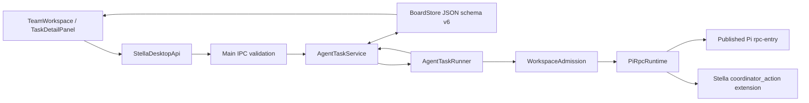
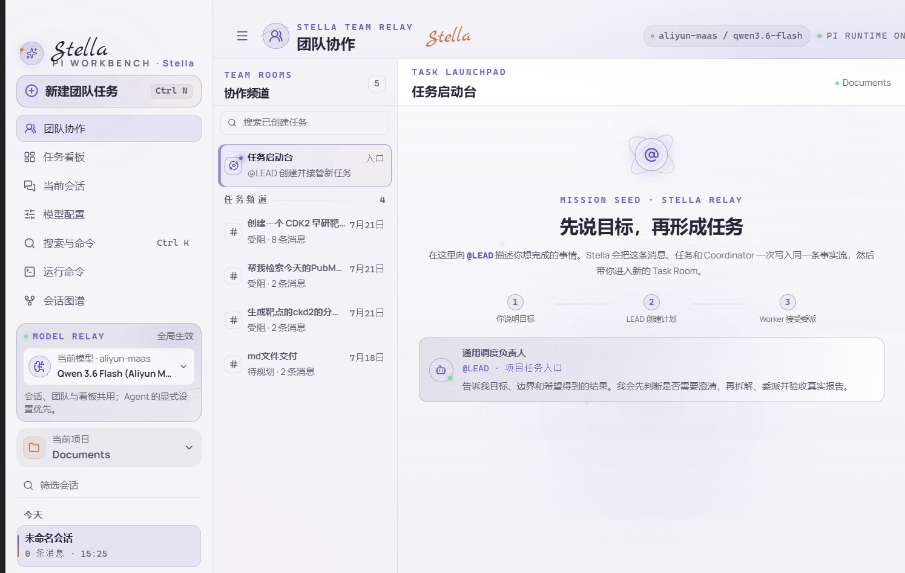
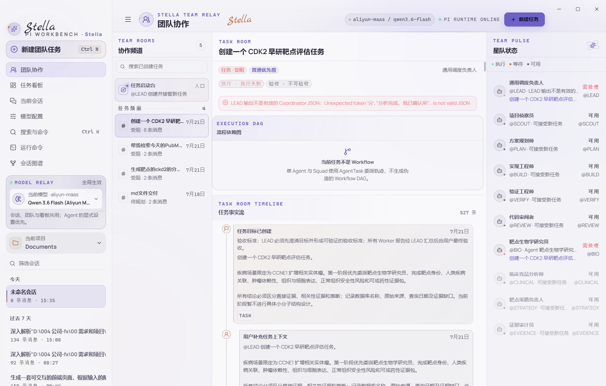
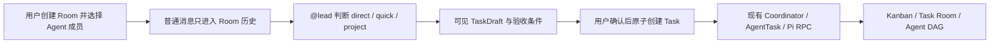

# Stella Team 能力综合审查（2026-07-26）

## 1. 结论

当前 Team 已经具备一个真实的本地 Agent 编排内核：Task、AgentTask、Coordinator、Worker 报告、人工验收、运行时令牌、项目/Skill 预检、重启恢复、Kanban 投影和独立 Pi RPC 都是持久化且可测试的实现，不是提示词演示。

但产品的准确形态仍是：

> **Task 驱动、全局单执行者、星型一层委派的本地 Team Relay。**

它还不是“先创建 Room、加入 Agent 成员、在 Room 中讨论，再通过 `@lead` 形成一个或多个 Task”的 Team Workspace。当前左栏的“任务启动台”是一个不保存 pre-Task 对话的虚拟入口，其余频道都只是 Task 的投影。

本次当前运行态还确认了一项阻断核心旅程的布局缺陷：在 1482×942 的实际 Electron viewport 中，任务启动台输入器和已有 Task Room 输入器都被布局推到窗口下方，而应用根容器禁止滚动。用户看不到“在哪里输入 @”是代码问题，不是试用方式问题。

## 2. 审查基线与范围

- Git 基线：`HEAD d157e376c02edc38f8aa8e5812d804b8c7be5594` 对比当前未提交工作区。
- 产品版本：`0.3.0`。
- Pi 依赖：`@earendil-works/pi-coding-agent@0.82.1`。
- npm `latest`：`0.82.1`（2026-07-26 实查）。
- Pi 最新正式 Release：[`v0.82.1`](https://github.com/earendil-works/pi/releases/tag/v0.82.1)。
- 参照项目：
  - [`multica-ai/multica@b0bae3f`](https://github.com/multica-ai/multica/tree/b0bae3f95ebe131079ae3f34e9cf39a62f69712e)
  - [`agentscope-ai/AgentTeams@37c31b7`](https://github.com/agentscope-ai/AgentTeams/tree/37c31b77d4e88ca87a1270c61a1e6f659e8023e1)，即现行的阿里 HiClaw 仓库
  - [`block/buzz@c2a4ee7`](https://github.com/block/buzz/tree/c2a4ee711e481bb427d6cf8cd08b2c7329d1508c)
  - [`earendil-works/pi@5bc1c2c`](https://github.com/earendil-works/pi/tree/5bc1c2c0a6f07e00e8c240304182f213ab8d311f)

`bozz.xyz` 无法核验为任何开源 Team 项目的官方域名；其可查历史快照是域名出售页。由于 Block Buzz 的域名是 `buzz.xyz`，且其产品内容与本次 Room / Agent 协作主题高度吻合，本次把 Buzz 作为“高概率拼写指代”单独审查，没有把推测写成确定事实。

## 3. Pi 升级与边界结论

本项目已经处于当前最新 Pi 正式版，因此没有执行无意义的 `npm install`，也没有改写 package/lockfile。

边界审查通过：

1. Team 通过 Pi 发布包的公开根导出、公开 `./rpc-entry` 和公共 Extension API 集成。
2. `resources/extensions/coordinator-action.ts` 是 Stella 自有的 Coordinator 适配扩展，不是 Pi 源码修改。
3. 仓库中没有 Pi fork、vendor 源码、`patch-package` 补丁，也没有导入 Pi 私有 `src/` 或 `dist/` 文件。
4. Team/Workflow 后台 Runtime 与完整的交互式 Pi 工作台保持隔离。
5. 当前 packaged runtime 实查状态为 `pi/task/schedule/webhook = ready`。

Pi `0.82.1` 的公开 RPC 文档明确把 RPC mode 定义为供 IDE/custom UI 嵌入的 JSONL headless 接口，并提供 prompt、abort、state、messages、models、stats 等命令。这正是 Team 上层适配应继续使用的边界。

## 4. 当前 Team 的真实调用链



状态所有权总体正确：

- Stella 持有 Room/Task（目前只有 Task Room）、WorkflowRun、AgentTask、人工关卡与验收状态。
- Pi 只执行隔离的 Agent 回合，并返回事件、消息、session、usage 和结果。
- `executionAttempt + specRevision + runtimeToken` 阻止旧执行回写当前 Task。
- `reported` 不等于 `accepted`；最终完成由用户验收决定。

## 5. 当前用户旅程

| 序号 | 用户动作 | 当前实现 | 判断 |
|---:|---|---|---|
| 1 | 进入团队协作 | 左侧一级入口，默认可见全局模型与 Pi Runtime 状态 | 已实现 |
| 2 | 创建一个 Room | 不能创建命名 Room；只能进入固定虚拟“任务启动台” | 未实现 |
| 3 | 添加成员 | 没有 Room membership；普通 Task 默认暴露项目全部 Agent | 未实现 |
| 4 | 在 Room 普通讨论 | 启动台不持久化 pre-Task 普通聊天；第一条有效消息立即创建 Task | 未实现 |
| 5 | `@lead` 形成任务 | 必须恰好一个 `@LEAD`，且用户先写目标与验收标准；原子创建 Task/Message/Coordinator | 已实现但心智不匹配 |
| 6 | `@worker` 直接委派 | 进入已有 Task Room 后可直接 mention 一个或多个 Worker，并预览副作用 | 已实现 |
| 7 | 观察状态 | Presence 从 AgentTask/WorkflowRun 投影；任务事实流、报告与验收可见 | 已实现但投影有缺陷 |
| 8 | 查看委派图 | Workflow 有流程视图；Coordinator/Squad 的真实 AgentTask 父子图未展示 | 部分实现 |
| 9 | 失败后恢复 | 失败明确持久化；但 Worker 失败会终止整个 Coordinator 组，LEAD 不能自动 replan | 部分实现 |

## 6. 当前运行态证据

### 6.1 任务启动台输入器在常见窗口尺寸下不可见



CDP 实测：

| 元素 | top | bottom | height | viewport 高度 |
|---|---:|---:|---:|---:|
| `.app-shell` | 0 | 942.4 | 942.4 | 942 |
| `.team-workspace` | 0 | 1312.1 | 1312.1 | 942 |
| `.team-launch-room__composer` | 933.1 | 1297.1 | 364 | 942 |

输入器只有顶部极小区域到达 viewport，其主要内容和提交按钮完全在窗口之外。

### 6.2 已有 Task Room 的输入器同样不可达



该状态中：

- `.task-room__composer` 的 `top = 1064.9`、`bottom = 1255.1`；
- viewport 高度为 942；
- `body` 与 `.app-shell` 都禁止滚动；
- 用户能看到时间线开头，但无法到达输入器。

### 6.3 根因

- `src/renderer/src/styles/app.css:1-13` 的 `.app-shell` 定义了列，没有定义受约束的 grid row；隐式 `auto` 行会被子元素 min-content 撑高。
- `src/renderer/src/styles/kanban.css:2603-2612` 的 `.team-workspace` 使用 `height: 100%`，但其父 grid auto row 已被内容撑至 1312px。
- `.app-shell`、`.team-workspace` 与 `.team-grid` 又使用 `overflow: hidden`，使超出 viewport 的 composer 无可用滚动路径。

最低风险的修复方向是先约束根 grid row（例如 `minmax(0, 1fr)`），再验证 Team 各级容器都保持 `min-height: 0`，让 Task timeline 成为唯一滚动区域、composer 固定在可见区域。不能只给某一张截图增加高度来掩盖根因。

## 7. 问题分级

### P0：核心输入器在当前实际窗口不可达

这是当前最先要处理的问题。它同时阻断：

- 启动台 `@LEAD` 创建任务；
- Task Room 普通消息；
- `@Worker` 直接委派；
- 对等待用户的 Coordinator 进行回复；
- 报告修订后的继续沟通。

现有 E2E 在更大的 viewport 上截图，没有断言 composer 与主按钮位于 viewport 内，所以 203 个测试全部通过仍未发现该回归。

### P1-1：没有真正的 Room 与成员作用域

当前 `TEAM_LAUNCH_ROOM_ID` 只是 renderer 常量；左栏随后直接遍历 Task。`TeamDefinition` 也不能作为执行目标。普通 Task 的 LEAD 默认拿到当前项目全部 Agent，包括代码 Agent 与医药 Agent。

这会造成三个产品问题：

1. 用户不能创建“CDK2 靶点评估室”并加入 BIO/CLINICAL/EVIDENCE。
2. 同一个长期讨论空间不能产生多个 Task。
3. 用户看到“TEAM ROOMS”，实际管理的却是 Task 列表。

### P1-2：mention 的文本边界与稳定身份不足

`请@BIO分析CDK2` 因 `@` 前没有空格不会触发 picker，也不会创建 AgentTask；`请 @BIO 分析CDK2` 才能识别。失败会静默退化成普通评论，风险高于显式报错。

同时，持久消息目前主要保存显示正文，而不是 `{agentId, displayToken, range}` 形式的结构化 mention。Agent 改名、删除或 callsign 重用后，历史消息缺少稳定引用。

### P1-3：Coordinator 的 Worker 失败不能进入 LEAD replan

任一 Worker 失败会把根 Coordinator 标记失败并取消同组非终态兄弟。LEAD 只有在所有 Worker 都 `reported` 后才得到复核回合，因此无法基于可恢复的 Worker/Skill/provider 失败执行改派、询问用户或调整计划。

失败必须继续显式暴露；改进方向不是静默重试，而是把可报告失败作为 Coordinator review 的输入，让 LEAD 明确返回 `replan / ask_human / request_revision`。

### P1-4：Squad 仍让自然语言 prose 触发控制副作用

Coordinator 已要求调用严格的 `coordinator_action` 工具；但 Squad Leader 仍从最终文本解析 `@mention` 来创建子 AgentTask。报告正文中的示例 mention 也可能意外触发真实委派和 Task 阶段变化。

Squad 应复用 Stella 自有结构化终止动作，彻底分离报告数据面与委派控制面；这只需要修改 Stella adapter，不需要改 Pi。

### P1-5：Agent Presence 与能力就绪不一致

当前 Presence 有 `available / queued / running / waiting / attention`，但存在以下问题：

- `protocol-invalid` 未投影成 attention，协议失败的 LEAD 可能显示“可用”；
- 历史 execution attempt 可能混入当前状态；
- Coordinator review 已排队时，根任务仍可能显示“等待成员”；
- 缺必需 Skill 的 Agent 仍显示“可用”，只在 disabled button 的 `title` 中说明失败原因；
- 图例只解释执行/等待/可用，漏掉排队/需处理。

“运行状态”和“能力就绪”应是两个可见维度，不能把“当前没运行”表达成“现在一定能接任务”。

### P1-6：Task Room 有两个不清楚的启动入口

- composer 的“发送消息”在包含 mention 时会创建 AgentTask；
- 底部“开始执行”会分发 Task 已配置的 workflow/agent/squad。

两者都像主动作，用户无法预测会启动谁、是否重复。应该把第二个动作改成包含目标的明确文案，例如“按任务配置启动 · 早研靶评”，并在 composer 旁解释普通消息、直接 Worker、LEAD 协调三种效果。

### P1-7：关键 Team/Pi 扩展闭环缺真实集成测试

现有单元测试很好地覆盖了状态机，但确定性 Electron E2E 没有真实点击启动台提交，也没有验证：

`@LEAD → 左栏立即出现频道 → Coordinator extension 加载 → Worker 委派 → 状态连续变化 → 报告 → 用户验收/修订`

这正是每次 Pi 升级时最重要的兼容合同。

### P2：应在 P0/P1 后处理

1. Coordinator 多轮委派缺 `delegationRoundId`，新旧报告会混在复核上下文。
2. Team launch/comment 缺 `clientRequestId`，IPC 响应丢失后重试可能创建重复事实。
3. Board 未持久化实际 resolved model、Pi version 与 Skill identity，历史环境不能完整还原。
4. 主进程没有强制只读 Agent 的 context/resource isolation flags，只依赖 UI 默认值。
5. AgentTask 已有父子关系，但 UI 不展示 Coordinator/Squad 的真实委派图。
6. 1060px 以下 Team Pulse 覆盖层缺 focus trap、Escape、背景 inert 与 dialog 语义。
7. 频道计数只统计 comments，与中间完整事实流条数不一致。
8. 所有 AgentTask 全局串行；它是有意的本地单执行者边界，但 UI 不能暗示并行团队。
9. 当前所谓 Workflow DAG 仍是顺序 `steps[]` 的相邻连线；没有 `dependsOn`、无环校验、ready-node 调度与分支汇合。

## 8. 已经做对、必须保留的能力

1. **严格 Coordinator 控制协议**：普通模型 prose 不能冒充结构化协调成功。
2. **Task / AgentTask / Run 分层**：业务阶段、运行状态与验收状态已分开。
3. **原子单执行者认领**：queued → running 生成 runtime token，旧进程不能回写新 attempt。
4. **不伪造重启恢复**：running 明确变 interrupted；queued 保留。
5. **实时权限复核**：执行前重新检查项目 trust、canonical path、tools、Skills 与 WorkspaceAdmission。
6. **执行快照**：Agent、Task spec 与 execution plan 在分发时冻结。
7. **人工验收**：模型 reported 不自动把 Task 变 completed。
8. **Pi 独立性**：完整 Pi 页面、会话与命令能力没有被 Team 反向裁剪。
9. **本地简单部署**：单用户 Electron 场景继续使用 BoardStore JSON 是合理选择。

## 9. 开源项目对照判断

| 来源 | 最值得借鉴 | 不应照搬 |
|---|---|---|
| Multica | Task/AgentTask 分离、稳定 mention ID、durable queue 不变量、权限 fail closed、显式 retry lineage | 完整服务端、PostgreSQL/Daemon 拓扑 |
| AgentTeams（原 HiClaw） | Source Room / Team Room / Task Room 分层、真实成员 mention、Quick Task / Project Work 分流、精确 Worker 生命周期 | Matrix、Kubernetes CR、每 Agent 容器、共享控制面 |
| Buzz | Agent 是频道成员、稳定身份、同频道回复、明确 busy-message 策略与统一审计流 | Nostr、relay、keys、PostgreSQL、Redis；尤其不能把 ACP 进程内 Drop 队列当任务真相 |
| Pi | 公共 SDK、RPC、Extension API、独立 Agent 执行 | Team/Room/Kanban 不是 Pi 的职责，不能通过 fork Pi 添加 |

Buzz 的 ACP mention filter 绑定频道、事件类型和精确 Agent 公钥身份；这是稳定身份的好参照。但它的 ACP queue 默认策略可在 busy 时 drop 事件，因此 PI-GUI 应借交互，不借任务持久化策略。

## 10. 保持简单的目标结构

不增加 PostgreSQL、Matrix、Redis、Nostr relay 或新的后台 Daemon。只在现有 BoardStore/领域层补最小对象：

```ts
type TeamRoom = Readonly<{
  id: string;
  projectPath: string;
  name: string;
  memberAgentIds: readonly string[];
  status: "active" | "archived";
  createdAt: string;
  updatedAt: string;
}>;

type RoomMention = Readonly<{
  agentId: string;
  displayToken: string;
  start: number;
  end: number;
}>;

type RoomMessage = Readonly<{
  id: string;
  roomId: string;
  author: "user" | "agent" | "system";
  body: string;
  mentions: readonly RoomMention[];
  promotedTaskId?: string;
  createdAt: string;
}>;
```

目标交互：



这里 Room 只负责长期上下文与成员，Task 继续负责工作承诺，AgentTask 继续负责一次 Pi 执行；不会创建第二套执行系统。

## 11. 推荐实施顺序

1. 修复 P0 根布局，并补 1366×768、1482×942、最小窗口三组 viewport 可达性断言。
2. 修复中文 mention 边界、结构化 mention 身份与显式失败，不允许静默退化。
3. 纠正 Presence 投影和 Skill readiness 显示。
4. 统一 Coordinator/Squad 的结构化控制协议，并让可报告 Worker 失败进入 LEAD review。
5. 在 BoardStore 增加最小 `TeamRoom / RoomMessage / membership`，保留现有 Task Room/AgentTask。
6. 增加 `clientRequestId`、`delegationRoundId` 与实际 runtime provenance。
7. 增加一条 published Pi + packaged Coordinator extension 的真实闭环 E2E。
8. 最后再决定：把当前流程诚实改称“执行链”，或实现真正 `dependsOn` DAG。

## 12. 验证记录

- `npm view @earendil-works/pi-coding-agent version dist-tags`：`latest = 0.82.1`。
- `npm ls @earendil-works/pi-coding-agent --depth=0`：已安装 `0.82.1`。
- GitHub latest release：`v0.82.1`。
- packaged runtime 当前实查：Pi、Task、Schedule、Webhook 全部 `ready`。
- `npm run check`：通过。
  - TypeScript typecheck：通过。
  - ESLint：通过。
  - Vitest：46 个测试文件、203 个测试全部通过。
- Team 定向验证：8 个测试文件、35 个测试全部通过。
- 当前运行截图：两张，均由本轮实际 packaged app/CDP 采集并人工检查。

测试通过证明既定状态机可以运行，但并不抵消本报告列出的布局、Room 领域和真实 extension E2E 缺口。

## 13. 详细报告

- [Team UI/UX 审查](team-ui-ux-audit-2026-07-26.md)
- [Team 架构审查](team-architecture-audit-2026-07-26.md)
- [Multica / AgentTeams / Buzz / Pi 深度对照研究](../research/team-comparators-multica-hiclaw-bozz-2026-07-26.md)

最终判断：**Team 应继续由 Stella 拥有，Pi 继续作为公开接口后的独立单 Agent runtime；当前最紧急的不是增加新基础设施，而是先恢复输入可达性，再把“Task 频道外观”补成真实且最小的 Room/成员/稳定 mention 语义。**
