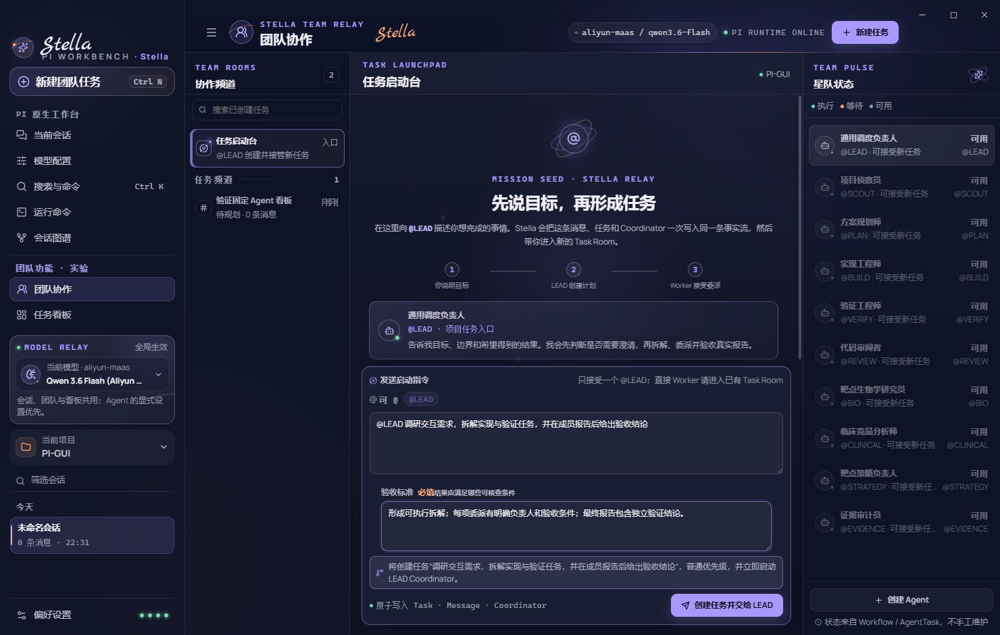
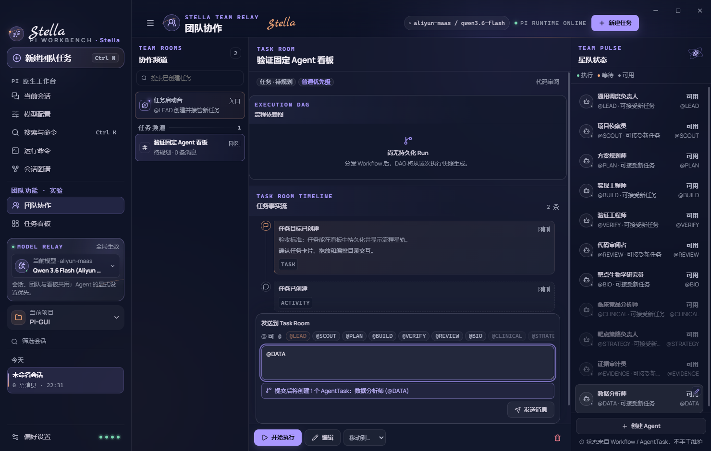
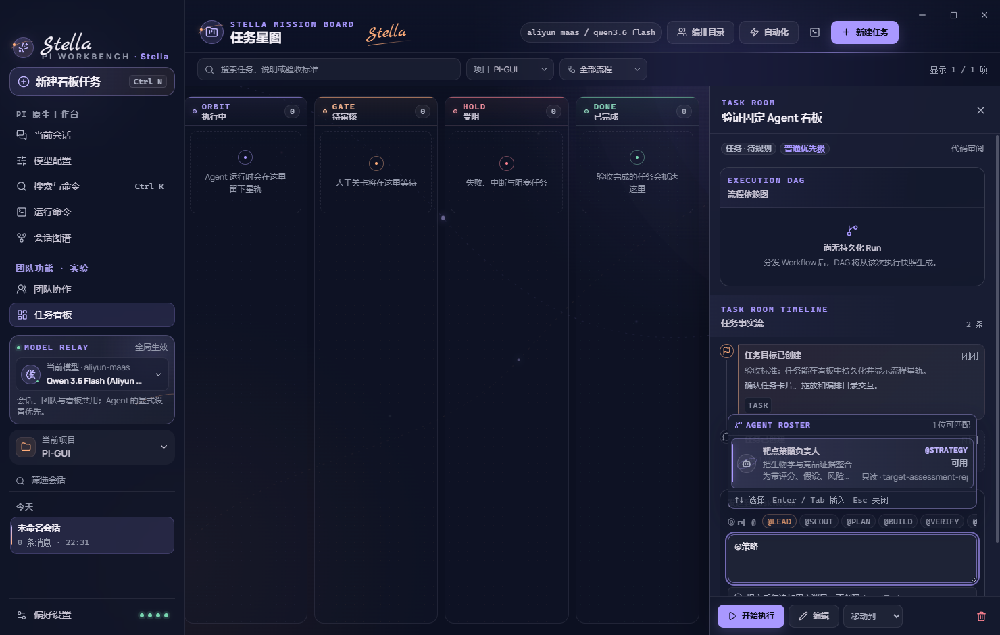

# Stella Team UI/UX 审查（2026-07-26）

## 结论

当前 Team 已经从“看板里点分发”进化为一个可用的三栏协作控制面：左侧任务频道、中间 Task Room 事实流、右侧动态 Agent Presence；`@LEAD`、直接 Worker mention、影响预览、执行验收、全局模型可见性和项目 Agent 创建都有真实代码与测试支撑。

但它尚未真正闭合用户所说的“先建 Room、把成员加入 Room、再通过聊天 @lead 开启任务”这一习惯。现在的真实语义是：**一个固定且不持久化聊天的任务启动台 → 必填任务表单 → 原子创建 Task + Message + Coordinator → 每个 Task 自动成为一个频道**。这比旧版易发现，但仍是“表单启动任务”，不是“Room 中对话形成任务”。

本轮没有发现需要定义为 P0 的 UI 崩溃；发现 6 项 P1 和 6 项 P2。其中最急迫的代码问题是：中文语句中 `@` 前没有空格时，mention 会被静默当作普通消息，AgentTask 不会创建。

## 审查范围与基线

- 代码基线：`HEAD d157e376c02edc38f8aa8e5812d804b8c7be5594` 对比 2026-07-26 当前未提交工作区。
- 用户目标：进入 Team，建立协作上下文，发现/创建 Agent，通过 `@LEAD` 或 `@Worker` 发起真实任务，观察动态状态，在 Task Room / Kanban / DAG 中追踪并处理结果。
- 重点文件：
  - `src/renderer/src/features/team/TeamWorkspace.tsx`
  - `src/renderer/src/features/team/TeamLaunchRoom.tsx`
  - `src/renderer/src/features/team/AgentDraftDialog.tsx`
  - `src/renderer/src/features/kanban/AgentMentionInput.tsx`
  - `src/renderer/src/features/kanban/TaskDetailPanel.tsx`
  - `src/shared/agent-mentions.ts`
  - `src/shared/agent-presence.ts`
  - `src/renderer/src/styles/kanban.css`
  - `src/renderer/src/styles/tokens.css`
- 规范与既有研究：`docs/specs/stella-v4-team-relay.md`、`docs/specs/stella-v3-capability-safe-task-control.md`、`docs/research/multica-chat-task-interaction-2026-07-18.md`、`docs/research/hiclaw-channel-manager-worker-audit-2026-07-18.md`。
- 自动验证：运行 6 个相关测试文件，共 25 个测试，全部通过：TeamWorkspace、TeamLaunchRoom、Task Room mention、mention parser、Agent Presence、全局字体缩放。

## 视觉证据与限制

以下是当前工作区随 E2E 保存的 2026-07-26 回归截图。本子 Agent 已逐张检查，但没有在本次审查中重新驱动 Electron 生成它们，因此它们可支持当前布局与信息层级判断，不能独立证明本轮运行时、键盘操作或真实模型事务成功。

### 截图 1：固定任务启动台

可见：全局模型、固定“任务启动台”、仅允许 `@LEAD`、必填验收标准、原子创建 Task / Message / Coordinator、Team Pulse Agent 列表。

### 截图 2：Task Room 与项目 Agent

可见：Task Room 时间线、直接 `@DATA` 影响预览、右侧 Agent 状态，以及底部同时存在“发送消息”和“开始执行”两个执行入口。

### 截图 3：中文 Agent 搜索

可见：中文职责搜索、稳定 callsign 插入、工作区权限和必需 Skill 元数据、键盘提示。

## 用户旅程逐步健康度

| 步骤 | 用户动作 | 当前健康度 | 证据与判断 |
|---|---|---:|---|
| 1 | 从左侧进入“团队协作” | 良好 | Team 是一级入口；默认页也是 Team；当前模型在页头和全局侧栏均可见。见 `App.tsx:158, 448-565`、`TeamWorkspace.tsx:123-127`。 |
| 2 | 找到一个 Room 并开始聊 | 较弱 | 只有固定的虚拟“任务启动台”和每 Task 一个频道；不能新建命名 Room、加成员、在 Room 中先讨论。见 `TeamWorkspace.tsx:16, 38, 134-142`。 |
| 3 | `@LEAD` 形成任务 | 较弱 | mention、预览和原子写入语义清楚，但验收标准在第一次对话前必填，且消息一发就建 Task，LEAD 无法先澄清再形成 Task。见 `TeamLaunchRoom.tsx:80-131`、`team-launch.ts:23-49`。 |
| 4 | 在 Task Room `@Worker` | 基本良好但有高风险边界 | 可见 roster、中文搜索、键盘选择、影响预览都已实现；但 `请@BIO分析` 这类无空格中文输入不会被识别，会静默变成普通消息。见 `agent-mentions.ts:3-4, 126-144`。 |
| 5 | 观察 Agent 与任务状态 | 基本良好 | Presence 来自 Workflow/AgentTask，不手工维护；但“可用”未表达 Skill 就绪，图例漏了“排队/需处理”，频道消息数与事实流条数不一致。 |
| 6 | 查看 DAG、报告并验收 | 良好 | Task 业务状态、执行状态、验收状态分开展示；Human Gate 与报告验收在事实流内联。见 `TaskDetailPanel.tsx:260-342`。 |
| 7 | 遇错后恢复 | 一般 | Task Capability 有明确原始错误和重试；Task Room 有 alert；但缺 Skill 时 Team Pulse 只禁用按钮并把原因塞进 `title`，没有可操作恢复路径。 |

## 已确认的优点

1. **副作用可见。** 普通消息明确提示“不创建 AgentTask”，direct mention 会显示将创建几个 AgentTask，`@LEAD` 会显示 Coordinator 语义。`TaskDetailPanel.tsx:193-215, 372-383`。
2. **同一事实源。** Team Chat 复用 TaskDetail / TaskMessage / Activity / AgentTask / Run，不建立第二套消息数据库；这与轻量本地桌面的目标一致。
3. **Agent 可发现性明显改善。** 输入 `@` 有 roster，支持中文名称/职责查询，展示 callsign、Presence、只读/可写和 Skills，支持方向键、Enter/Tab、Escape。`AgentMentionInput.tsx:74-97, 168-186, 194-265`。
4. **状态不是手工标签。** `available / queued / running / waiting / attention` 从持久执行事实投影，Task 业务阶段不会被模型 prose 直接操纵。`agent-presence.ts:3-73`。
5. **项目边界可见。** Team 仅列当前项目 Task，自定义 Agent 带项目范围；切换项目后隐藏的 Task Room 会关闭。`TeamWorkspace.tsx:48-66`，并有单测覆盖。
6. **模型选择已跨页可见。** Team 页头显示当前模型，侧栏保留可操作的 GlobalModelControl，回归 E2E 检查视图切换后模型值不变。
7. **基础可访问性有进展。** 表单有 label / aria-label，关键错误使用 `role="alert"`，影响预览使用 `status`，Modal 已有焦点圈定，支持 `prefers-reduced-motion`，字体使用 rem 并提供 14 / 16 / 19px 根字号选项。

## P1：高优先级问题

### P1-1 中文无空格 mention 会静默失效

**复现**

1. 进入任意空闲 Task Room。
2. 输入 `请@BIO分析CDK2` 或 `让@STRATEGY先评估`，即 `@` 前没有空格。
3. roster 不会打开；影响预览显示“仅追加用户消息”；提交后不会创建 AgentTask。

**根因**

- 活跃查询和最终解析都要求 `@` 前是字符串开头或空白：`src/shared/agent-mentions.ts:3-4`。
- 本轮用同一正则做最小复算：`请@BIO分析CDK2` 匹配数为 `0`，`请 @BIO 分析CDK2` 才匹配 `BIO`。

**影响**

这是高风险的“看起来已 @，实际上只是留言”。它违反 v4 spec 中“typing `@` opens a visible Agent roster”的直觉，也尤其不符合中文输入习惯。

**建议**

使用同一个边界扫描器同时驱动 picker、preview 和 main-process parser；允许字符串开头、空白或常见中英文标点/汉字边界前的 `@`，同时明确排除邮箱和路径等误匹配。补 `请@BIO`、中文标点、邮箱、IME composition 的 UI + domain 测试。

### P1-2 当前没有“先建 Room、加成员、再 @lead”的能力

**证据**

- Team 只有本地常量 `TEAM_LAUNCH_ROOM_ID = "project-launch-room"` 与 Task id 两类选中项：`TeamWorkspace.tsx:16, 38, 82`。
- 左侧频道是固定启动台加 `board.tasks.map(...)`：`TeamWorkspace.tsx:134-142`。
- 全仓没有 Team Room 创建、Room membership 或 roomId 领域类型；只有 Squad 的 `memberAgentIds`，其编辑入口在自动化工作室，不在 Team Room。
- 非 Squad Task 默认可 @ 当前项目全部 Agent；Squad Task 才限制为 LEAD + Squad 成员。用户看不到统一的“本 Room 成员”概念：`agent-mentions.ts:105-124`。

**影响**

当前 UI 视觉上像频道产品，但语义仍是“Task 列表”。用户不能创建“CDK2 靶点评估室”、先加入靶点生物学研究员/临床/证据审计员，再在该上下文里持续发起多个任务；在 Squad Task 中刚创建的新 Agent 甚至会因不属于 Squad 而无法在当前 Room mention。

**建议**

先做明确产品选择：

- 若要满足用户已经反复表达的 Room 心智，增加由 Stella 持有的轻量 Room/成员关系，Task 仍是执行事实源，Pi 只执行 AgentTask；不要修改 Pi。
- 若坚持每 Task 一个 Room 的最简方案，应取消“可创建 Room/加成员”的暗示，把界面统一称为“任务频道”，并明确告诉用户成员范围由 Task 的执行目标/Squad 决定。

目前两种语义混在一起，是团队交互困惑的主因。

### P1-3 “先说目标，再形成任务”实际仍是表单优先

**证据**

- 页面文案称“先说目标，再形成任务”，LEAD 会“先判断是否需要澄清”：`TeamLaunchRoom.tsx:80-90`。
- 但验收标准在第一次发送前强制必填：`TeamLaunchRoom.tsx:113-121`、`team-launch.ts:27-29`。
- 一次发送立即创建 Task + Message + Coordinator，并不存在 pre-Task 对话回合：`TeamLaunchRoom.tsx:124-131`、v4 spec 的 Project Launch Room 约束。

**影响**

新用户恰恰希望 LEAD 帮他补全任务边界和验收条件，却必须先自己写出可验证验收标准才能叫醒 LEAD。这个流程把创建表单做成了聊天外观，没有获得 Multica/HiClaw 的“在频道里澄清、再形成结构化工作”的核心价值。

**建议**

保持简单的前提下，将“讨论”和“提交”拆成两个显式阶段：第一条可以只形成可编辑 TaskDraft / 澄清问题，不进入 Kanban；用户确认标题、范围、验收后再原子创建 Task + Coordinator。若不打算支持 pre-Task 对话，文案应直说“填写任务目标和验收标准后启动”，避免承诺 LEAD 会在建卡前澄清。

### P1-4 Agent 显示“可用”，但可能因缺 Skill 完全不可用

**复现**

1. 项目没有 `target-evidence`。
2. 打开 Team Pulse。
3. “靶点生物学研究员”仍显示运行 Presence“可用”；mention 按钮被禁用。
4. 禁用原因只在 `title="缺少 Skill…"`，disabled button 无法获得键盘焦点，用户也没有安装/定位入口。

**根因**

- Presence 只投影执行状态，默认回落为 `available`：`src/shared/agent-presence.ts:57-72`。
- Skill 缺失在 renderer 另算，然后通过 disabled + title 阻止 mention：`TeamWorkspace.tsx:193-206`。
- 创建 Agent 的 Skills 是自由文本逗号列表，没有发现/选择/安装反馈：`AgentDraftDialog.tsx:39, 78`。

**影响**

“可用”被用户理解为“现在能接任务”，实际仅代表“当前没在跑”。这正对应近期真实错误“Agent 靶点生物学研究员缺少 target-evidence”，会让用户以为是模型或任务问题。

**建议**

不要把能力就绪塞进 Presence 状态机；在 Agent 卡上增加独立且始终可见的“运行状态 / 能力就绪”双轴标识，例如“可用 · 缺 1 个 Skill”。缺失项和可信安装目录应直接显示，并给出可聚焦的查看/安装指导入口。创建 Agent 时使用已发现 Skills 多选并实时预检，仍允许手输不存在的 Skill，但必须显示显式错误而非静默创建不可运行角色。

### P1-5 Task Room 同时有两个“启动工作”的主入口，语义不够清楚

**证据**

- mention composer 的“发送消息”可直接创建 AgentTask：`TaskDetailPanel.tsx:347-383`。
- 同一 Task Room 底部同时有主按钮“开始执行”，它分发 Task 预设的 workflow / agent / squad：`TaskDetailPanel.tsx:390-405`。
- 回归截图 `team-chat-stella.png` 中两个入口同时可见；顶部执行目标与底部按钮距离很远。

**影响**

用户无法快速判断：应该 `@DATA` 后点“发送消息”，还是点“开始执行”；两者是否串行、是否重复、分别会启动谁。对于 Team 产品，这是控制权不清，而不是纯视觉问题。

**建议**

在 Team workspace 中把固定目标分发按钮改为自描述文案，例如“按任务配置启动 · 代码审阅”，并在 composer 上方用一句话区分“普通消息 / @Worker 直接委派 / @LEAD 协调 / 按配置执行”。可以保留两种能力，但不能都呈现成无上下文的主动作。

### P1-6 窄窗 Team Pulse 覆盖层没有完整键盘/读屏对话框行为

**证据**

- 1060px 以下，Team Pulse 变成带 scrim 的右侧覆盖层：`kanban.css:2907-2931`。
- 打开时只切换 state；没有把焦点移入、Tab 圈定、Escape 关闭或使背后内容 inert：`TeamWorkspace.tsx:54, 126, 184-188`。
- `aside` 仍是普通补充区域，没有 `role="dialog"` / `aria-modal`。相比之下通用 `Modal.tsx` 已正确实现焦点圈定和背景 inert。

**影响**

在应用最小窗口（980px）附近，这是常见布局。键盘用户打开 Agent 面板后仍可把焦点移动到被遮挡的 Task Room，且不能用 Escape 退出。

**建议**

复用 Modal 的焦点管理原语或抽取通用 OverlayDialog：打开后聚焦关闭按钮，Tab 圈定，Escape 关闭，背景 inert，关闭后焦点回到 Agent toggle。桌面三栏态继续保持普通 aside。

## P2：中优先级问题

### P2-1 Agent 状态图例只解释 3/5 状态

`AgentPresenceState` 有 `available / queued / running / waiting / attention`，但 Team Pulse 图例只有“执行 / 等待 / 可用”：`TeamWorkspace.tsx:189`。卡片虽会显示“排队/需处理”文字，用户仍无法预先理解颜色与优先级。补齐五态，或把图例改成可折叠的状态说明。

### P2-2 频道的“消息数”与 Task Room 可见事实条数不一致

左栏只计算 `board.comments`：`TeamWorkspace.tsx:137-139`；Task Room 时间线还包含目标、活动、执行、报告、产物和验收。截图里左侧显示“0 条消息”，中间事实流已有“2 条”，容易被理解为频道没有活动。应明确显示“0 条用户消息”，或用事实流总数 / 未读数。

### P2-3 搜索可以把当前频道从列表中隐藏，但中间仍停留在该 Room

这是刻意保留上下文并有单测覆盖，但没有“当前频道被筛选隐藏”的提示。用户可能认为列表状态与中间内容失去同步。建议始终在结果顶部固定当前频道，或显示一条可清除筛选的提示。

### P2-4 选中频道只有视觉 class，没有语义状态

频道按钮通过 `is-active` 着色，但没有 `aria-current` 或 `aria-pressed`：`TeamWorkspace.tsx:134, 139`。读屏用户无法知道当前 Room。建议使用 `aria-current="page"` 或把频道列表实现为可访问的 tabs/listbox 模式。

### P2-5 大量关键辅助文案仍为 0.75rem，信息密度偏高

默认根字号已从小字号提升到 16px，并支持 14 / 19px 偏好，这是改进；但 Team/Task Room 的频道元信息、状态、Agent 职责、时间、事实详情、输入区说明普遍是 `0.75rem`（默认 12px）。在四栏 1852px 截图中依然显得拥挤，老年用户或高 DPI 屏幕会更多依赖“大号”。建议把需要阅读和决策的正文至少提高到 `0.8125–0.875rem`，保留 0.75rem 给代码/时间/辅助标签。mention chip 21px、Agent 编辑按钮 20px 也低于 WCAG 2.5.8 常见的 24×24 CSS px 目标建议：`kanban.css:1162, 2843`。

### P2-6 E2E 没有验证最重要的真实闭环

- `tests/e2e/app.spec.ts` 填好了启动台并截图，但没有点击“创建任务并交给 LEAD”。
- `team-launch-ui.test.tsx` 只验证 stub `onLaunch` 收到参数。
- `team-workspace-ui.test.tsx` 覆盖搜索、删除确认重置、项目切换，却不覆盖真实 launch 后左栏立即出现、自动选中新 Room、queued/running/waiting 状态、错误后保留草稿、报告后验收。

因此“第一条消息创建 Task 后立即出现在左侧、真实 Agent 状态连续变化”仍缺 GUI 级证据。应至少增加一个确定性 Electron E2E：提交启动 → 新频道可见且已选中 → Coordinator 排队/执行状态可见 → 模拟/真实受控结果后进入报告与验收；失败必须展示原错误并保持输入。

## P3：低优先级与文案一致性

1. Team 页头的模型 chip 与侧栏 GlobalModelControl 同时出现是可取的“可见 + 可操作”组合，但 chip 看起来像可点击控件，实际是普通 `span`。可以弱化按钮外观，或让它打开模型配置。
2. 同一条主旅程混用“团队中继 / Team Relay / Task Launchpad / Task Room / Coordinator / LEAD / Worker / 星队状态”。对开发者清晰，对非技术研究用户认知成本高。建议第一次出现时用中文主词、英文作为次级术语，并保持“任务频道 / Task Room”不互换。
3. Team Pulse 里的 Agent 卡默认点击语义是“插入 mention”，而不是“查看 Agent / 当前任务”。卡片可用性强，但运行中用户更可能想查看它正在做什么；后续可把身份区域用于详情，单独提供 `@` 动作。

## 与 Multica / HiClaw 调研结论的交互对照

| 维度 | Multica / HiClaw 的共同启发 | 当前 Stella | UI/UX 判断 |
|---|---|---|---|
| 频道先于任务 | 频道是持续上下文；任务是频道中的结构化事实 | 固定启动台不是持久对话；每 Task 自动成频道 | 尚未满足“先 Room 后任务” |
| mention 语义 | mention 是可见投递/唤醒，结构化任务另存 | mention 预览后创建真实 AgentTask | 方向正确；无空格解析是危险缺口 |
| Lead 连续协调 | 澄清、委派、验收、修订由事件再次唤醒 | Task 建立后有 Coordinator re-entry / waiting_human | 执行闭环优于旧版；pre-Task 澄清仍不存在 |
| 成员边界 | Room/Team 明确显示成员关系 | 普通 Task 全项目可 @；Squad Task 才限成员 | 用户看不到统一 Room roster |
| 状态可见 | 人与 Agent 能看到正在做什么、为何阻塞 | Presence + Task timeline + DAG | 骨架已具备；Skill readiness 和五态解释不足 |
| 基础设施 | HiClaw/AgentTeams 依赖真实频道和受管 Worker | Stella 保持单机 Electron + Pi RPC | 对安装复杂度是正确取舍；Room 语义应由 Stella 适配层承担，不应改 Pi |

## 建议的简单优先序

1. 修正 mention 边界与 IME/中文测试，消除静默不分发。
2. 在产品层明确选择“真正轻量 Room”还是“诚实的任务启动台”；不要继续用两套心智文案。
3. 将 Agent 运行状态与 Skill/Runtime 能力就绪并列展示，给出可操作恢复路径。
4. 区分 Task Room 的“按配置执行”和“聊天 mention 委派”两个入口。
5. 补齐 Team Pulse 覆盖层可访问性、五态图例、频道语义状态和关键字号。
6. 用一个真实 Electron E2E 覆盖 `@LEAD → 新频道立即出现 → 状态变化 → 报告 → 验收/修订`。

## 证据边界

- 本报告确认了代码路径、静态 DOM/ARIA、领域映射、现有回归截图与 25 个相关自动测试。
- 未在本子 Agent 运行中重新启动桌面应用并采集一套新截图，因此没有宣称当前构建在所有皮肤、Windows 缩放比例、macOS、屏幕阅读器或真实 Qwen 模型下都通过。
- 未执行全量 WCAG 审计；颜色对比受透明背景和皮肤合成影响。`tokens.css:621-629` 已为深/浅主题统一提升语义文字颜色，这是明确的正向改动，但仍需在每个皮肤渲染后测量。
- 未修改任何产品代码、依赖或 Pi，只新增本审查报告。
