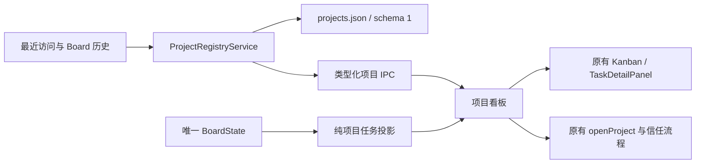

# Stella 项目看板设计说明

日期：2026-09-13。基线：`8d72beb`（v0.6.0）。交付范围：桌面项目管理、任务聚合、跨项目浏览、未归属项目的任务以及大量任务的滚动访问。

## 1. 问题与源码证据

当前产品有任务看板，却没有长期项目清单。`StateStore.recordProject` 的最近访问仅保存 12 项；`ProjectMeta` 是当前 Pi 工作目录的运行快照；`BoardState` 以 `task.projectPath` 归属任务。三者用途不同，不能把最近访问列表当项目数据库，也不能让项目完成度成为第二份 Task 状态。

代码并非整体不可维护：BoardRepository 已提供串行提交，Task 规格、执行尝试、报告、人工验收、Workspace 租约与 Provider Adapter 都已有清晰接口与回归测试。需要处理的是入口和投影之间的接缝：

| 发现 | 影响 | 本次处理 |
| --- | --- | --- |
| 项目只有当前目录与有限最近访问 | 无法保留无任务项目、备注、置顶与归档 | 独立且有版本的项目清单，按已有项目历史增量登记 |
| Kanban 只有当前/全部项目两种过滤 | 查某个非当前项目必须切换会话或搜索名称 | 增加任意项目过滤与指定任务导航，浏览无需切换 Runtime |
| 路径判断散落，部分直接比较字符串 | Windows 大小写和分隔符不同可能漏任务 | 提取纯路径标识，应用于项目投影和受影响的团队/看板路径比较；磁盘权限判断继续使用 Main 的 canonical realpath |
| 人工注意逻辑已存在，但按单任务反复查找 | 项目汇总容易复制语义或退化为重复扫描 | 从统一的人工注意投影汇总，索引当前执行，区分当前状态与历史执行 |
| `main/index.ts` 同时承担启动、IPC 校验和组合 | 把项目 CRUD 全放进去会增加耦合 | 项目校验、持久化与历史发现放独立模块，Main 只装配依赖和注册窄 IPC |
| Board 与 Pi 各有独立故障状态 | 若项目页依赖 Pi hydrate，会在断连时消失 | 项目清单独立读取；任务数据失败明确显示不可用，不把未知计数写成零 |
| 每个 Task 都要求项目路径，首次启动与新建入口也依赖当前项目 | 无法先记录不属于任何目录的待办 | schema v10 明确允许未归属的手工任务；执行前由用户绑定真实工作区 |
| 看板子元素最小宽度超出父容器且被裁切，列高度使用隐式轨道 | 窄窗口或大量任务时，横向列与最末任务不易到达 | 看板内部横向滚动、固定可用行高、各列独立纵向滚动，提供键盘焦点 |

## 2. 既有研究与跨项目取舍

本轮重新核验本项目已研究过的相关产品，完整固定提交、源码引用和语义冲突见 [跨项目比较](../research/project-board-comparison-2026-09-13.md) 与 [Orca 专项研究](../research/orca-project-board-2026-09-13.md)。旧研究是证据索引，其中未实现的提案不是本轮必须照搬的需求。

| 来源 | 采用 | 明确不采用的不同语义 |
| --- | --- | --- |
| Orca | 项目长期身份，工作区与运行观察分开，项目上下文导航 | 不按相同 Git remote 合并不同目录；不引入 Host、Setup、Relay、PTY 或外部 Linear 状态同步 |
| Multica | 独立 Project 计划阶段、真实任务统计、长期工作目标与一次执行分开 | 不将 cancelled 计为已完成；不引入 daemon 和远程资源调度 |
| AgentTeams / HiClaw | 提交结果与接受结果分开；等待关联当前执行 | 不将项目“暂缓”绑定到 scheduler pause，不用自然语言写入状态 |
| Plane / AppFlowy | 项目对象与视图分离，同一数据可有总览与阶段列 | 不引入通用数据库、自定义字段或查询引擎 |
| Vikunja / OpenProject | 移动卡片必须明确修改哪个对象；筛选不改任务归属 | 不把项目进入完成列映射成 Task.done，不绕过现有人工验收 |
| Buzz / Activepieces | 协作事件、持久工作意图、具体执行步骤的等待各有边界 | 不复制会丢弃意图的内存队列，不再建立一套 Workflow 或等待数据库 |

Stella 的单机项目以一个本地目录为范围。以上产品不成为生产依赖，不复制上游代码或运行其 CLI。Git worktree 仍由现有 ExecutionWorkspace 管理，项目统计按所属 Task 归集，不能从子 worktree 推测另一个项目。

## 3. 产品行为与取舍

- 在任务工作台中提供始终可见的“项目看板”，不依赖实验性团队开关；命令面板也可到达。
- 添加项目选择或填写一个已存在的本地目录，主进程检查真实目录并去重。添加只登记元数据，不启动 Agent、不切换会话、不赋予信任。
- 项目保存稳定 ID、规范路径、显示名称、说明、计划阶段、置顶、归档与时间。路径不是可编辑字段；改名称不改磁盘目录或历史任务名称。一个路径对应一个项目。
- 提供“待安排 / 进行中 / 暂缓 / 已收尾”四个项目计划阶段。新增及历史发现默认进入待安排，用户通过菜单或拖动调整；总览与阶段看板共享同一数据。计划阶段不暂停调度、不完成 Task、不接受报告、不关闭自动化。收尾项目仍显示运行和待处理事项；若仍有未完成任务，卡片单独标明数量。
- 首次及后续刷新从当前/最近打开的项目和历史任务、项目 Agent、Squad、Autopilot 发现目录。发现是幂等增量登记，保留已有名称、说明、归档与置顶。已被旧版本淘汰且没有任何任务记录的目录无法凭空恢复。
- 默认显示未归档项目，支持归档视图、名称/目录/说明/任务内容搜索，以及全部、需处理、有执行的筛选。置顶优先，同组按最近活动或名称排序。
- 每张卡片显示真实的任务阶段分布、完成数、需处理数、运行/排队数。`completed / total` 是任务完成比例；零任务显示“尚无任务”，不显示虚构的 100%。
- 需处理包括任务受阻、手工任务待审核、当前报告待验收、当前 Coordinator 等待回复、当前 Workflow 人工关卡。同一 Task 命中多条原因只计一项。旧失败和外部 CLI 的完成不自动改变任务阶段。
- 项目详情展示说明、目录检查结果、阶段数量和任务列表。任务点击携带项目范围与任务 ID 进入同一个 Kanban/TaskDetailPanel。非当前项目可查看任务；编辑/运行继续要求打开对应项目。
- 任务看板默认“不限项目”，另有“未归属项目”、当前工作区和指定项目筛选。未选择任何工作区时也能新建任务；已打开工作区时，新建表单仍可选择“不选择项目”。未归属任务可以编辑、评论、删除和手工推进，不分配虚构目录或暗用进程 cwd。
- 未归属任务需要本地 Agent/Workflow 执行时，先打开实际工作区，在任务详情点击带项目名称的“绑定到 …”。绑定保留 Task ID、评论、阶段与活动历史，并记录实际归属变更；已绑定任务不能通过此动作迁移到另一项目。来自 Pi 会话的固化任务继续保留原会话的项目与来源。
- “打开工作区”使用现有 Pi 项目切换与信任机制，先保存当前草稿。取消切换时保持原界面；失败显示原始可操作错误。
- 归档只是项目清单的可逆整理。任务、Agent、自动化和工作目录均保留，已有执行与自动化继续按原规则工作；编辑器明确说明此语义。
- 目录丢失、不可访问或真实路径变化时保留历史，显示检查失败原因；仍可浏览历史任务。禁止静默指向另一目录或自动新建目录。

## 4. 界面与交互

沿用 Stella 的 Manrope/微软雅黑正文、等宽路径、现有八主题的颜色和间距变量。页头包含项目总览标题、刷新与添加；下方为搜索和分组筛选，以及总览 / 阶段看板切换。卡片的六段任务分布是主要信息结构，颜色对应现有任务阶段。选择项目后展示详情侧栏，窄窗口改为纵向布局；阶段列在中等窗口内部横向滚动，最窄布局转为纵向分组。

```text
项目看板                         刷新  添加项目
搜索名称、目录或任务…     活跃/已归档   全部/需处理/有执行
┌ 项目 A · 当前 · 置顶 ┐  ┌ 项目 B ┐   ┌ 项目详情 ────┐
│ 说明 / 真实目录      │  │        │   │ 说明、目录检查 │
│ 阶段分布、完成比例   │  │        │   │ 查看任务看板   │
│ 需处理 · 排队 · 执行 │  │        │   │ 当前任务列表   │
└─────────────────────┘  └────────┘   └───────────────┘
```

所有操作使用语义化按钮、可访问名称、可见焦点；表单复用已有 Modal 的焦点锁定与 Escape。键盘可完整访问项目与任务，不要求拖放。任务看板各列在可用高度内独立纵向滚动，列较多时在看板内横向滚动；项目详情的任务列表拥有独立滚动区，不截取前若干任务，不把列表长度当业务上限。加载、空清单、无搜索结果、归档空清单、任务数据不可用和存储错误分别呈现。错误不会替换为示例数据。

## 5. 架构与数据一致性



项目文件独立于 Board 和官方 Pi JSONL。使用 `AtomicJsonFile` 完整写入、flush 后替换，串行队列执行登记和更新；校验输入及持久文件，损坏/未来版本明确拒绝覆盖。写入成功才返回新状态并广播项目变更。Task Control 不可用时保留可读项目元数据，并在快照中明确标注历史发现不完整；任务统计由 Board 的真实可用状态决定。

Board 升至 schema v10，唯一领域扩展是 Task 的 `projectPath` 可以缺省，明确代表“未归属项目”。该状态只允许手工任务、`trusted: false`，且不能附带执行、来源 Session 或外部运行记录。Main 对无项目 CRUD 不要求当前 Pi 工作区；执行、工作区租约与会话继续入口统一要求真实项目。v9 文件在迁移前备份，逐条校验旧任务仍携带必需的项目路径字段，保留全部 ID、路径、规格与历史；不会把缺失路径的坏 v9 数据解释成合法无项目任务。

Renderer 不读文件、扫描 CLI 或维护持久化任务计数。项目记录、任务、运行通过路径标识关联，执行关联仍用 Task 当前的 execution ID。项目刷新与并发保存采用请求代际，旧读取不得覆盖新操作。应用在当前项目变化时同步项目清单，因此新访问项目不会因最近访问列表上限消失。

项目清单首次读取不等待 Task Control 的 CLI 探测完成。此时可呈现最近访问和已存项目，明确显示历史发现尚未完整；Task Control 就绪事件随后补齐。Board 提交新增项目路径时也触发补齐，已知项目的每次状态变化只更新纯任务投影，不重复扫描磁盘。没有新增、删减或改动项目时不重写清单。

信任继续只有现有主进程工作区流程拥有；项目元数据不持久第二份信任授权。新增 IPC 校验主窗口来源。项目历史发现不会据旧 Task 的 `trusted` 字段授予新项目权限。

### 5.1 持久格式与接口

文件位置为 Electron `userData/projects.json`，根结构为 `{ version: 1, revision, projects: [...] }`。每条记录字段如下：

| 字段 | 类型及语义 |
| --- | --- |
| id | 随机 UUID，创建后不变，用于项目编辑与列表选择 |
| path | 已登记的绝对目录；新登记执行 realpath + directory 检查，历史目录保留原身份 |
| name / description | 用户显示名与说明，去除首尾空白，不改 Task 的历史规格 |
| stage | planned / active / paused / completed，仅表达项目计划 |
| pinned / archived | 独立布尔元数据，归档恢复保留原阶段 |
| createdAt / updatedAt | ISO 时间；仅登记或实际元数据变化更新 |

快照另返回按 ID 索引的目录状态、检查时间和历史发现警告，这些字段不写入项目文件。

| API | 参数 | 结果与约束 |
| --- | --- | --- |
| projectsInitialize | 无 | 幂等发现、读取并检查目录，返回项目快照 |
| projectsAdd | path, name, description | 只登记已存在目录，规范路径重复则明确报错，不覆盖已有项目 |
| projectsUpdate | projectId + 字段补丁 | 允许 name / description / stage / pinned / archived；在串行队列里合并当前记录，避免并发字段更新丢失 |
| boardCreateTask | 原 Task 输入；projectPath 可缺省 | 缺省时创建未归属手工任务，不解析成当前目录；已有项目仍校验与当前工作区一致 |
| boardAssignTaskProject | 原 Task ID + 用户看到的项目路径 | 与工作区切换共用串行操作队列，确认当前工作区仍与用户选择一致，再校验 canonical path 并在单次事务中绑定；名称和信任来自 Main，不能由 Renderer 伪造 |

`project: changed` 只在持久化成功后广播，客户端重新取得权威快照。项目到 Kanban 的导航只传路径范围、Task ID 和请求代际；Task ID 是原记录身份，路径只充当筛选条件。筛选指定的非当前项目时，新建入口禁用并说明原因，已有任务详情提供“打开项目”以进入原操作流程；切回不限项目或未归属范围即可记录无项目待办。

项目发现和进度统计只处理实际绑定的目录，未归属 Task 不会生成名为“未归属项目”的假项目。Companion 的 Task 摘要同步允许省略路径，仍可展示任务与名称；项目目录汇总不纳入这些任务。

### 5.2 统计、复杂度与失败语义

任务汇总按路径分桶；当前 AgentTask 与 Run 使用 Map 查询；人工注意规则由项目与 Team 共用。主体索引为 `O(P + T + A + R)`，另有每项目任务按注意事项、优先级、更新时间排序的成本，和搜索文本匹配成本。任务总数按 Task 计算，不随子 Agent 数、重试次数或执行报告数增长。

| 情况 | 对用户的结果 | 对数据的影响 |
| --- | --- | --- |
| Pi 不可用 | 项目和可用的 Board 仍可查看 | 不为了浏览项目重启 Pi |
| Task Control 未就绪或失败 | 说明原因，统计显示不可用，支持重试 | 不把未知显示成零；项目元数据保持独立 |
| 项目 JSON 损坏 / 未来版本 | 项目读取或修改明确失败，可重读核对 | 不覆盖、不重建空文件；Pi 与 Board 保留原能力 |
| 项目写盘失败 | 表单保留输入，卡片不提前显示成功，错误可见 | 旧提交保留，串行队列后续仍可重试 |
| 目录不存在 / 权限失败 / 指向发生变化 | 目录状态与原因可见，保留历史下钻 | 不删除项目，不自动改指向或新建目录 |
| 旧刷新晚于新保存 | 使用最新请求对应快照 | 旧响应不回滚 UI |

### 5.3 本轮重构边界

本轮提取项目路径识别、项目登记、项目投影与项目 UI，并统一涉及 Agent 可见性/归属的路径比较。为支持未归属任务，增加 Board v9 → v10 迁移、绑定事务、执行前项目检查，以及 Companion 摘要的可选路径。各 CLI Adapter、Workflow 调度和 Pi RPC 没有重写。`main/index.ts` 和 Kanban 的既有大组件仍有组合复杂度，本轮只增加装配、必要边界与导航，不把整个任务作为大规模框架拆分的理由。

当前范围不包含多目录逻辑项目、项目间搬运任务、远程 issue 双向同步、自动合并分支或清理工作区；这些会改变资源和执行所有权，不能从“项目看板”默认为已授权的业务行为。

## 6. 验收与回归

实际执行结果、截图、故障修复与验证边界见 [项目看板验收记录](../testing/stella-project-board-acceptance.md)。

1. 纯领域测试：Windows/UNC 与 POSIX 区分、聚合阶段、待人工/历史执行隔离、完成比例、空任务、排序/过滤。
2. 真实临时文件测试：首次登记、重复路径去重、超过 12 个长期项目、重启恢复、归档恢复、历史恢复、并发更新、写盘失败、坏数据/未来版本、目录消失/路径重定向；未归属任务 CRUD、评论、阶段、绑定、拒绝越界执行，以及 v9 备份与迁移。
3. UI 测试：元数据编辑、失败保留表单、筛选、空态、非当前项目浏览不调用 openProject、任务导航与可访问操作。
4. Electron 验收：隔离用户目录与 Pi 配置；真实 IPC/磁盘；创建项目、手工任务生命周期、跨项目范围、搜索、真实拖卡、归档恢复、重启恢复、窄窗口与亮暗主题截图；首次启动不选项目创建任务，并用 120 项预置任务验证滚动和最末项访问。协议测试如使用本地 fixture 会明确标识，项目功能不依赖模型成功。
5. 项目规定的 `npm run check`、生产 `npm run build`，以及受影响的既有 E2E。

## 7. 问题确认

目前无必须由用户裁决的矛盾。上游对“暂停”“完成”“移列”的不同定义已经结合 Stella 的现行执行/验收边界作出选择，理由见第二节和跨项目比较。若后续出现不能兼容的用户要求或不可逆决策，向本仓库提交 `【问题确认】：…` issue，记录问题、冲突证据、选项、建议与无法代选原因；普通实现细节不提交确认 issue。
