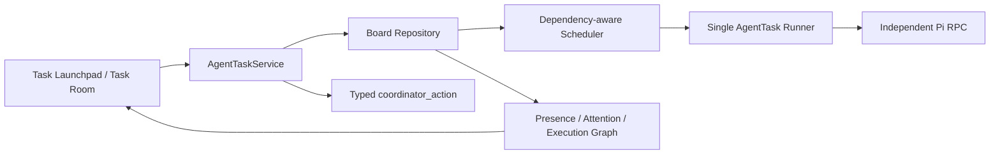

# Stella Team 可靠执行改进方案

状态：本轮核心语义已实现；Room/Plan DAG 的领域升级保留为后续阶段。上游证据与固定提交链接见 [`team-multica-hiclaw-2026-08.md`](../research/team-multica-hiclaw-2026-08.md)。

## 目标

在不修改 Pi、不引入第二套聊天后端和分布式基础设施的前提下，使当前 Task Room / AgentTask 模型具备可解释调度、结构化团队控制、Worker 失败恢复和清晰的人工注意入口。Pi 仍是独立执行器，Board 是当前 Team 单一事实源。

## 上游取舍

| 来源 | 采用 | 不采用 |
|---|---|---|
| Multica | Issue/Attempt 分离、显式 mention、触发预览、Leader 回收、事务认领与状态投影 | 多租户评论路由、外部 IM、为了单机调度引入 PostgreSQL |
| AgentTeams（原 HiClaw） | Room-first 方向、Manager/Leader/Worker 边界、DAG/验收门、Worker 结果不等于最终完成 | Matrix、MinIO、Kubernetes、每 Worker 一个容器、多层 Room 拓扑 |

## 本轮架构



边界保持简单：

- `AgentTaskService` 是状态转换入口；模型不能直接写 Board。
- Scheduler 是纯投影；Runner 不复制依赖和排序规则。
- Runner 仍为单执行器；没有伪装并行。
- LEAD 和 Squad Leader 共用结构化控制协议；Squad 只是成员范围和指令快照。
- UI 的“待我处理”、Agent 状态和执行图都是 Board 投影，不是第二事实源。

## 调度不变量与算法

### Ready 条件

```text
ready(root) = queued AND task.activeAgentTaskId == root.id

ready(child) = queued
  AND child belongs to current active root
  AND parent.status == waiting_children
  AND (child is not coordinator-review
       OR same-round delegated siblings are all terminal)
```

父任务仍为 `queued/running` 时，子任务显示为依赖等待；父任务已进入其他状态时，该队列项为结构无效并显式失败。这样修复了根与子任务使用相同时间戳时，随机 UUID 可能让子任务先运行的问题。

### 公平排序

```text
effectivePriority = priorityWeight + floor(waitingMs / 15 minutes)
order = effectivePriority DESC, createdAt ASC, durableInsertionIndex ASC
```

`low/medium/high/urgent` 的基础权重为 `0/1/2/3`。等待老化不设上限，因此低优先级任务最终可以越过持续到来的高优先级任务；持久化数组位置是最终稳定 tie-breaker，UUID 永不承载执行语义。认领时在 Repository 事务内重新计算同一排序，防止预检或工作区等待期间队列变化导致越序认领。

复杂度：每次投影为 `O(N + R log R)`，`N` 为 AgentTask 数，`R` 为 ready 数；本地 Board 规模下比引入优先队列持久结构更简单可靠。

## Coordinator 轮次与失败恢复

一次 `delegate/request_revision/replan` 创建一个单调递增的 `delegationRound`。同轮 Worker 可依次执行，进入 `reported/failed/interrupted/cancelled/protocol-invalid` 任一终态后参与汇总；当本轮全部 Worker 终态时，系统创建一个 Coordinator review AgentTask。

Worker 执行或启动前预检失败时：

1. 精确失败的 Worker 记录原始错误；
2. 未完成的同轮兄弟继续执行，不被连带取消；
3. 全部成员终态后重新唤醒 Leader；
4. Leader 通过 `request_revision/replan/ask_human/complete` 明确决定；
5. Coordinator 自身协议错误、根执行错误和状态破坏仍明确阻断任务，不做静默恢复。

应用启动时的 reconciler 会补建“成员已全终态但 review 尚未入队”的验收回合；它不会周期性启动 LLM 检查健康任务。

## 交互改进

- Task Launchpad 接受恰好一个明确负责人：复杂或归属不清使用 `@LEAD`，职责清楚可直接 `@Worker`。
- Agent mention 菜单在启动台显示当前项目全部可用 Agent，并继续执行 Skill 预检。
- 频道增加“全部 / 待我处理 / 执行中”投影；待处理由受阻、等待用户回复、人工关卡和报告待验收推导。
- Task Room 展示真实 Agent 执行图：根、委派轮次、Worker、Leader 验收、队列位置、依赖原因和错误。
- Agent Presence 只显示当前执行或当前失败事实；历史运行不再污染实时状态，`protocol-invalid` 会进入注意状态。

## 后续阶段（不在本轮伪装完成）

1. **Room-first 领域拆分**：允许先建 Room、加入 Lead/Workers，再在同一 composer 中创建 WorkItem；每个 Room 同时最多一个活动 WorkItem。
2. **结构化 mention token 与 Trigger Preview**：编辑器持久化 Agent ID，发送前显示动作、目标、模型、排队、缺 Skill 和成员范围。
3. **Plan/PlanNode DAG**：Leader 用 typed plan command 提议完整图；系统做 `O(V+E)` 环检测、accepted-only readiness、owner/Skill/resource 校验和 Plan 版本隔离。
4. **Attempt lease/CAS/outbox**：当 Board 从本地单写者演进为多调度器或远程 daemon 时，再引入持久 lease、状态版本和事务 outbox；不预先引入 PostgreSQL。

## 验收

- 相同时间戳且 UUID 字典序相反时，子任务不能先于根任务运行。
- 高优先级优先，但等待老化保证低优先级不会永久饥饿。
- `claim` 只能认领事务内重新计算后的队首 ready 项。
- Squad 普通文本中的 `@mention` 不创建子任务；只有合法 `coordinator_action` 可改变控制状态。
- 一个 Worker 失败后，兄弟继续执行，Leader 收到失败与成功报告并作下一步决定。
- 应用重启能补建缺失 review，不把可恢复 Coordinator 根直接标记失败。
- 启动台直派 Worker 会原子创建 Task、首条 Message 和 direct AgentTask。
- Presence、待处理筛选和执行图使用同一 Board 事实，并显示协议错误和依赖等待。
