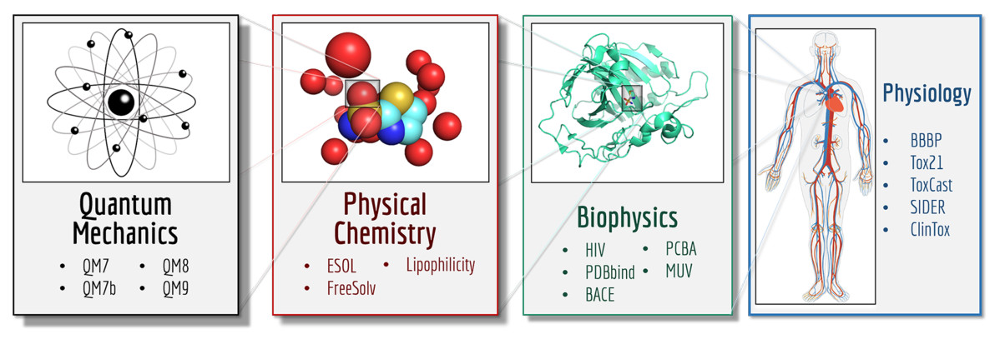
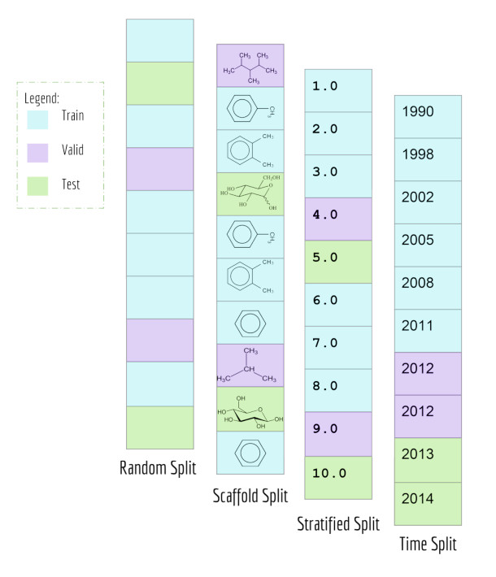

# MoleculeNet 分子性质预测局部复现

MoleculeNet

分子性质预测的局部复现

3 个完整数据集，48 次训练与评估

现代环境下的基准重跑与方法审计

来源：Wu et al., Chemical Science, 2018     本地实验：2026-09-18

<!-- NOTES
本报告介绍 MoleculeNet 的三个理化性质基准，以及现代软件环境下完成的局部复现实验。已有实验包含三个数据集、四个模型和三个随机种子，再加一个骨架划分诊断，共四十八次训练与评估。这里的重点是哪些结论有实际数据支持，以及哪些差异仍未解释。这不等于完整复现论文的十七个数据集，也不构成湿实验或药物有效性证据。

来源：Wu et al. MoleculeNet: a benchmark for molecular machine learning. Chemical Science 9, 513–530 (2018). DOI: 10.1039/C7SC02664A. https://pubmed.ncbi.nlm.nih.gov/29629118/
Local evidence: ../moleculenet-reproduction-20260918/verification/summary.json; runs.json; diagnostics.json. Experiments completed 2026-09-18. Numerical computation by DeepChem on CPU.
-->

---

# 本次复现聚焦三个理化性质数据集

论文覆盖 17 个数据集；本次运行其中 3 个完整集合

数值复现不涉及靶点验证、分子设计或临床疗效

来源：原图：Wu et al., Fig.2，CC BY-NC 3.0。保留原图，未裁切或改绘。

<!-- NOTES
MoleculeNet 将分子机器学习任务划分为量子力学、物理化学、生物物理和生理学等层面，原论文汇集十七个数据集。本次只选取图中物理化学部分的 ESOL、FreeSolv 和 Lipophilicity。三个集合都使用完整数据，而不是小样本演示，但其他十四个集合和论文中的其他算法没有运行。范围上的完整与局部需要同时说明。

来源：Wu et al. MoleculeNet: a benchmark for molecular machine learning. Chemical Science 9, 513–530 (2018). DOI: 10.1039/C7SC02664A. https://pubmed.ncbi.nlm.nih.gov/29629118/
原图：arXiv v3 Fig.2, p.7. https://arxiv.org/abs/1703.00564v3 。Wu et al.，CC BY-NC 3.0。
-->

---

# 三个基准使用不同目标与单位

| 数据集 | 记录数 | 预测目标 | 报告单位 |
| --- | --- | --- | --- |
| ESOL | 1128 | 水溶解度 | log10(mol/L) |
| FreeSolv | 642 | 溶剂化自由能 | kcal/mol |
| Lipophilicity | 4200 | 脂溶性 | logD |

36 次主实验 + 12 次 ESOL 骨架划分诊断 = 48 次

主实验：3 数据集 × 4 模型 × 3 种子

来源：来源：原始数据文件及 verification/summary.json。各任务 RMSE 不跨单位合并。

<!-- NOTES
ESOL 有一千一百二十八条记录，预测水溶解度的对数。FreeSolv 有六百四十二条记录，目标是以每摩尔千卡表示的溶剂化自由能。Lipophilicity 有四千二百条记录，预测 logD。这些目标的尺度不同，因此不能把三组误差平均成一个总分。每个数据集只应在自己的单位和相同划分条件下比较模型。

来源：Local evidence: ../moleculenet-reproduction-20260918/verification/summary.json; runs.json; diagnostics.json. Experiments completed 2026-09-18. Numerical computation by DeepChem on CPU.
Wu et al. MoleculeNet: a benchmark for molecular machine learning. Chemical Science 9, 513–530 (2018). DOI: 10.1039/C7SC02664A. https://pubmed.ncbi.nlm.nih.gov/29629118/
-->

---

# 模型比较采用预先固定的实验协议

| 模型 | 特征 | 固定设置 |
| --- | --- | --- |
| 均值基线 | 不使用分子特征 | 预测训练集目标均值 |
| RF | ECFP4 | 500 棵树 |
| KRR | ECFP4 | RBF；alpha 0.001；gamma 1/1024 |
| GraphConv | 75 维原子特征 | 卷积 128/128；100 epochs |

随机 80/10/10；种子 123、456、789

仅训练集拟合标准化；GraphConv 固定最后一个 epoch

来源：来源：experiment.json、benchmark.py。未执行原论文的超参数搜索。

<!-- NOTES
四个模型包括训练均值基线、随机森林、核岭回归和图卷积网络。随机森林和核岭回归使用相同的 ECFP4 特征，图模型使用原子特征。参数在结果出现前固定，图模型取第一百个 epoch，不按测试集效果选点。软件环境为 DeepChem 2.8 与 TensorFlow 2.15.1，因此这是一套公开记录的现代重跑协议，而不是原论文执行环境的完全还原。

来源：Local evidence: ../moleculenet-reproduction-20260918/verification/summary.json; runs.json; diagnostics.json. Experiments completed 2026-09-18. Numerical computation by DeepChem on CPU.
../moleculenet-reproduction-20260918/experiment.json, benchmark.py
-->

---

# 随机划分与骨架划分回答不同问题

主实验：随机划分

三个数据集均采用 80/10/10  
不同种子产生不同随机分区

诊断：ESOL 骨架划分

三个种子共享同一骨架分区  
仅学习器随机性改变  
不等同于三折交叉验证

来源：原图：Wu et al., Fig.3，CC BY-NC 3.0。右侧为本次实验协议。

<!-- NOTES
原图对比了四种数据划分方式。本次主实验采用随机划分，并只对 ESOL 增加骨架划分诊断。骨架划分让共享骨架的分子保持在同一分区，从而检验更困难的结构外推。需要特别注意，所用 DeepChem ScaffoldSplitter 是确定性的，三次运行使用同一个骨架分区，改变的是学习器随机性，不是三折交叉验证。

来源：Wu et al. MoleculeNet: a benchmark for molecular machine learning. Chemical Science 9, 513–530 (2018). DOI: 10.1039/C7SC02664A. https://pubmed.ncbi.nlm.nih.gov/29629118/
原图：arXiv v3 Fig.3, p.13，CC BY-NC 3.0。
Local evidence: ../moleculenet-reproduction-20260918/verification/summary.json; runs.json; diagnostics.json. Experiments completed 2026-09-18. Numerical computation by DeepChem on CPU.
-->

---

# ESOL 上 GraphConv 的平均误差最低

ESOL   测试 RMSE / log10(mol/L)

| 模型 | 本次实验 | 原论文 |
| --- | --- | --- |
| 训练均值基线 | 2.137 ± 0.016 | 未列此基线 |
| RF / ECFP4 | 1.190 ± 0.159 | 1.070 ± 0.190 |
| KRR / ECFP4 | 1.485 ± 0.119 | 1.530 ± 0.060 |
| GraphConv | 1.046 ± 0.106 | 0.970 ± 0.010 |

本次 GraphConv 为 1.046，论文为 0.970  
不同划分与训练条件下，不作显著性判断

来源：测试 RMSE（log10(mol/L)），越低越好。本次均值 ± 样本 SD，n=3。论文：Table 8。

<!-- NOTES
先看 ESOL。三个学习模型都优于训练均值基线，GraphConv 的平均测试误差最低。其均值为一点零四六，而论文同模型为零点九七。两者在量级上接近，但运行次数只有三次，训练条件也不一致，不能直接据此断言复现了相同性能。随机划分中的重复结构交叉还会限制对新结构的外推解释。

本次标准差使用 ddof=1。论文标准差的具体口径未独立恢复。不同超参数与分区下的比较仅为描述性比较，不代表统计显著性或算法因果优劣。

来源：MoleculeNet author manuscript arXiv:1703.00564v3, Table 8, p.51. https://arxiv.org/abs/1703.00564v3
Local evidence: ../moleculenet-reproduction-20260918/verification/summary.json; runs.json; diagnostics.json. Experiments completed 2026-09-18. Numerical computation by DeepChem on CPU.
-->

---

# FreeSolv 未重现 GraphConv 的优势

FreeSolv   测试 RMSE / kcal/mol

| 模型 | 本次实验 | 原论文 |
| --- | --- | --- |
| 训练均值基线 | 3.963 ± 0.473 | 未列此基线 |
| RF / ECFP4 | 2.061 ± 0.664 | 2.030 ± 0.220 |
| KRR / ECFP4 | 1.999 ± 0.410 | 2.110 ± 0.070 |
| GraphConv | 2.151 ± 0.232 | 1.400 ± 0.160 |

本次 GraphConv 误差较论文均值高 53.7%  
其均值也高于本次 RF 与 KRR

来源：测试 RMSE（kcal/mol），越低越好。本次均值 ± 样本 SD，n=3。论文：Table 8。

<!-- NOTES
FreeSolv 是本轮必须保留的负结果。原论文中 GraphConv 的测试误差为一点四，而本次为二点一五一，较论文均值高百分之五十三点七。本次 KRR 和 RF 的误差均值都略低于 GraphConv。这个结果说明固定协议下没有重现图模型的优势。我们没有为得到更漂亮的排序重新选择种子，也没有把未经验证的训练配置差异当成已确定的原因。

本次标准差使用 ddof=1。论文标准差的具体口径未独立恢复。不同超参数与分区下的比较仅为描述性比较，不代表统计显著性或算法因果优劣。

来源：MoleculeNet author manuscript arXiv:1703.00564v3, Table 8, p.51. https://arxiv.org/abs/1703.00564v3
Local evidence: ../moleculenet-reproduction-20260918/verification/summary.json; runs.json; diagnostics.json. Experiments completed 2026-09-18. Numerical computation by DeepChem on CPU.
-->

---

# 脂溶性任务中 GraphConv 的平均误差最低

Lipophilicity   测试 RMSE / logD

| 模型 | 本次实验 | 原论文 |
| --- | --- | --- |
| 训练均值基线 | 1.169 ± 0.014 | 未列此基线 |
| RF / ECFP4 | 0.838 ± 0.011 | 0.876 ± 0.040 |
| KRR / ECFP4 | 0.835 ± 0.016 | 0.899 ± 0.043 |
| GraphConv | 0.704 ± 0.016 | 0.655 ± 0.036 |

GraphConv 为 0.704，RF / KRR 约为 0.84  
本次 GraphConv 仍略高于论文的 0.655

来源：测试 RMSE（logD），越低越好。本次均值 ± 样本 SD，n=3。论文：Table 8。

<!-- NOTES
Lipophilicity 的结果与 ESOL 在模型排序上相似：GraphConv 平均误差最低，RF 和 KRR 接近。GraphConv 的误差是零点七零四，论文对应数值为零点六五五。这个结果支持图表示在当前协议和当前任务中的价值，但不足以外推到所有分子性质，更不能直接转化为药物发现成功率的保证。

本次标准差使用 ddof=1。论文标准差的具体口径未独立恢复。不同超参数与分区下的比较仅为描述性比较，不代表统计显著性或算法因果优劣。

来源：MoleculeNet author manuscript arXiv:1703.00564v3, Table 8, p.51. https://arxiv.org/abs/1703.00564v3
Local evidence: ../moleculenet-reproduction-20260918/verification/summary.json; runs.json; diagnostics.json. Experiments completed 2026-09-18. Numerical computation by DeepChem on CPU.
-->

---

# 骨架划分提高了 ESOL 的测试误差

| 模型 | 随机划分 | 骨架划分 |
| --- | --- | --- |
| 训练均值基线 | 2.137 ± 0.016 | 2.315 ± 0.000 |
| RF / ECFP4 | 1.190 ± 0.159 | 1.691 ± 0.018 |
| KRR / ECFP4 | 1.485 ± 0.119 | 2.472 ± 0.000 |
| GraphConv | 1.046 ± 0.106 | 1.370 ± 0.036 |

骨架测试中，KRR 比均值基线更差

随机划分成绩不能替代新骨架外推评估

来源：测试 RMSE，log10(mol/L)。骨架划分固定，不是三折交叉验证。

<!-- NOTES
同一组模型转到 ESOL 骨架测试集后，误差均值都升高。KRR 从一点四八五上升到二点四七二，甚至高于二点三一五的均值基线。GraphConv 仍是本轮骨架测试中的最低误差模型，但也从一点零四六升到一点三七零。这里展示的是一个特定固定骨架分区的诊断结果，不能把差值解释为普遍适用的外推损失。

来源：Local evidence: ../moleculenet-reproduction-20260918/verification/summary.json; runs.json; diagnostics.json. Experiments completed 2026-09-18. Numerical computation by DeepChem on CPU.
-->

---

# FreeSolv 的数据单位错误已纠正并重跑

3.845×

误把标准化误差标成 kcal/mol 时的虚假改善幅度

纠正后使用原始 SAMPL.csv 的 expt 列

仅训练集拟合标准化；完整重跑并排除错误批次

来源：来源：data/freesolv/SOURCE-CORRECTION.md。错误批次未进入最终汇总。

<!-- NOTES
在数据审计时发现，DeepChem 2.8 默认下载的 FreeSolv 压缩文件已经进行全数据标准化。若直接把其误差标成每摩尔千卡，就会产生大约三点八四五倍的虚假改善。我们改用原始 SAMPL.csv 的 expt 列，只在训练集上拟合标准化，并将相关实验完整重跑。前面所有 FreeSolv 数字都来自纠正后的批次。这个案例说明数据尺度检查比单纯跑通模型更重要。

来源：Local evidence: ../moleculenet-reproduction-20260918/verification/summary.json; runs.json; diagnostics.json. Experiments completed 2026-09-18. Numerical computation by DeepChem on CPU.
../moleculenet-reproduction-20260918/data/freesolv/SOURCE-CORRECTION.md
-->

---

# 重复结构限制随机划分的外推解释

| 数据集 | 重复结构行 | 训练 / 测试同结构交集 |
| --- | --- | --- |
| ESOL | 11 | 2 / 2 / 0 |
| FreeSolv | 0 | 0 / 0 / 0 |
| Lipophilicity | 0 | 0 / 0 / 0 |

交集按种子 123、456、789 顺序列出

48 次运行均保留逐分子预测与分区索引

独立重算指标，并核对标签、单位、哈希与训练集标准化

来源：来源：verification/summary.json、diagnostics.json。结构按规范 SMILES 核对。

<!-- NOTES
ESOL 有十一条重复结构记录。三个随机种子下，训练集和测试集之间的相同规范结构交集分别为二、二和零。FreeSolv 与 Lipophilicity 没有发现这种交叉。这里没有为了消除重复而改变事先确定的全量数据协议，所以必须如实报告。另一方面，已独立核对所有运行的预测与标签、分区覆盖、指标、归一化及数据哈希。数据可核查不等于所有科学偏差已消除。

来源：Local evidence: ../moleculenet-reproduction-20260918/verification/summary.json; runs.json; diagnostics.json. Experiments completed 2026-09-18. Numerical computation by DeepChem on CPU.
-->

---

# 本次结果仍有明确的复现边界

本轮已完成

3 个完整数据集  
4 类模型，3 个种子  
48 次训练与评估  
逐分子预测与独立指标核验

本轮未覆盖

全 17 数据集与全部算法  
原论文超参数搜索  
原始环境与精确分区还原  
湿实验、临床或靶点验证

来源：来源：原论文方法与本地固定实验协议。差异不能单独解释某一个结果。

<!-- NOTES
论文比较与本地重跑之间存在多处差异。数据范围只覆盖三个理化性质集合，软件使用较新的 DeepChem 与 TensorFlow，没有还原原论文的全部模型和超参数搜索。原论文使用的精确种子与分区索引也未在本轮恢复。这些差异提醒我们，对结果应使用描述性语言，而不是宣称已经证明某种算法一定更好或更差。完整论文复现仍然没有完成。

来源：Wu et al. MoleculeNet: a benchmark for molecular machine learning. Chemical Science 9, 513–530 (2018). DOI: 10.1039/C7SC02664A. https://pubmed.ncbi.nlm.nih.gov/29629118/
Local evidence: ../moleculenet-reproduction-20260918/verification/summary.json; runs.json; diagnostics.json. Experiments completed 2026-09-18. Numerical computation by DeepChem on CPU.
-->

---

# AIDD 基准结果应按任务和划分解读

模型优势依赖具体任务

FreeSolv 的负结果，与 ESOL、脂溶性的排序并存

外推能力需要相匹配的划分

随机划分中的低误差，不能保证新骨架上的表现

这份结果支持基准评估，不构成候选药物有效性的证据

来源：依据：本轮三个任务结果与 ESOL 骨架诊断。以下为方法学解读。

<!-- NOTES
本轮实验提供了三个实际可用的判断。第一，模型优势依赖任务，GraphConv 在 ESOL 和脂溶性上平均误差最低，但在 FreeSolv 上没有显示同样优势。第二，随机与骨架划分衡量不同的泛化条件，不应互相替代。第三，数据单位、重复结构和独立指标核验是解释结果的前提。这些结论对评估 AIDD 模型有帮助，但当前实验仍然只是性质预测基准，不能提供药物有效性证据。

来源：Local evidence: ../moleculenet-reproduction-20260918/verification/summary.json; runs.json; diagnostics.json. Experiments completed 2026-09-18. Numerical computation by DeepChem on CPU.
Wu et al. MoleculeNet: a benchmark for molecular machine learning. Chemical Science 9, 513–530 (2018). DOI: 10.1039/C7SC02664A. https://pubmed.ncbi.nlm.nih.gov/29629118/
-->

---

# 文献与可复运行证据

Wu et al. MoleculeNet  
Chemical Science 9, 513–530 (2018)

DOI 10.1039/C7SC02664A    PMID 29629118

本地复运行与审计入口

experiment.json / benchmark.py  
verification/summary.json / runs.json  
results/ 与 results-corrected/：预测、分区、指标

来源：实验资料日期：2026-09-18。当前报告保留局部复现范围与原始负结果。

<!-- NOTES
文献通过 PubMed 和 DOI 定位。数值对照使用作者稿第三版的 Table 8，避免期刊与作者稿图号混用。本地证据包括固定配置、训练脚本、原始预测、分区以及独立核验汇总。复运行时应使用新的输出目录，以免覆盖既有结果。不同硬件或库版本不保证逐位相同。

Wu et al. MoleculeNet: a benchmark for molecular machine learning. Chemical Science 9, 513–530 (2018). DOI: 10.1039/C7SC02664A. https://pubmed.ncbi.nlm.nih.gov/29629118/
MoleculeNet author manuscript arXiv:1703.00564v3, Table 8, p.51. https://arxiv.org/abs/1703.00564v3
DeepChem 2.8.0: https://github.com/deepchem/deepchem/tree/2.8.0
Local evidence: ../moleculenet-reproduction-20260918/verification/summary.json; runs.json; diagnostics.json. Experiments completed 2026-09-18. Numerical computation by DeepChem on CPU.
参考路径均相对本报告所属工作区的历史实验目录。
-->